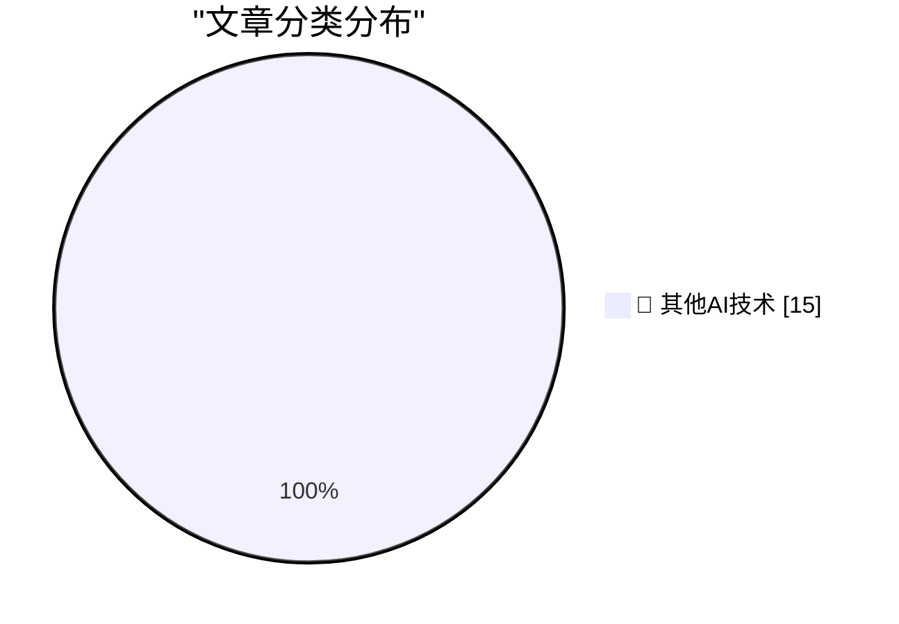

# 📰 AI 博客每日精选 — 2026-06-02

> 来自 98 个技术博客和社交媒体源，AI 精选 Top 15

## 🏆 今日必读

🥇 **Meta Reportedly Has a Slew of New Smart Glasses Planned for This Year**

[Meta Reportedly Has a Slew of New Smart Glasses Planned for This Year](https://gizmodo.com/meta-has-a-ridiculous-amount-of-smart-glasses-planned-for-this-year-2000765741) — daringfireball.net · 1 小时前 · 🔬 其他AI技术

> Meta Reportedly Has a Slew of New Smart Glasses Planned for This Year

🥈 **Apple, the Anti-‘Metaverse’ VR Company**

[Apple, the Anti-‘Metaverse’ VR Company](https://daringfireball.net/2025/12/meta_says_fuck_that_metaverse_shit) — daringfireball.net · 2 小时前 · 🔬 其他AI技术

> Apple, the Anti-‘Metaverse’ VR Company

🥉 **The Metaverse Was Snake Oil for Isolation**

[The Metaverse Was Snake Oil for Isolation](https://daringfireball.net/linked/2026/06/01/the-metaverse-fever-dream) — daringfireball.net · 2 小时前 · 🔬 其他AI技术

> The Metaverse Was Snake Oil for Isolation

4️⃣ **Scott Pelley Accuses CBS News Boss of ‘Murdering’ ‘60 Minutes’**

[Scott Pelley Accuses CBS News Boss of ‘Murdering’ ‘60 Minutes’](https://www.nytimes.com/2026/06/01/business/media/cbs-60-minutes-scott-pelley-nick-bilton.html?unlocked_article_code=1.nFA.TDGJ.HbBmlXuQWmcQ&amp;smid=url-share) — daringfireball.net · 3 小时前 · 🔬 其他AI技术

> Scott Pelley Accuses CBS News Boss of ‘Murdering’ ‘60 Minutes’

5️⃣ **Three Ways to Get Paid**

[Three Ways to Get Paid](https://jasonzweig.com/three-ways-to-get-paid/) — daringfireball.net · 6 小时前 · 🔬 其他AI技术

> Three Ways to Get Paid

---

## 📊 数据概览

| 扫描源 | 抓取文章 | 时间范围 | 精选 |
|:---:|:---:|:---:|:---:|
| 76/98 | 2693 篇 → 26 篇 | 24h | **15 篇** |

### 分类分布

---

====================

## 🔬 其他AI技术

### 1. Meta Reportedly Has a Slew of New Smart Glasses Planned for This Year

[Meta Reportedly Has a Slew of New Smart Glasses Planned for This Year](https://gizmodo.com/meta-has-a-ridiculous-amount-of-smart-glasses-planned-for-this-year-2000765741) — **daringfireball.net** · 1 小时前 · ⭐ 15/25

> Meta Reportedly Has a Slew of New Smart Glasses Planned for This Year

📌 其他AI技术

---

### 2. Apple, the Anti-‘Metaverse’ VR Company

[Apple, the Anti-‘Metaverse’ VR Company](https://daringfireball.net/2025/12/meta_says_fuck_that_metaverse_shit) — **daringfireball.net** · 2 小时前 · ⭐ 15/25

> Apple, the Anti-‘Metaverse’ VR Company

📌 其他AI技术

---

### 3. The Metaverse Was Snake Oil for Isolation

[The Metaverse Was Snake Oil for Isolation](https://daringfireball.net/linked/2026/06/01/the-metaverse-fever-dream) — **daringfireball.net** · 2 小时前 · ⭐ 15/25

> The Metaverse Was Snake Oil for Isolation

📌 其他AI技术

---

### 4. Scott Pelley Accuses CBS News Boss of ‘Murdering’ ‘60 Minutes’

[Scott Pelley Accuses CBS News Boss of ‘Murdering’ ‘60 Minutes’](https://www.nytimes.com/2026/06/01/business/media/cbs-60-minutes-scott-pelley-nick-bilton.html?unlocked_article_code=1.nFA.TDGJ.HbBmlXuQWmcQ&amp;smid=url-share) — **daringfireball.net** · 3 小时前 · ⭐ 15/25

> Scott Pelley Accuses CBS News Boss of ‘Murdering’ ‘60 Minutes’

📌 其他AI技术

---

### 5. Three Ways to Get Paid

[Three Ways to Get Paid](https://jasonzweig.com/three-ways-to-get-paid/) — **daringfireball.net** · 6 小时前 · ⭐ 15/25

> Three Ways to Get Paid

📌 其他AI技术

---

### 6. The First-Time-Buyer-Discount Dickover Scheme

[The First-Time-Buyer-Discount Dickover Scheme](https://x.com/usgraphics/status/2060559523585355986) — **daringfireball.net** · 7 小时前 · ⭐ 15/25

> The First-Time-Buyer-Discount Dickover Scheme

📌 其他AI技术

---

### 7. [Sponsor] Mux — Video for Developers

[[Sponsor] Mux — Video for Developers](https://www.mux.com/?utm_campaign=fireball&amp;utm_source=DF) — **daringfireball.net** · 21 小时前 · ⭐ 15/25

> [Sponsor] Mux — Video for Developers

📌 其他AI技术

---

### 8. ‘The Metaverse Fever Dream’

[‘The Metaverse Fever Dream’](https://pxlnv.com/blog/metaverse-fever-dream/) — **daringfireball.net** · 22 小时前 · ⭐ 15/25

> ‘The Metaverse Fever Dream’

📌 其他AI技术

---

### 9. ‘If You Take the Weasel Job Then You Must Be the Weasel’

[‘If You Take the Weasel Job Then You Must Be the Weasel’](https://www.hamiltonnolan.com/p/if-you-take-the-weasel-job-then-you?r=qy6gq) — **daringfireball.net** · 23 小时前 · ⭐ 15/25

> ‘If You Take the Weasel Job Then You Must Be the Weasel’

📌 其他AI技术

---

### 10. Pluralistic: The tedious power of storytelling (02 Jun 2026) must-we-pretend

[Pluralistic: The tedious power of storytelling (02 Jun 2026) must-we-pretend](https://pluralistic.net/2026/06/02/must-we-pretend/) — **pluralistic.net** · 13 小时前 · ⭐ 15/25

> Pluralistic: The tedious power of storytelling (02 Jun 2026) must-we-pretend

📌 其他AI技术

---

### 11. Using FourSquare's API to post location checkins to social media

[Using FourSquare's API to post location checkins to social media](https://shkspr.mobi/blog/2026/06/using-foursquares-api-to-post-location-checkins-to-social-media/) — **shkspr.mobi** · 11 小时前 · ⭐ 15/25

> Using FourSquare's API to post location checkins to social media

📌 其他AI技术

---

### 12. Logic for Programmers extra credits

[Logic for Programmers extra credits](https://buttondown.com/hillelwayne/archive/logic-for-programmers-extra-credits/) — **buttondown.com/hillelwayne** · 8 小时前 · ⭐ 15/25

> Logic for Programmers extra credits

📌 其他AI技术

---

### 13. AI Doesn't Have ROI

[AI Doesn't Have ROI](https://www.wheresyoured.at/ai-doesnt-have-roi/) — **wheresyoured.at** · 8 小时前 · ⭐ 15/25

> AI Doesn't Have ROI

📌 其他AI技术

---

### 14. An Ode to the Exacting Pedantry of Computers

[An Ode to the Exacting Pedantry of Computers](https://blog.jim-nielsen.com/2026/pedantry-of-computing/) — **blog.jim-nielsen.com** · 4 小时前 · ⭐ 15/25

> An Ode to the Exacting Pedantry of Computers

📌 其他AI技术

---

### 15. Cyrix 486DLC CPU: Introduced June 1992

[Cyrix 486DLC CPU: Introduced June 1992](https://dfarq.homeip.net/cyrix-486dlc-cpu-introduced-june-1992/?utm_source=rss&#038;utm_medium=rss&#038;utm_campaign=cyrix-486dlc-cpu-introduced-june-1992) — **dfarq.homeip.net** · 12 小时前 · ⭐ 15/25

> Cyrix 486DLC CPU: Introduced June 1992

📌 其他AI技术

---

====================

*生成于 2026-06-02 23:01 | 扫描 76 源 → 获取 2693 篇 → 精选 15 篇*
*基于 [Hacker News Popularity Contest 2025](https://refactoringenglish.com/tools/hn-popularity/) RSS 源列表，由 [Andrej Karpathy](https://x.com/karpathy) 推荐*
*由「懂点儿AI」制作，欢迎关注同名微信公众号获取更多 AI 实用技巧 💡*
