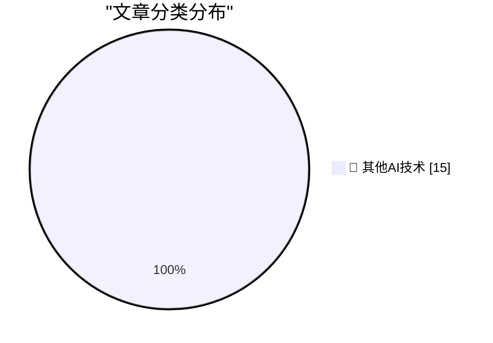

# 📰 AI 博客每日精选 — 2026-06-03

> 来自 98 个技术博客和社交媒体源，AI 精选 Top 15

## 🏆 今日必读

🥇 **The ‘60 Minutes’ Purge**

[The ‘60 Minutes’ Purge](https://www.paramountpressexpress.com/cbs-news-and-stations/shows/60-minutes/talent/) — daringfireball.net · 1 小时前 · 🔬 其他AI技术

> The ‘60 Minutes’ Purge

🥈 **CBS News Fires Scott Pelley of ‘60 Minutes’**

[CBS News Fires Scott Pelley of ‘60 Minutes’](https://www.nytimes.com/2026/06/02/business/media/scott-pelley-cbs-bari-weiss.html) — daringfireball.net · 3 小时前 · 🔬 其他AI技术

> CBS News Fires Scott Pelley of ‘60 Minutes’

🥉 **The Underworld Market to Remove the Recording Indicator Light on Meta Glasses**

[The Underworld Market to Remove the Recording Indicator Light on Meta Glasses](https://www.youtube.com/watch?v=EaJSPeJmqis) — daringfireball.net · 3 小时前 · 🔬 其他AI技术

> The Underworld Market to Remove the Recording Indicator Light on Meta Glasses

4️⃣ **Now that your newsletter is AI-generated, I've Unsubscribed**

[Now that your newsletter is AI-generated, I've Unsubscribed](https://idiallo.com/blog/unsubscribed-from-ai-generated-newsletters?src=feed) — idiallo.com · 1 小时前 · 🔬 其他AI技术

> Now that your newsletter is AI-generated, I've Unsubscribed

5️⃣ **Skills Registry Threat Models**

[Skills Registry Threat Models](https://nesbitt.io/2026/06/03/skills-registry-threat-models.html) — nesbitt.io · 8 小时前 · 🔬 其他AI技术

> Skills Registry Threat Models

---

## 📊 数据概览

| 扫描源 | 抓取文章 | 时间范围 | 精选 |
|:---:|:---:|:---:|:---:|
| 74/98 | 2667 篇 → 20 篇 | 24h | **15 篇** |

### 分类分布

---

====================

## 🔬 其他AI技术

### 1. The ‘60 Minutes’ Purge

[The ‘60 Minutes’ Purge](https://www.paramountpressexpress.com/cbs-news-and-stations/shows/60-minutes/talent/) — **daringfireball.net** · 1 小时前 · ⭐ 15/25

> The ‘60 Minutes’ Purge

📌 其他AI技术

---

### 2. CBS News Fires Scott Pelley of ‘60 Minutes’

[CBS News Fires Scott Pelley of ‘60 Minutes’](https://www.nytimes.com/2026/06/02/business/media/scott-pelley-cbs-bari-weiss.html) — **daringfireball.net** · 3 小时前 · ⭐ 15/25

> CBS News Fires Scott Pelley of ‘60 Minutes’

📌 其他AI技术

---

### 3. The Underworld Market to Remove the Recording Indicator Light on Meta Glasses

[The Underworld Market to Remove the Recording Indicator Light on Meta Glasses](https://www.youtube.com/watch?v=EaJSPeJmqis) — **daringfireball.net** · 3 小时前 · ⭐ 15/25

> The Underworld Market to Remove the Recording Indicator Light on Meta Glasses

📌 其他AI技术

---

### 4. Now that your newsletter is AI-generated, I've Unsubscribed

[Now that your newsletter is AI-generated, I've Unsubscribed](https://idiallo.com/blog/unsubscribed-from-ai-generated-newsletters?src=feed) — **idiallo.com** · 1 小时前 · ⭐ 15/25

> Now that your newsletter is AI-generated, I've Unsubscribed

📌 其他AI技术

---

### 5. Skills Registry Threat Models

[Skills Registry Threat Models](https://nesbitt.io/2026/06/03/skills-registry-threat-models.html) — **nesbitt.io** · 8 小时前 · ⭐ 15/25

> Skills Registry Threat Models

📌 其他AI技术

---

### 6. A survey of inlining heuristics

[A survey of inlining heuristics](https://bernsteinbear.com/blog/inlining-heuristics/?utm_source=rss) — **bernsteinbear.com** · 23 小时前 · ⭐ 15/25

> A survey of inlining heuristics

📌 其他AI技术

---

### 7. Is datacentre sovereignty really that important?

[Is datacentre sovereignty really that important?](https://martinalderson.com/posts/is-datacentre-sovereignty-really-that-important/?utm_source=rss&amp;utm_medium=rss&amp;utm_campaign=feed) — **martinalderson.com** · -56 分钟前 · ⭐ 15/25

> Is datacentre sovereignty really that important?

📌 其他AI技术

---

### 8. We’re bringing new capabilities to GPT-Rosalind, a model series purpose-built for life sciences research at enterprise scale. It brings GPT-5.5’s ag...

[We’re bringing new capabilities to GPT-Rosalind, a model series purpose-built for life sciences research at enterprise scale. It brings GPT-5.5’s ag...](https://x.com/OpenAI/status/2062281977122996256) — **𝕏 @OpenAI** · 1 小时前 · ⭐ 15/25

> We’re bringing new capabilities to GPT-Rosalind, a model series purpose-built for life sciences research at enterprise scale. It brings GPT-5.5’s ag...

📌 其他AI技术

---

### 9. Caught up with @openclaw maintainer @BradGroux to see what he’s been cooking up with the GitHub Copilot app 🦞

[Caught up with @openclaw maintainer @BradGroux to see what he’s been cooking up with the GitHub Copilot app 🦞](https://x.com/github/status/2062298364935635114) — **𝕏 @GitHub** · 44 分钟前 · ⭐ 15/25

> Caught up with @openclaw maintainer @BradGroux to see what he’s been cooking up with the GitHub Copilot app 🦞

📌 其他AI技术

---

### 10. “I’ll send notes after the call.” (They didn’t.) So we built an agent that does it automatically. Before a call, it pulls together the docs, decis...

[“I’ll send notes after the call.” (They didn’t.) So we built an agent that does it automatically. Before a call, it pulls together the docs, decis...](https://x.com/NotionHQ/status/2062279975731179651) — **𝕏 @NotionHQ** · 1 小时前 · ⭐ 15/25

> “I’ll send notes after the call.” (They didn’t.) So we built an agent that does it automatically. Before a call, it pulls together the docs, decis...

📌 其他AI技术

---

### 11. RT saya: How do you build a brain? Everyone's talking about world models and unified enterprise data that agents and people can reason against but I h...

[RT saya: How do you build a brain? Everyone's talking about world models and unified enterprise data that agents and people can reason against but I h...](https://x.com/NotionHQ/status/2062297848495087861) — **𝕏 @NotionHQ** · 2 小时前 · ⭐ 15/25

> RT saya: How do you build a brain? Everyone's talking about world models and unified enterprise data that agents and people can reason against but I h...

📌 其他AI技术

---

### 12. RT Ish Verduzco: I asked Grug if he had anything to share with you all. here's what he said...

[RT Ish Verduzco: I asked Grug if he had anything to share with you all. here's what he said...](https://x.com/NotionHQ/status/2062268391256445103) — **𝕏 @NotionHQ** · 7 小时前 · ⭐ 15/25

> RT Ish Verduzco: I asked Grug if he had anything to share with you all. here's what he said...

📌 其他AI技术

---

### 13. Meet Grug. Grug is a “Caveman Designer” Custom Agent that our team turns to for blunt, anti-complexity product/design feedback. Basically: “complex...

[Meet Grug. Grug is a “Caveman Designer” Custom Agent that our team turns to for blunt, anti-complexity product/design feedback. Basically: “complex...](https://x.com/NotionHQ/status/2062197178538525096) — **𝕏 @NotionHQ** · 7 小时前 · ⭐ 15/25

> Meet Grug. Grug is a “Caveman Designer” Custom Agent that our team turns to for blunt, anti-complexity product/design feedback. Basically: “complex...

📌 其他AI技术

---

### 14. RT Sam H Li: Re @NotionHQ community events happening this month: 🇵🇭 Manila, Philippines — June 4 🇦🇺 Melbourne, Australia — June 4 🇹�...

[RT Sam H Li: Re @NotionHQ community events happening this month: 🇵🇭 Manila, Philippines — June 4 🇦🇺 Melbourne, Australia — June 4 🇹�...](https://x.com/NotionHQ/status/2062237992690004034) — **𝕏 @NotionHQ** · 8 小时前 · ⭐ 15/25

> RT Sam H Li: Re @NotionHQ community events happening this month: 🇵🇭 Manila, Philippines — June 4 🇦🇺 Melbourne, Australia — June 4 🇹�...

📌 其他AI技术

---

### 15. ↑ ↑ ↓ ↓ ← → ← → B A

[↑ ↑ ↓ ↓ ← → ← → B A](https://x.com/NotionHQ/status/2061979728492577225) — **𝕏 @NotionHQ** · 21 小时前 · ⭐ 15/25

> ↑ ↑ ↓ ↓ ← → ← → B A

📌 其他AI技术

---

====================

*生成于 2026-06-03 23:04 | 扫描 74 源 → 获取 2667 篇 → 精选 15 篇*
*基于 [Hacker News Popularity Contest 2025](https://refactoringenglish.com/tools/hn-popularity/) RSS 源列表，由 [Andrej Karpathy](https://x.com/karpathy) 推荐*
*由「懂点儿AI」制作，欢迎关注同名微信公众号获取更多 AI 实用技巧 💡*
