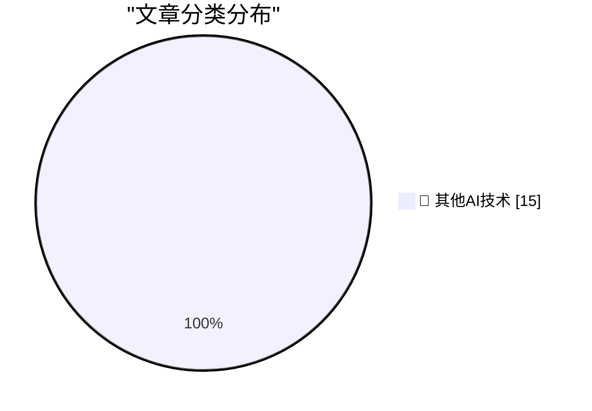

# 📰 AI 博客每日精选 — 2026-06-05

> 来自 98 个技术博客和社交媒体源，AI 精选 Top 15

## 🏆 今日必读

🥇 **I tested every IP KVM in my Homelab**

[I tested every IP KVM in my Homelab](https://www.jeffgeerling.com/blog/2026/i-tested-every-ip-kvm/) — jeffgeerling.com · 8 小时前 · 🔬 其他AI技术

> I tested every IP KVM in my Homelab

🥈 **Nieman Journalism Lab: Twitter/X Punishes Accounts That Post Links**

[Nieman Journalism Lab: Twitter/X Punishes Accounts That Post Links](https://www.niemanlab.org/2026/04/do-links-hurt-news-publishers-on-twitter-our-analysis-suggests-yes/) — daringfireball.net · 1 小时前 · 🔬 其他AI技术

> Nieman Journalism Lab: Twitter/X Punishes Accounts That Post Links

🥉 **Elon Musk’s X Is a Freak Show**

[Elon Musk’s X Is a Freak Show](https://www.natesilver.net/p/social-media-has-become-a-freak-show) — daringfireball.net · 1 小时前 · 🔬 其他AI技术

> Elon Musk’s X Is a Freak Show

4️⃣ **Checking in on Perplexity**

[Checking in on Perplexity](https://daringfireball.net/linked/2025/08/05/regarding-those-rumors-of-apple-pursuing-an-acquisition-of-perplexity) — daringfireball.net · 6 小时前 · 🔬 其他AI技术

> Checking in on Perplexity

5️⃣ **Some People Rooted for The Empire in ‘Star Wars’, Too**

[Some People Rooted for The Empire in ‘Star Wars’, Too](https://hotair.com/ed-morrissey/2026/06/03/cbs-fires-scott-pelley-after-trying-very-hard-to-get-fired-n3815553) — daringfireball.net · 21 小时前 · 🔬 其他AI技术

> Some People Rooted for The Empire in ‘Star Wars’, Too

---

## 📊 数据概览

| 扫描源 | 抓取文章 | 时间范围 | 精选 |
|:---:|:---:|:---:|:---:|
| 76/98 | 2690 篇 → 21 篇 | 24h | **15 篇** |

### 分类分布

---

====================

## 🔬 其他AI技术

### 1. I tested every IP KVM in my Homelab

[I tested every IP KVM in my Homelab](https://www.jeffgeerling.com/blog/2026/i-tested-every-ip-kvm/) — **jeffgeerling.com** · 8 小时前 · ⭐ 15/25

> I tested every IP KVM in my Homelab

📌 其他AI技术

---

### 2. Nieman Journalism Lab: Twitter/X Punishes Accounts That Post Links

[Nieman Journalism Lab: Twitter/X Punishes Accounts That Post Links](https://www.niemanlab.org/2026/04/do-links-hurt-news-publishers-on-twitter-our-analysis-suggests-yes/) — **daringfireball.net** · 1 小时前 · ⭐ 15/25

> Nieman Journalism Lab: Twitter/X Punishes Accounts That Post Links

📌 其他AI技术

---

### 3. Elon Musk’s X Is a Freak Show

[Elon Musk’s X Is a Freak Show](https://www.natesilver.net/p/social-media-has-become-a-freak-show) — **daringfireball.net** · 1 小时前 · ⭐ 15/25

> Elon Musk’s X Is a Freak Show

📌 其他AI技术

---

### 4. Checking in on Perplexity

[Checking in on Perplexity](https://daringfireball.net/linked/2025/08/05/regarding-those-rumors-of-apple-pursuing-an-acquisition-of-perplexity) — **daringfireball.net** · 6 小时前 · ⭐ 15/25

> Checking in on Perplexity

📌 其他AI技术

---

### 5. Some People Rooted for The Empire in ‘Star Wars’, Too

[Some People Rooted for The Empire in ‘Star Wars’, Too](https://hotair.com/ed-morrissey/2026/06/03/cbs-fires-scott-pelley-after-trying-very-hard-to-get-fired-n3815553) — **daringfireball.net** · 21 小时前 · ⭐ 15/25

> Some People Rooted for The Empire in ‘Star Wars’, Too

📌 其他AI技术

---

### 6. Pluralistic: Refining humanity (05 Jun 2026)

[Pluralistic: Refining humanity (05 Jun 2026)](https://pluralistic.net/2026/06/05/defining-humanity/) — **pluralistic.net** · 1 小时前 · ⭐ 15/25

> Pluralistic: Refining humanity (05 Jun 2026)

📌 其他AI技术

---

### 7. Giving your Go apps Tigris superpowers

[Giving your Go apps Tigris superpowers](https://www.tigrisdata.com/blog/storage-sdk-go/) — **xeiaso.net** · -4427 分钟前 · ⭐ 15/25

> Giving your Go apps Tigris superpowers

📌 其他AI技术

---

### 8. IPv6 zones in URLs are a mistake

[IPv6 zones in URLs are a mistake](https://xeiaso.net/notes/2026/ipv6-zones-go-url/) — **xeiaso.net** · 22 小时前 · ⭐ 15/25

> IPv6 zones in URLs are a mistake

📌 其他AI技术

---

### 9. Using Safetensors with Flax

[Using Safetensors with Flax](https://www.gilesthomas.com/2026/06/flax-and-safetensors) — **gilesthomas.com** · 22 小时前 · ⭐ 15/25

> Using Safetensors with Flax

📌 其他AI技术

---

### 10. JAX backends and devices

[JAX backends and devices](https://www.gilesthomas.com/2026/06/jax-backends-and-devices) — **gilesthomas.com** · 2 小时前 · ⭐ 15/25

> JAX backends and devices

📌 其他AI技术

---

### 11. Install-script allowlists

[Install-script allowlists](https://nesbitt.io/2026/06/05/install-script-allowlists.html) — **nesbitt.io** · 10 小时前 · ⭐ 15/25

> Install-script allowlists

📌 其他AI技术

---

### 12. Premium: The Hater's Guide To The AI Bubble 3.0

[Premium: The Hater's Guide To The AI Bubble 3.0](https://www.wheresyoured.at/premium-the-haters-guide-to-the-ai-bubble-3-0/) — **wheresyoured.at** · 6 小时前 · ⭐ 15/25

> Premium: The Hater's Guide To The AI Bubble 3.0

📌 其他AI技术

---

### 13. First Commodore PET sold, June 5, 1977

[First Commodore PET sold, June 5, 1977](https://dfarq.homeip.net/first-commodore-pet-sold-june-5-1977/?utm_source=rss&#038;utm_medium=rss&#038;utm_campaign=first-commodore-pet-sold-june-5-1977) — **dfarq.homeip.net** · 11 小时前 · ⭐ 15/25

> First Commodore PET sold, June 5, 1977

📌 其他AI技术

---

### 14. Aggressive caching for a Mastodon reverse proxy: what to cache, what to never cache, and why content negotiation will eventually betray you

[Aggressive caching for a Mastodon reverse proxy: what to cache, what to never cache, and why content negotiation will eventually betray you](https://it-notes.dragas.net/2026/06/05/aggressive_caching_for_a_mastodon_reverse_proxy/) — **it-notes.dragas.net** · 13 小时前 · ⭐ 15/25

> Aggressive caching for a Mastodon reverse proxy: what to cache, what to never cache, and why content negotiation will eventually betray you

📌 其他AI技术

---

### 15. An issue caused some user accounts to be incorrectly suspended. We’re restoring access and working through related subscription and credit issues. ht...

[An issue caused some user accounts to be incorrectly suspended. We’re restoring access and working through related subscription and credit issues. ht...](https://x.com/OpenAI/status/2062927046448431587) — **𝕏 @OpenAI** · 6 小时前 · ⭐ 15/25

> An issue caused some user accounts to be incorrectly suspended. We’re restoring access and working through related subscription and credit issues. ht...

📌 其他AI技术

---

====================

*生成于 2026-06-05 22:13 | 扫描 76 源 → 获取 2690 篇 → 精选 15 篇*
*基于 [Hacker News Popularity Contest 2025](https://refactoringenglish.com/tools/hn-popularity/) RSS 源列表，由 [Andrej Karpathy](https://x.com/karpathy) 推荐*
*由「懂点儿AI」制作，欢迎关注同名微信公众号获取更多 AI 实用技巧 💡*
