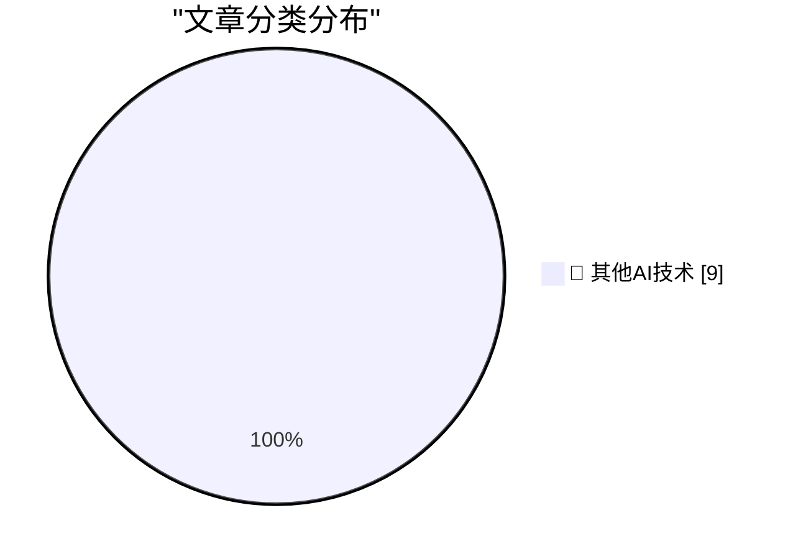

# 📰 AI 博客每日精选 — 2026-06-07

> 来自 98 个技术博客和社交媒体源，AI 精选 Top 9

## 🏆 今日必读

🥇 **Mux — Video for Developers**

[Mux — Video for Developers](https://www.mux.com/?utm_campaign=fireball&amp;utm_source=DF) — daringfireball.net · 4 小时前 · 🔬 其他AI技术

> Mux — Video for Developers

🥈 **Halide Mark III**

[Halide Mark III](https://www.lux.camera/halide-mark-iii/) — daringfireball.net · 21 小时前 · 🔬 其他AI技术

> Halide Mark III

🥉 **Arp 297:**

[Arp 297:](https://maurycyz.com/astro/arp297/) — maurycyz.com · 22 小时前 · 🔬 其他AI技术

> Arp 297:

4️⃣ **Giving your Go apps Tigris superpowers**

[Giving your Go apps Tigris superpowers](https://www.tigrisdata.com/blog/storage-sdk-go/) — xeiaso.net · -1559 分钟前 · 🔬 其他AI技术

> Giving your Go apps Tigris superpowers

5️⃣ **Thoughts on starting new projects with LLM agents**

[Thoughts on starting new projects with LLM agents](https://eli.thegreenplace.net/2026/thoughts-on-starting-new-projects-with-llm-agents/) — eli.thegreenplace.net · 21 小时前 · 🔬 其他AI技术

> Thoughts on starting new projects with LLM agents

---

## 📊 数据概览

| 扫描源 | 抓取文章 | 时间范围 | 精选 |
|:---:|:---:|:---:|:---:|
| 75/98 | 2748 篇 → 9 篇 | 24h | **9 篇** |

### 分类分布

---

====================

## 🔬 其他AI技术

### 1. Mux — Video for Developers

[Mux — Video for Developers](https://www.mux.com/?utm_campaign=fireball&amp;utm_source=DF) — **daringfireball.net** · 4 小时前 · ⭐ 15/25

> Mux — Video for Developers

📌 其他AI技术

---

### 2. Halide Mark III

[Halide Mark III](https://www.lux.camera/halide-mark-iii/) — **daringfireball.net** · 21 小时前 · ⭐ 15/25

> Halide Mark III

📌 其他AI技术

---

### 3. Arp 297:

[Arp 297:](https://maurycyz.com/astro/arp297/) — **maurycyz.com** · 22 小时前 · ⭐ 15/25

> Arp 297:

📌 其他AI技术

---

### 4. Giving your Go apps Tigris superpowers

[Giving your Go apps Tigris superpowers](https://www.tigrisdata.com/blog/storage-sdk-go/) — **xeiaso.net** · -1559 分钟前 · ⭐ 15/25

> Giving your Go apps Tigris superpowers

📌 其他AI技术

---

### 5. Thoughts on starting new projects with LLM agents

[Thoughts on starting new projects with LLM agents](https://eli.thegreenplace.net/2026/thoughts-on-starting-new-projects-with-llm-agents/) — **eli.thegreenplace.net** · 21 小时前 · ⭐ 15/25

> Thoughts on starting new projects with LLM agents

📌 其他AI技术

---

### 6. KPN Interactieve TV zonder Experia Box

[KPN Interactieve TV zonder Experia Box](https://berthub.eu/articles/posts/kpn-interactieve-tv-zelf-doen/) — **berthub.eu** · 11 小时前 · ⭐ 15/25

> KPN Interactieve TV zonder Experia Box

📌 其他AI技术

---

### 7. Tanner Linsley used AI to rebuild React with only the parts he needed. Here's why Redact changes how we think about dependencies. ▶️

[Tanner Linsley used AI to rebuild React with only the parts he needed. Here's why Redact changes how we think about dependencies. ▶️](https://x.com/github/status/2063699306268229641) — **𝕏 @GitHub** · 2 小时前 · ⭐ 15/25

> Tanner Linsley used AI to rebuild React with only the parts he needed. Here's why Redact changes how we think about dependencies. ▶️

📌 其他AI技术

---

### 8. Come behind the scenes with us on the GitHub Shop shoot. ✨ What are you adding to your wishlist? http://thegithubshop.com

[Come behind the scenes with us on the GitHub Shop shoot. ✨ What are you adding to your wishlist? http://thegithubshop.com](https://x.com/github/status/2063630962240417918) — **𝕏 @GitHub** · 7 小时前 · ⭐ 15/25

> Come behind the scenes with us on the GitHub Shop shoot. ✨ What are you adding to your wishlist? http://thegithubshop.com

📌 其他AI技术

---

### 9. RT Max Schoening: The amount of people RT-ing this because they want a story around model quality to be the reason is astonishing. The degraded perfor...

[RT Max Schoening: The amount of people RT-ing this because they want a story around model quality to be the reason is astonishing. The degraded perfor...](https://x.com/NotionHQ/status/2063668695097110736) — **𝕏 @NotionHQ** · 5 小时前 · ⭐ 15/25

> RT Max Schoening: The amount of people RT-ing this because they want a story around model quality to be the reason is astonishing. The degraded perfor...

📌 其他AI技术

---

====================

*生成于 2026-06-07 22:01 | 扫描 75 源 → 获取 2748 篇 → 精选 9 篇*
*基于 [Hacker News Popularity Contest 2025](https://refactoringenglish.com/tools/hn-popularity/) RSS 源列表，由 [Andrej Karpathy](https://x.com/karpathy) 推荐*
*由「懂点儿AI」制作，欢迎关注同名微信公众号获取更多 AI 实用技巧 💡*
