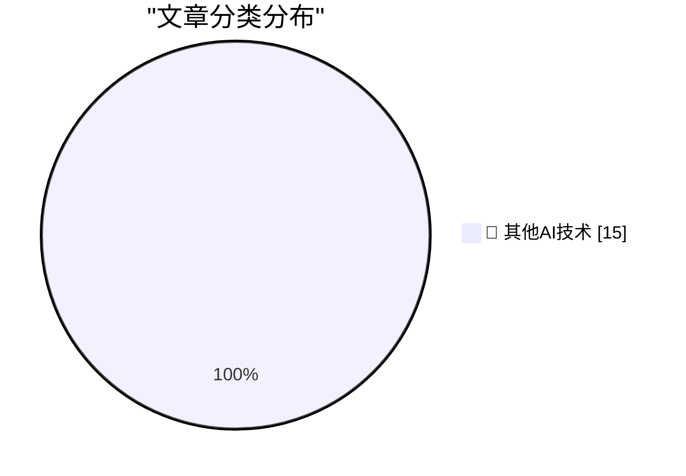

# 📰 AI 博客每日精选 — 2026-06-08

> 来自 98 个技术博客和社交媒体源，AI 精选 Top 15

## 🏆 今日必读

🥇 **Mux — Video for Developers**

[Mux — Video for Developers](https://www.mux.com/?utm_campaign=fireball&amp;utm_source=DF) — daringfireball.net · 20 小时前 · 🔬 其他AI技术

> Mux — Video for Developers

🥈 **★ SwiftUI Only Makes It Easy to Develop Bad Apps**

[★ SwiftUI Only Makes It Easy to Develop Bad Apps](https://daringfireball.net/2026/06/swiftui_only_makes_it_easy_to_develop_bad_apps) — daringfireball.net · 20 小时前 · 🔬 其他AI技术

> ★ SwiftUI Only Makes It Easy to Develop Bad Apps

🥉 **Alberto Romero on Apple’s AI Spending**

[Alberto Romero on Apple’s AI Spending](https://www.thealgorithmicbridge.com/p/what-apple-knows-about-ai-that-silicon) — daringfireball.net · 21 小时前 · 🔬 其他AI技术

> Alberto Romero on Apple’s AI Spending

4️⃣ **ppclp.ai announces 100x Productivity Gains**

[ppclp.ai announces 100x Productivity Gains](https://idiallo.com/blog/100x-productivity-gain) — idiallo.com · 2 小时前 · 🔬 其他AI技术

> ppclp.ai announces 100x Productivity Gains

5️⃣ **How many consecutive hyphens can you have in a domain name?**

[How many consecutive hyphens can you have in a domain name?](https://shkspr.mobi/blog/2026/06/how-many-consecutive-hyphens-can-you-have-in-a-domain-name/) — shkspr.mobi · 10 小时前 · 🔬 其他AI技术

> How many consecutive hyphens can you have in a domain name?

---

## 📊 数据概览

| 扫描源 | 抓取文章 | 时间范围 | 精选 |
|:---:|:---:|:---:|:---:|
| 76/98 | 2761 篇 → 20 篇 | 24h | **15 篇** |

### 分类分布

---

====================

## 🔬 其他AI技术

### 1. Mux — Video for Developers

[Mux — Video for Developers](https://www.mux.com/?utm_campaign=fireball&amp;utm_source=DF) — **daringfireball.net** · 20 小时前 · ⭐ 15/25

> Mux — Video for Developers

📌 其他AI技术

---

### 2. ★ SwiftUI Only Makes It Easy to Develop Bad Apps

[★ SwiftUI Only Makes It Easy to Develop Bad Apps](https://daringfireball.net/2026/06/swiftui_only_makes_it_easy_to_develop_bad_apps) — **daringfireball.net** · 20 小时前 · ⭐ 15/25

> ★ SwiftUI Only Makes It Easy to Develop Bad Apps

📌 其他AI技术

---

### 3. Alberto Romero on Apple’s AI Spending

[Alberto Romero on Apple’s AI Spending](https://www.thealgorithmicbridge.com/p/what-apple-knows-about-ai-that-silicon) — **daringfireball.net** · 21 小时前 · ⭐ 15/25

> Alberto Romero on Apple’s AI Spending

📌 其他AI技术

---

### 4. ppclp.ai announces 100x Productivity Gains

[ppclp.ai announces 100x Productivity Gains](https://idiallo.com/blog/100x-productivity-gain) — **idiallo.com** · 2 小时前 · ⭐ 15/25

> ppclp.ai announces 100x Productivity Gains

📌 其他AI技术

---

### 5. How many consecutive hyphens can you have in a domain name?

[How many consecutive hyphens can you have in a domain name?](https://shkspr.mobi/blog/2026/06/how-many-consecutive-hyphens-can-you-have-in-a-domain-name/) — **shkspr.mobi** · 10 小时前 · ⭐ 15/25

> How many consecutive hyphens can you have in a domain name?

📌 其他AI技术

---

### 6. Giving your Go apps Tigris superpowers

[Giving your Go apps Tigris superpowers](https://www.tigrisdata.com/blog/storage-sdk-go/) — **xeiaso.net** · -96 分钟前 · ⭐ 15/25

> Giving your Go apps Tigris superpowers

📌 其他AI技术

---

### 7. Package Manager Patents

[Package Manager Patents](https://nesbitt.io/2026/06/08/package-manager-patents.html) — **nesbitt.io** · 12 小时前 · ⭐ 15/25

> Package Manager Patents

📌 其他AI技术

---

### 8. The sample efficiency black hole

[The sample efficiency black hole](https://www.dwarkesh.com/p/the-sample-efficiency-black-hole) — **dwarkesh.com** · 4 小时前 · ⭐ 15/25

> The sample efficiency black hole

📌 其他AI技术

---

### 9. AI Is Slowing Down

[AI Is Slowing Down](https://www.wheresyoured.at/ai-is-slowing-down/) — **wheresyoured.at** · 6 小时前 · ⭐ 15/25

> AI Is Slowing Down

📌 其他AI技术

---

### 10. Planescape: Torment, Part 2: …to the Desktop

[Planescape: Torment, Part 2: …to the Desktop](https://www.filfre.net/2026/06/planescape-torment-part-2-to-the-desktop/) — **filfre.net** · 6 小时前 · ⭐ 15/25

> Planescape: Torment, Part 2: …to the Desktop

📌 其他AI技术

---

### 11. Eagle Computer: The rise and fall of an early PC clone

[Eagle Computer: The rise and fall of an early PC clone](https://dfarq.homeip.net/eagle-computer-the-rise-and-fall-of-an-early-pc-clone/?utm_source=rss&#038;utm_medium=rss&#038;utm_campaign=eagle-computer-the-rise-and-fall-of-an-early-pc-clone) — **dfarq.homeip.net** · 11 小时前 · ⭐ 15/25

> Eagle Computer: The rise and fall of an early PC clone

📌 其他AI技术

---

### 12. De gietijzeren pan en big tech

[De gietijzeren pan en big tech](https://berthub.eu/articles/posts/de-gietijzeren-pan-en-big-tech/) — **berthub.eu** · 11 小时前 · ⭐ 15/25

> De gietijzeren pan en big tech

📌 其他AI技术

---

### 13. Hacking for Defense @ Stanford 2026 – Lessons Learned Presentations

[Hacking for Defense @ Stanford 2026 – Lessons Learned Presentations](https://steveblank.com/2026/06/08/g-for-defense-stanford-2026-lessons-learned-presentations/) — **steveblank.com** · 9 小时前 · ⭐ 15/25

> Hacking for Defense @ Stanford 2026 – Lessons Learned Presentations

📌 其他AI技术

---

### 14. xAI is looking more like a datacentre REIT than a frontier lab

[xAI is looking more like a datacentre REIT than a frontier lab](https://martinalderson.com/posts/xais-new-rental-business/?utm_source=rss&amp;utm_medium=rss&amp;utm_campaign=feed) — **martinalderson.com** · 22 小时前 · ⭐ 15/25

> xAI is looking more like a datacentre REIT than a frontier lab

📌 其他AI技术

---

### 15. Instead of fixing accessibility issues later, prevent them from the start. We're piloting an experimental general-purpose accessibility agent to impro...

[Instead of fixing accessibility issues later, prevent them from the start. We're piloting an experimental general-purpose accessibility agent to impro...](https://x.com/github/status/2064098899464237336) — **𝕏 @GitHub** · 49 分钟前 · ⭐ 15/25

> Instead of fixing accessibility issues later, prevent them from the start. We're piloting an experimental general-purpose accessibility agent to impro...

📌 其他AI技术

---

====================

*生成于 2026-06-08 22:24 | 扫描 76 源 → 获取 2761 篇 → 精选 15 篇*
*基于 [Hacker News Popularity Contest 2025](https://refactoringenglish.com/tools/hn-popularity/) RSS 源列表，由 [Andrej Karpathy](https://x.com/karpathy) 推荐*
*由「懂点儿AI」制作，欢迎关注同名微信公众号获取更多 AI 实用技巧 💡*
