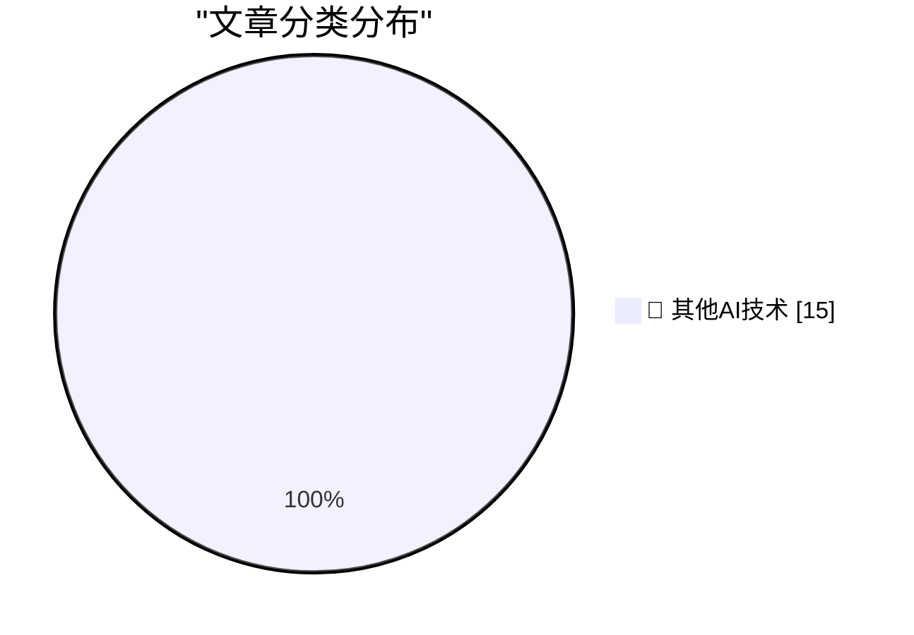

# 📰 AI 博客每日精选 — 2026-06-09

> 来自 98 个技术博客和社交媒体源，AI 精选 Top 15

## 🏆 今日必读

🥇 **Apple OS 27: The Small Things**

[Apple OS 27: The Small Things](https://blog.oneberri.com/posts/wwdc26-the-small-things) — daringfireball.net · 52 分钟前 · 🔬 其他AI技术

> Apple OS 27: The Small Things

🥈 **The Talk Show Live From WWDC: Tonight, In-Person and Streaming**

[The Talk Show Live From WWDC: Tonight, In-Person and Streaming](https://ti.to/daringfireball/the-talk-show-live-from-wwdc-2026) — daringfireball.net · 3 小时前 · 🔬 其他AI技术

> The Talk Show Live From WWDC: Tonight, In-Person and Streaming

🥉 **Apple WWDC 2026 Keynote**

[Apple WWDC 2026 Keynote](https://www.youtube.com/watch?v=hF8swzNR1-o) — daringfireball.net · 4 小时前 · 🔬 其他AI技术

> Apple WWDC 2026 Keynote

4️⃣ **Apple’s WWDC AI Demos Were Real and in Real Time**

[Apple’s WWDC AI Demos Were Real and in Real Time](https://techcrunch.com/2026/06/08/apples-wwdc-ai-demos-looked-more-real-after-250m-false-ad-settlement/) — daringfireball.net · 4 小时前 · 🔬 其他AI技术

> Apple’s WWDC AI Demos Were Real and in Real Time

5️⃣ **Apple Introduces Siri AI**

[Apple Introduces Siri AI](https://www.apple.com/newsroom/2026/06/apple-introduces-siri-ai-a-profoundly-more-capable-and-personal-assistant/) — daringfireball.net · 4 小时前 · 🔬 其他AI技术

> Apple Introduces Siri AI

---

## 📊 数据概览

| 扫描源 | 抓取文章 | 时间范围 | 精选 |
|:---:|:---:|:---:|:---:|
| 79/98 | 2815 篇 → 26 篇 | 24h | **15 篇** |

### 分类分布

---

====================

## 🔬 其他AI技术

### 1. Apple OS 27: The Small Things

[Apple OS 27: The Small Things](https://blog.oneberri.com/posts/wwdc26-the-small-things) — **daringfireball.net** · 52 分钟前 · ⭐ 15/25

> Apple OS 27: The Small Things

📌 其他AI技术

---

### 2. The Talk Show Live From WWDC: Tonight, In-Person and Streaming

[The Talk Show Live From WWDC: Tonight, In-Person and Streaming](https://ti.to/daringfireball/the-talk-show-live-from-wwdc-2026) — **daringfireball.net** · 3 小时前 · ⭐ 15/25

> The Talk Show Live From WWDC: Tonight, In-Person and Streaming

📌 其他AI技术

---

### 3. Apple WWDC 2026 Keynote

[Apple WWDC 2026 Keynote](https://www.youtube.com/watch?v=hF8swzNR1-o) — **daringfireball.net** · 4 小时前 · ⭐ 15/25

> Apple WWDC 2026 Keynote

📌 其他AI技术

---

### 4. Apple’s WWDC AI Demos Were Real and in Real Time

[Apple’s WWDC AI Demos Were Real and in Real Time](https://techcrunch.com/2026/06/08/apples-wwdc-ai-demos-looked-more-real-after-250m-false-ad-settlement/) — **daringfireball.net** · 4 小时前 · ⭐ 15/25

> Apple’s WWDC AI Demos Were Real and in Real Time

📌 其他AI技术

---

### 5. Apple Introduces Siri AI

[Apple Introduces Siri AI](https://www.apple.com/newsroom/2026/06/apple-introduces-siri-ai-a-profoundly-more-capable-and-personal-assistant/) — **daringfireball.net** · 4 小时前 · ⭐ 15/25

> Apple Introduces Siri AI

📌 其他AI技术

---

### 6. Apple’s WWDC Announcement of the New Apple Intelligence System

[Apple’s WWDC Announcement of the New Apple Intelligence System](https://www.apple.com/newsroom/2026/06/apple-intelligence-brings-powerful-ai-capabilities-into-everyday-experiences/) — **daringfireball.net** · 5 小时前 · ⭐ 15/25

> Apple’s WWDC Announcement of the New Apple Intelligence System

📌 其他AI技术

---

### 7. [Sponsor] WorkOS Launches auth.md — an Open Protocol for Agent Registration

[[Sponsor] WorkOS Launches auth.md — an Open Protocol for Agent Registration](https://youtu.be/Dqp_b8GHLXU?t=1074) — **daringfireball.net** · 17 小时前 · ⭐ 15/25

> [Sponsor] WorkOS Launches auth.md — an Open Protocol for Agent Registration

📌 其他AI技术

---

### 8. From the Annals of People Having Knowledge of the Matter, Siri AI Extensions Edition

[From the Annals of People Having Knowledge of the Matter, Siri AI Extensions Edition](https://www.bloomberg.com/news/articles/2026-03-26/apple-plans-to-open-up-siri-to-rival-ai-assistants-beyond-chatgpt-in-ios-27) — **daringfireball.net** · 20 小时前 · ⭐ 15/25

> From the Annals of People Having Knowledge of the Matter, Siri AI Extensions Edition

📌 其他AI技术

---

### 9. Pluralistic: Naomi Kritzer's "Obstetrix" (09 Jun 2026)

[Pluralistic: Naomi Kritzer's "Obstetrix" (09 Jun 2026)](https://pluralistic.net/2026/06/09/deliver-us/) — **pluralistic.net** · 8 小时前 · ⭐ 15/25

> Pluralistic: Naomi Kritzer's "Obstetrix" (09 Jun 2026)

📌 其他AI技术

---

### 10. Giving your Go apps Tigris superpowers

[Giving your Go apps Tigris superpowers](https://www.tigrisdata.com/blog/storage-sdk-go/) — **xeiaso.net** · 22 小时前 · ⭐ 15/25

> Giving your Go apps Tigris superpowers

📌 其他AI技术

---

### 11. "No way to prevent this" say users of only language where this regularly happens

["No way to prevent this" say users of only language where this regularly happens](https://xeiaso.net/shitposts/no-way-to-prevent-this/memory-safety/CVE-2026-45447/) — **xeiaso.net** · 22 小时前 · ⭐ 15/25

> "No way to prevent this" say users of only language where this regularly happens

📌 其他AI技术

---

### 12. The Microsoft Company Party where everybody played name tag swap

[The Microsoft Company Party where everybody played name tag swap](https://devblogs.microsoft.com/oldnewthing/20260609-00/?p=112409) — **devblogs.microsoft.com/oldnewthing** · 8 小时前 · ⭐ 15/25

> The Microsoft Company Party where everybody played name tag swap

📌 其他AI技术

---

### 13. Forms of Open Source Government

[Forms of Open Source Government](https://nesbitt.io/2026/06/09/forms-of-open-source-government.html) — **nesbitt.io** · 12 小时前 · ⭐ 15/25

> Forms of Open Source Government

📌 其他AI技术

---

### 14. Apple II: Launched June 10, 1977

[Apple II: Launched June 10, 1977](https://dfarq.homeip.net/apple-ii-launched-june-10-1977/?utm_source=rss&#038;utm_medium=rss&#038;utm_campaign=apple-ii-launched-june-10-1977) — **dfarq.homeip.net** · 11 小时前 · ⭐ 15/25

> Apple II: Launched June 10, 1977

📌 其他AI技术

---

### 15. Incorruptible

[Incorruptible](https://steveblank.com/2026/06/09/incorruptible/) — **steveblank.com** · 9 小时前 · ⭐ 15/25

> Incorruptible

📌 其他AI技术

---

====================

*生成于 2026-06-09 22:22 | 扫描 79 源 → 获取 2815 篇 → 精选 15 篇*
*基于 [Hacker News Popularity Contest 2025](https://refactoringenglish.com/tools/hn-popularity/) RSS 源列表，由 [Andrej Karpathy](https://x.com/karpathy) 推荐*
*由「懂点儿AI」制作，欢迎关注同名微信公众号获取更多 AI 实用技巧 💡*
