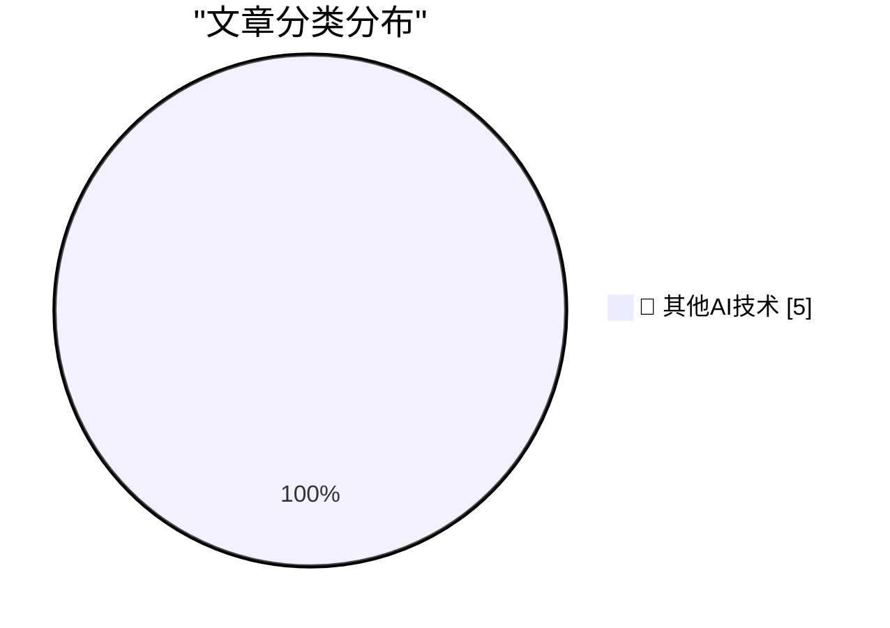

# 📰 AI 博客每日精选 — 2026-06-10

> 来自 98 个技术博客和社交媒体源，AI 精选 Top 5

## 🏆 今日必读

🥇 **Please, use a link!**

[Please, use a link!](https://idiallo.com/blog/use-a-link-please) — idiallo.com · 2 小时前 · 🔬 其他AI技术

> Please, use a link!

🥈 **Book Review: The Husbands by Holly Gramazio ★★★★★**

[Book Review: The Husbands by Holly Gramazio ★★★★★](https://shkspr.mobi/blog/2026/06/book-review-the-husbands-by-holly-gramazio/) — shkspr.mobi · 11 小时前 · 🔬 其他AI技术

> Book Review: The Husbands by Holly Gramazio ★★★★★

🥉 **Gaslighting Openness**

[Gaslighting Openness](https://lucumr.pocoo.org/2026/6/10/gaslighting/) — lucumr.pocoo.org · 22 小时前 · 🔬 其他AI技术

> Gaslighting Openness

4️⃣ **Nontrailing separators do not spark joy**

[Nontrailing separators do not spark joy](https://buttondown.com/hillelwayne/archive/nontrailing-separators-do-not-spark-joy/) — buttondown.com/hillelwayne · 10 小时前 · 🔬 其他AI技术

> Nontrailing separators do not spark joy

5️⃣ **Texas Instruments Speak and Spell**

[Texas Instruments Speak and Spell](https://dfarq.homeip.net/texas-instruments-speak-and-spell/?utm_source=rss&#038;utm_medium=rss&#038;utm_campaign=texas-instruments-speak-and-spell) — dfarq.homeip.net · 11 小时前 · 🔬 其他AI技术

> Texas Instruments Speak and Spell

---

## 📊 数据概览

| 扫描源 | 抓取文章 | 时间范围 | 精选 |
|:---:|:---:|:---:|:---:|
| 60/98 | 1881 篇 → 5 篇 | 24h | **5 篇** |

### 分类分布

---

====================

## 🔬 其他AI技术

### 1. Please, use a link!

[Please, use a link!](https://idiallo.com/blog/use-a-link-please) — **idiallo.com** · 2 小时前 · ⭐ 15/25

> Please, use a link!

📌 其他AI技术

---

### 2. Book Review: The Husbands by Holly Gramazio ★★★★★

[Book Review: The Husbands by Holly Gramazio ★★★★★](https://shkspr.mobi/blog/2026/06/book-review-the-husbands-by-holly-gramazio/) — **shkspr.mobi** · 11 小时前 · ⭐ 15/25

> Book Review: The Husbands by Holly Gramazio ★★★★★

📌 其他AI技术

---

### 3. Gaslighting Openness

[Gaslighting Openness](https://lucumr.pocoo.org/2026/6/10/gaslighting/) — **lucumr.pocoo.org** · 22 小时前 · ⭐ 15/25

> Gaslighting Openness

📌 其他AI技术

---

### 4. Nontrailing separators do not spark joy

[Nontrailing separators do not spark joy](https://buttondown.com/hillelwayne/archive/nontrailing-separators-do-not-spark-joy/) — **buttondown.com/hillelwayne** · 10 小时前 · ⭐ 15/25

> Nontrailing separators do not spark joy

📌 其他AI技术

---

### 5. Texas Instruments Speak and Spell

[Texas Instruments Speak and Spell](https://dfarq.homeip.net/texas-instruments-speak-and-spell/?utm_source=rss&#038;utm_medium=rss&#038;utm_campaign=texas-instruments-speak-and-spell) — **dfarq.homeip.net** · 11 小时前 · ⭐ 15/25

> Texas Instruments Speak and Spell

📌 其他AI技术

---

====================

*生成于 2026-06-10 22:51 | 扫描 60 源 → 获取 1881 篇 → 精选 5 篇*
*基于 [Hacker News Popularity Contest 2025](https://refactoringenglish.com/tools/hn-popularity/) RSS 源列表，由 [Andrej Karpathy](https://x.com/karpathy) 推荐*
*由「懂点儿AI」制作，欢迎关注同名微信公众号获取更多 AI 实用技巧 💡*
