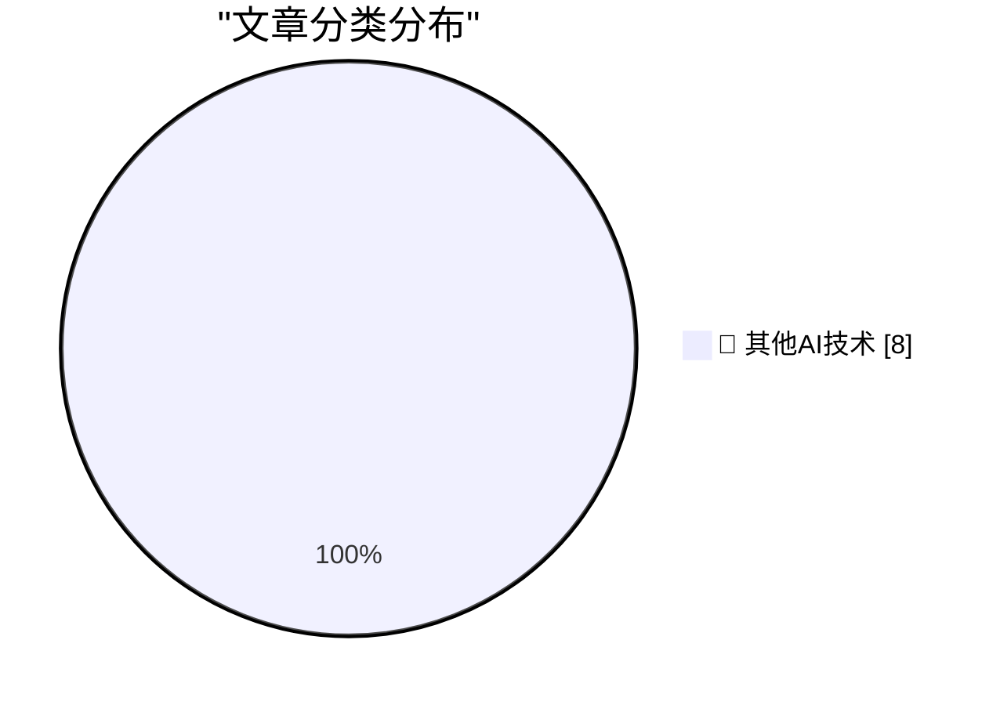

# 📰 AI 博客每日精选 — 2026-06-11

> 来自 98 个技术博客和社交媒体源，AI 精选 Top 8

## 🏆 今日必读

🥇 **Apple: ‘Due to DMA, Siri AI Delayed in EU for iOS 27 and iPadOS 27’**

[Apple: ‘Due to DMA, Siri AI Delayed in EU for iOS 27 and iPadOS 27’](https://www.apple.com/newsroom/2026/06/due-to-dma-siri-ai-delayed-in-eu-for-ios-27-and-ipados-27/) — daringfireball.net · 51 分钟前 · 🔬 其他AI技术

> Apple: ‘Due to DMA, Siri AI Delayed in EU for iOS 27 and iPadOS 27’

🥈 **Spielberg on Being Repeatedly Turned Down to Direct a James Bond Film**

[Spielberg on Being Repeatedly Turned Down to Direct a James Bond Film](https://www.youtube.com/watch?v=iEho3brGB64) — daringfireball.net · 2 小时前 · 🔬 其他AI技术

> Spielberg on Being Repeatedly Turned Down to Direct a James Bond Film

🥉 **Craig Federighi Details Apple’s Collaboration With Google for Siri AI — Live, on Stage**

[Craig Federighi Details Apple’s Collaboration With Google for Siri AI — Live, on Stage](https://9to5mac.com/2026/06/08/craig-federighi-details-apples-collaboration-with-google-for-siri-ai-in-ios-27/) — daringfireball.net · 22 小时前 · 🔬 其他AI技术

> Craig Federighi Details Apple’s Collaboration With Google for Siri AI — Live, on Stage

4️⃣ **★ Sweet Jeebus, MacOS 27 Golden Gate Removes the Dumb Icons From Menu Items**

[★ Sweet Jeebus, MacOS 27 Golden Gate Removes the Dumb Icons From Menu Items](https://daringfireball.net/2026/06/macos_27_golden_gate_removes_the_dumb_icons_from_menu_items) — daringfireball.net · 22 小时前 · 🔬 其他AI技术

> ★ Sweet Jeebus, MacOS 27 Golden Gate Removes the Dumb Icons From Menu Items

5️⃣ **Pluralistic: The world has moved on (11 Jun 2026)**

[Pluralistic: The world has moved on (11 Jun 2026)](https://pluralistic.net/2026/06/11/lapsarianism/) — pluralistic.net · 8 小时前 · 🔬 其他AI技术

> Pluralistic: The world has moved on (11 Jun 2026)

---

## 📊 数据概览

| 扫描源 | 抓取文章 | 时间范围 | 精选 |
|:---:|:---:|:---:|:---:|
| 63/98 | 1933 篇 → 8 篇 | 24h | **8 篇** |

### 分类分布

---

====================

## 🔬 其他AI技术

### 1. Apple: ‘Due to DMA, Siri AI Delayed in EU for iOS 27 and iPadOS 27’

[Apple: ‘Due to DMA, Siri AI Delayed in EU for iOS 27 and iPadOS 27’](https://www.apple.com/newsroom/2026/06/due-to-dma-siri-ai-delayed-in-eu-for-ios-27-and-ipados-27/) — **daringfireball.net** · 51 分钟前 · ⭐ 15/25

> Apple: ‘Due to DMA, Siri AI Delayed in EU for iOS 27 and iPadOS 27’

📌 其他AI技术

---

### 2. Spielberg on Being Repeatedly Turned Down to Direct a James Bond Film

[Spielberg on Being Repeatedly Turned Down to Direct a James Bond Film](https://www.youtube.com/watch?v=iEho3brGB64) — **daringfireball.net** · 2 小时前 · ⭐ 15/25

> Spielberg on Being Repeatedly Turned Down to Direct a James Bond Film

📌 其他AI技术

---

### 3. Craig Federighi Details Apple’s Collaboration With Google for Siri AI — Live, on Stage

[Craig Federighi Details Apple’s Collaboration With Google for Siri AI — Live, on Stage](https://9to5mac.com/2026/06/08/craig-federighi-details-apples-collaboration-with-google-for-siri-ai-in-ios-27/) — **daringfireball.net** · 22 小时前 · ⭐ 15/25

> Craig Federighi Details Apple’s Collaboration With Google for Siri AI — Live, on Stage

📌 其他AI技术

---

### 4. ★ Sweet Jeebus, MacOS 27 Golden Gate Removes the Dumb Icons From Menu Items

[★ Sweet Jeebus, MacOS 27 Golden Gate Removes the Dumb Icons From Menu Items](https://daringfireball.net/2026/06/macos_27_golden_gate_removes_the_dumb_icons_from_menu_items) — **daringfireball.net** · 22 小时前 · ⭐ 15/25

> ★ Sweet Jeebus, MacOS 27 Golden Gate Removes the Dumb Icons From Menu Items

📌 其他AI技术

---

### 5. Pluralistic: The world has moved on (11 Jun 2026)

[Pluralistic: The world has moved on (11 Jun 2026)](https://pluralistic.net/2026/06/11/lapsarianism/) — **pluralistic.net** · 8 小时前 · ⭐ 15/25

> Pluralistic: The world has moved on (11 Jun 2026)

📌 其他AI技术

---

### 6. What Happened to tea.xyz

[What Happened to tea.xyz](https://nesbitt.io/2026/06/11/what-happened-to-tea.html) — **nesbitt.io** · 12 小时前 · ⭐ 15/25

> What Happened to tea.xyz

📌 其他AI技术

---

### 7. The failed 3Com and US Robotics merger

[The failed 3Com and US Robotics merger](https://dfarq.homeip.net/the-failed-3com-and-us-robotics-merger/?utm_source=rss&#038;utm_medium=rss&#038;utm_campaign=the-failed-3com-and-us-robotics-merger) — **dfarq.homeip.net** · 11 小时前 · ⭐ 15/25

> The failed 3Com and US Robotics merger

📌 其他AI技术

---

### 8. Hacking Google with A.I. for $500,000

[Hacking Google with A.I. for $500,000](https://brutecat.com/articles/hacking-google-with-ai) — **brutecat.com** · 22 小时前 · ⭐ 15/25

> Hacking Google with A.I. for $500,000

📌 其他AI技术

---

====================

*生成于 2026-06-11 22:49 | 扫描 63 源 → 获取 1933 篇 → 精选 8 篇*
*基于 [Hacker News Popularity Contest 2025](https://refactoringenglish.com/tools/hn-popularity/) RSS 源列表，由 [Andrej Karpathy](https://x.com/karpathy) 推荐*
*由「懂点儿AI」制作，欢迎关注同名微信公众号获取更多 AI 实用技巧 💡*
