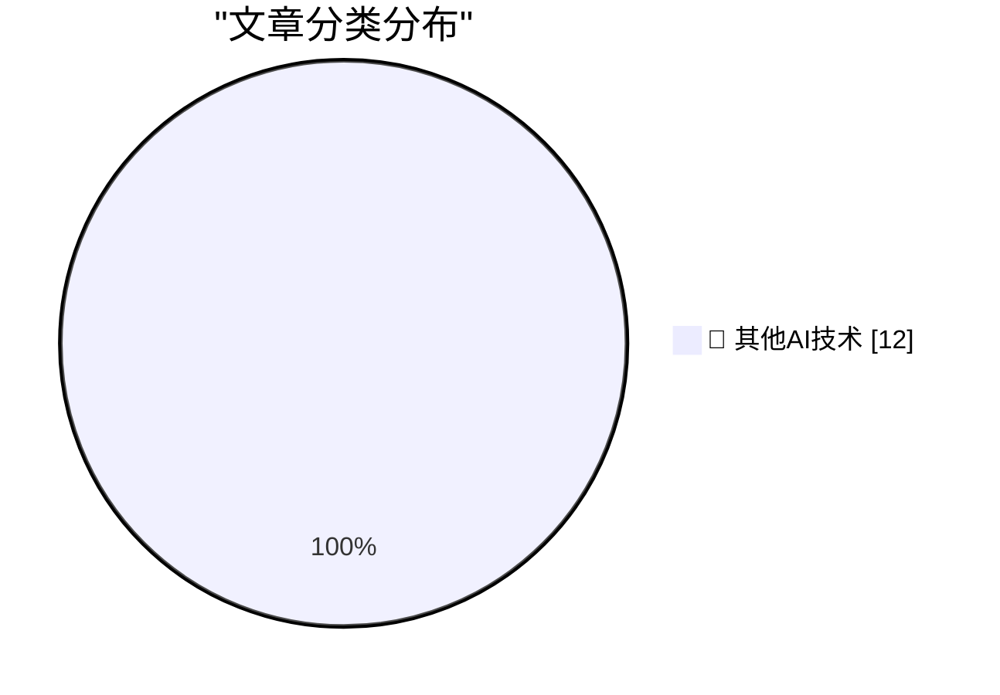

# 📰 AI 博客每日精选 — 2026-06-12

> 来自 98 个技术博客和社交媒体源，AI 精选 Top 12

## 🏆 今日必读

🥇 **You can finally power on a Mac remotely**

[You can finally power on a Mac remotely](https://www.jeffgeerling.com/blog/2026/power-on-your-mac-remotely/) — jeffgeerling.com · 8 小时前 · 🔬 其他AI技术

> You can finally power on a Mac remotely

🥈 **The WWDC 2026 Keynote and State of the Union on YouTube**

[The WWDC 2026 Keynote and State of the Union on YouTube](https://www.youtube.com/watch?v=hF8swzNR1-o) — daringfireball.net · 4 小时前 · 🔬 其他AI技术

> The WWDC 2026 Keynote and State of the Union on YouTube

🥉 **The European Commission Response to Siri AI and the DMA**

[The European Commission Response to Siri AI and the DMA](https://www.linkedin.com/posts/thomas-regnier-24a05810b_what-is-the-true-story-behind-apples-decision-activity-7470439874664280064-TuEt) — daringfireball.net · 5 小时前 · 🔬 其他AI技术

> The European Commission Response to Siri AI and the DMA

4️⃣ **I can never fully embrace LLMs for code**

[I can never fully embrace LLMs for code](https://idiallo.com/blog/i-can-never-embrace-llms-to-write-code) — idiallo.com · 10 小时前 · 🔬 其他AI技术

> I can never fully embrace LLMs for code

5️⃣ **Pluralistic: Google's new remote attestation scheme is every bit as terrible as its old remote attestation scheme (12 Jun 2026)**

[Pluralistic: Google's new remote attestation scheme is every bit as terrible as its old remote attestation scheme (12 Jun 2026)](https://pluralistic.net/2026/06/12/compelled-speech/) — pluralistic.net · 1 小时前 · 🔬 其他AI技术

> Pluralistic: Google's new remote attestation scheme is every bit as terrible as its old remote attestation scheme (12 Jun 2026)

---

## 📊 数据概览

| 扫描源 | 抓取文章 | 时间范围 | 精选 |
|:---:|:---:|:---:|:---:|
| 62/98 | 1921 篇 → 12 篇 | 24h | **12 篇** |

### 分类分布

---

====================

## 🔬 其他AI技术

### 1. You can finally power on a Mac remotely

[You can finally power on a Mac remotely](https://www.jeffgeerling.com/blog/2026/power-on-your-mac-remotely/) — **jeffgeerling.com** · 8 小时前 · ⭐ 15/25

> You can finally power on a Mac remotely

📌 其他AI技术

---

### 2. The WWDC 2026 Keynote and State of the Union on YouTube

[The WWDC 2026 Keynote and State of the Union on YouTube](https://www.youtube.com/watch?v=hF8swzNR1-o) — **daringfireball.net** · 4 小时前 · ⭐ 15/25

> The WWDC 2026 Keynote and State of the Union on YouTube

📌 其他AI技术

---

### 3. The European Commission Response to Siri AI and the DMA

[The European Commission Response to Siri AI and the DMA](https://www.linkedin.com/posts/thomas-regnier-24a05810b_what-is-the-true-story-behind-apples-decision-activity-7470439874664280064-TuEt) — **daringfireball.net** · 5 小时前 · ⭐ 15/25

> The European Commission Response to Siri AI and the DMA

📌 其他AI技术

---

### 4. I can never fully embrace LLMs for code

[I can never fully embrace LLMs for code](https://idiallo.com/blog/i-can-never-embrace-llms-to-write-code) — **idiallo.com** · 10 小时前 · ⭐ 15/25

> I can never fully embrace LLMs for code

📌 其他AI技术

---

### 5. Pluralistic: Google's new remote attestation scheme is every bit as terrible as its old remote attestation scheme (12 Jun 2026)

[Pluralistic: Google's new remote attestation scheme is every bit as terrible as its old remote attestation scheme (12 Jun 2026)](https://pluralistic.net/2026/06/12/compelled-speech/) — **pluralistic.net** · 1 小时前 · ⭐ 15/25

> Pluralistic: Google's new remote attestation scheme is every bit as terrible as its old remote attestation scheme (12 Jun 2026)

📌 其他AI技术

---

### 6. Gadget Review: TP Link EH210 Ethernet Splitter (USB-C) ★★★★★

[Gadget Review: TP Link EH210 Ethernet Splitter (USB-C) ★★★★★](https://shkspr.mobi/blog/2026/06/gadget-review-tp-link-eh210-ethernet-splitter-usb-c/) — **shkspr.mobi** · 10 小时前 · ⭐ 15/25

> Gadget Review: TP Link EH210 Ethernet Splitter (USB-C) ★★★★★

📌 其他AI技术

---

### 7. Why are cached input tokens cheaper with AI services?

[Why are cached input tokens cheaper with AI services?](https://xeiaso.net/notes/2026/why-llm-cached-token-cheaper/) — **xeiaso.net** · 22 小时前 · ⭐ 15/25

> Why are cached input tokens cheaper with AI services?

📌 其他AI技术

---

### 8. Joint Guidance on Vulnerability Naming and Disclosure

[Joint Guidance on Vulnerability Naming and Disclosure](https://nesbitt.io/2026/06/12/joint-guidance-on-vulnerability-naming-and-disclosure.html) — **nesbitt.io** · 12 小时前 · ⭐ 15/25

> Joint Guidance on Vulnerability Naming and Disclosure

📌 其他AI技术

---

### 9. Premium: The Silicon Valley Bubble (Part 1)

[Premium: The Silicon Valley Bubble (Part 1)](https://www.wheresyoured.at/premium-the-silicon-valley-bubble-part-1/) — **wheresyoured.at** · 5 小时前 · ⭐ 15/25

> Premium: The Silicon Valley Bubble (Part 1)

📌 其他AI技术

---

### 10. This Week on The Analog Antiquarian

[This Week on The Analog Antiquarian](https://www.filfre.net/2026/06/this-week-on-the-analog-antiquarian/) — **filfre.net** · 5 小时前 · ⭐ 15/25

> This Week on The Analog Antiquarian

📌 其他AI技术

---

### 11. Intel’s Pentium FDIV bug and recall

[Intel’s Pentium FDIV bug and recall](https://dfarq.homeip.net/the-pentium-fdiv-bug-and-recall/?utm_source=rss&#038;utm_medium=rss&#038;utm_campaign=the-pentium-fdiv-bug-and-recall) — **dfarq.homeip.net** · 11 小时前 · ⭐ 15/25

> Intel’s Pentium FDIV bug and recall

📌 其他AI技术

---

### 12. I Am Not a Reverse Centaur

[I Am Not a Reverse Centaur](https://blog.miguelgrinberg.com/post/i-am-not-a-reverse-centaur) — **miguelgrinberg.com** · 13 小时前 · ⭐ 15/25

> I Am Not a Reverse Centaur

📌 其他AI技术

---

====================

*生成于 2026-06-12 22:23 | 扫描 62 源 → 获取 1921 篇 → 精选 12 篇*
*基于 [Hacker News Popularity Contest 2025](https://refactoringenglish.com/tools/hn-popularity/) RSS 源列表，由 [Andrej Karpathy](https://x.com/karpathy) 推荐*
*由「懂点儿AI」制作，欢迎关注同名微信公众号获取更多 AI 实用技巧 💡*
