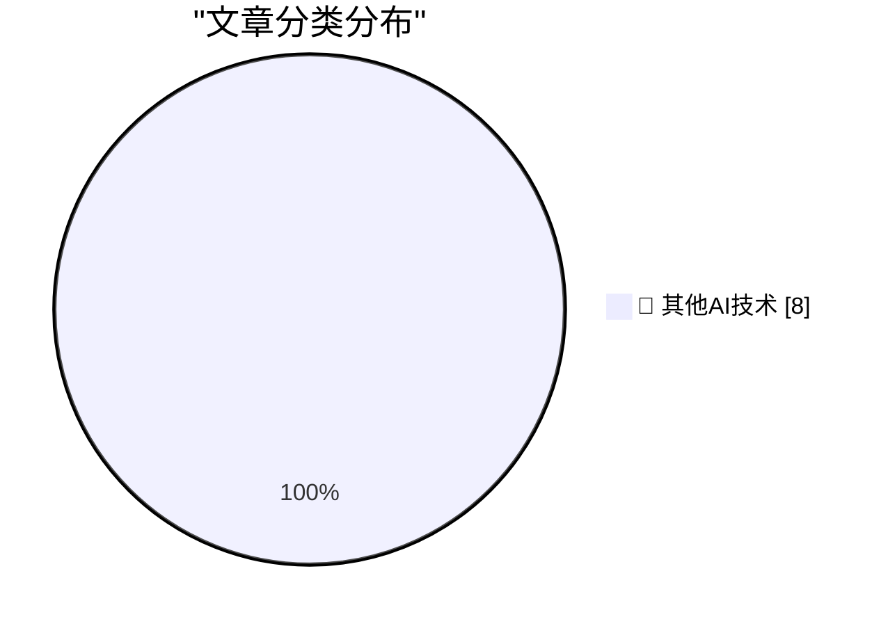

# 📰 AI 博客每日精选 — 2026-06-13

> 来自 98 个技术博客和社交媒体源，AI 精选 Top 8

## 🏆 今日必读

🥇 **Trump’s Name (Set in the Wrong Font, of Course) Has Been Removed From the Kennedy Center**

[Trump’s Name (Set in the Wrong Font, of Course) Has Been Removed From the Kennedy Center](https://apple.news/ANLNtQOeuSkiJ35tzkYw9oA) — daringfireball.net · 4 小时前 · 🔬 其他AI技术

> Trump’s Name (Set in the Wrong Font, of Course) Has Been Removed From the Kennedy Center

🥈 **Apple’s Private Cloud Compute Is Severely Limited for Third-Party Developers**

[Apple’s Private Cloud Compute Is Severely Limited for Third-Party Developers](https://developer.apple.com/private-cloud-compute/) — daringfireball.net · 4 小时前 · 🔬 其他AI技术

> Apple’s Private Cloud Compute Is Severely Limited for Third-Party Developers

🥉 **U.S. Government Directs Anthropic to Shut Down Fable 5 and Mythos 5 Models on National Security Grounds**

[U.S. Government Directs Anthropic to Shut Down Fable 5 and Mythos 5 Models on National Security Grounds](https://www.anthropic.com/news/fable-mythos-access) — daringfireball.net · 4 小时前 · 🔬 其他AI技术

> U.S. Government Directs Anthropic to Shut Down Fable 5 and Mythos 5 Models on National Security Grounds

4️⃣ **★ The Talk Show: Live From WWDC 2026**

[★ The Talk Show: Live From WWDC 2026](https://daringfireball.net/2026/06/the_talk_show_live_from_wwdc_2026) — daringfireball.net · 22 小时前 · 🔬 其他AI技术

> ★ The Talk Show: Live From WWDC 2026

5️⃣ **Pluralistic: Shareholder supremacy and the precog CEO (13 Jun 2026)**

[Pluralistic: Shareholder supremacy and the precog CEO (13 Jun 2026)](https://pluralistic.net/2026/06/13/minority-shareholder-report/) — pluralistic.net · 4 小时前 · 🔬 其他AI技术

> Pluralistic: Shareholder supremacy and the precog CEO (13 Jun 2026)

---

## 📊 数据概览

| 扫描源 | 抓取文章 | 时间范围 | 精选 |
|:---:|:---:|:---:|:---:|
| 60/98 | 1872 篇 → 8 篇 | 24h | **8 篇** |

### 分类分布

---

====================

## 🔬 其他AI技术

### 1. Trump’s Name (Set in the Wrong Font, of Course) Has Been Removed From the Kennedy Center

[Trump’s Name (Set in the Wrong Font, of Course) Has Been Removed From the Kennedy Center](https://apple.news/ANLNtQOeuSkiJ35tzkYw9oA) — **daringfireball.net** · 4 小时前 · ⭐ 15/25

> Trump’s Name (Set in the Wrong Font, of Course) Has Been Removed From the Kennedy Center

📌 其他AI技术

---

### 2. Apple’s Private Cloud Compute Is Severely Limited for Third-Party Developers

[Apple’s Private Cloud Compute Is Severely Limited for Third-Party Developers](https://developer.apple.com/private-cloud-compute/) — **daringfireball.net** · 4 小时前 · ⭐ 15/25

> Apple’s Private Cloud Compute Is Severely Limited for Third-Party Developers

📌 其他AI技术

---

### 3. U.S. Government Directs Anthropic to Shut Down Fable 5 and Mythos 5 Models on National Security Grounds

[U.S. Government Directs Anthropic to Shut Down Fable 5 and Mythos 5 Models on National Security Grounds](https://www.anthropic.com/news/fable-mythos-access) — **daringfireball.net** · 4 小时前 · ⭐ 15/25

> U.S. Government Directs Anthropic to Shut Down Fable 5 and Mythos 5 Models on National Security Grounds

📌 其他AI技术

---

### 4. ★ The Talk Show: Live From WWDC 2026

[★ The Talk Show: Live From WWDC 2026](https://daringfireball.net/2026/06/the_talk_show_live_from_wwdc_2026) — **daringfireball.net** · 22 小时前 · ⭐ 15/25

> ★ The Talk Show: Live From WWDC 2026

📌 其他AI技术

---

### 5. Pluralistic: Shareholder supremacy and the precog CEO (13 Jun 2026)

[Pluralistic: Shareholder supremacy and the precog CEO (13 Jun 2026)](https://pluralistic.net/2026/06/13/minority-shareholder-report/) — **pluralistic.net** · 4 小时前 · ⭐ 15/25

> Pluralistic: Shareholder supremacy and the precog CEO (13 Jun 2026)

📌 其他AI技术

---

### 6. Dangerous Technology For Americans Only

[Dangerous Technology For Americans Only](https://lucumr.pocoo.org/2026/6/13/americans-only/) — **lucumr.pocoo.org** · 22 小时前 · ⭐ 15/25

> Dangerous Technology For Americans Only

📌 其他AI技术

---

### 7. This Week in Package Management: 13 June 2026

[This Week in Package Management: 13 June 2026](https://nesbitt.io/2026/06/13/this-week-in-package-management.html) — **nesbitt.io** · 12 小时前 · ⭐ 15/25

> This Week in Package Management: 13 June 2026

📌 其他AI技术

---

### 8. Human Routers of Machine Words

[Human Routers of Machine Words](https://borretti.me/article/human-routers-of-machine-words) — **borretti.me** · 22 小时前 · ⭐ 15/25

> Human Routers of Machine Words

📌 其他AI技术

---

====================

*生成于 2026-06-13 22:01 | 扫描 60 源 → 获取 1872 篇 → 精选 8 篇*
*基于 [Hacker News Popularity Contest 2025](https://refactoringenglish.com/tools/hn-popularity/) RSS 源列表，由 [Andrej Karpathy](https://x.com/karpathy) 推荐*
*由「懂点儿AI」制作，欢迎关注同名微信公众号获取更多 AI 实用技巧 💡*
