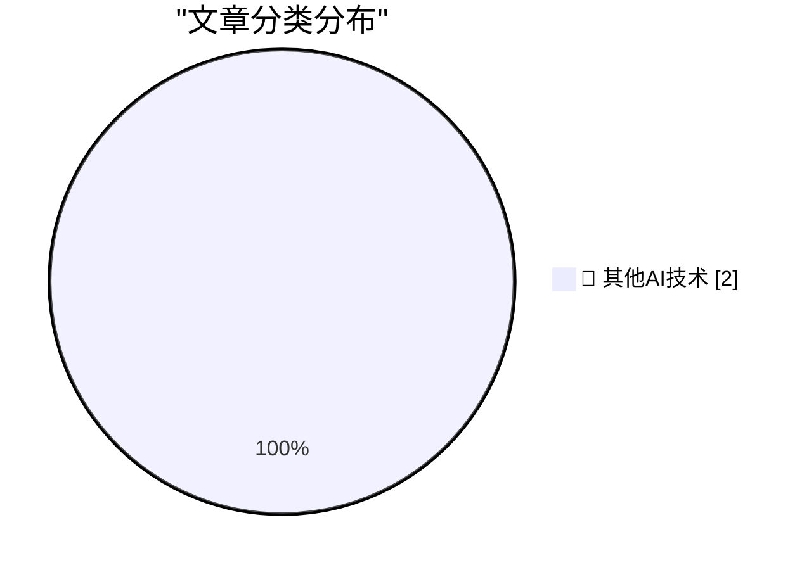

# 📰 AI 博客每日精选 — 2026-06-14

> 来自 98 个技术博客和社交媒体源，AI 精选 Top 2

## 📊 数据概览

| 扫描源 | 抓取文章 | 时间范围 | 精选 |
|:---:|:---:|:---:|:---:|
| 63/98 | 1933 篇 → 2 篇 | 24h | **2 篇** |

### 分类分布

---

====================

## 🔬 其他AI技术

### 1. Did Frank Sinatra really think "Something" was a Lennon/McCartney song?

[Did Frank Sinatra really think "Something" was a Lennon/McCartney song?](https://shkspr.mobi/blog/2026/06/did-frank-sinatra-really-think-something-was-a-lennon-mccartney-song/) — **shkspr.mobi** · 10 小时前 · ⭐ 15/25

> Did Frank Sinatra really think "Something" was a Lennon/McCartney song?

📌 其他AI技术

---

### 2. Plugins case study: Pluggy

[Plugins case study: Pluggy](https://eli.thegreenplace.net/2026/plugins-case-study-pluggy/) — **eli.thegreenplace.net** · 18 小时前 · ⭐ 15/25

> Plugins case study: Pluggy

📌 其他AI技术

---

====================

*生成于 2026-06-14 22:07 | 扫描 63 源 → 获取 1933 篇 → 精选 2 篇*
*基于 [Hacker News Popularity Contest 2025](https://refactoringenglish.com/tools/hn-popularity/) RSS 源列表，由 [Andrej Karpathy](https://x.com/karpathy) 推荐*
*由「懂点儿AI」制作，欢迎关注同名微信公众号获取更多 AI 实用技巧 💡*
