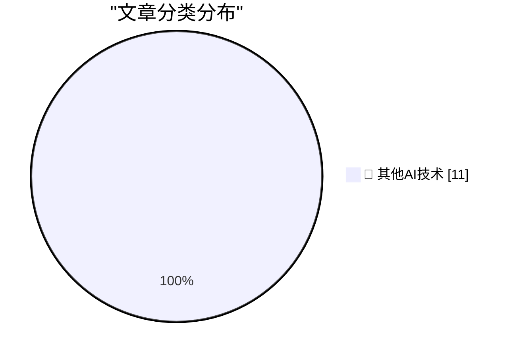

# 📰 AI 博客每日精选 — 2026-06-15

> 来自 98 个技术博客和社交媒体源，AI 精选 Top 11

## 🏆 今日必读

🥇 **AI GPUs probably live longer than three years**

[AI GPUs probably live longer than three years](https://seangoedecke.com/ai-gpus-live-longer-than-three-years/) — seangoedecke.com · 23 小时前 · 🔬 其他AI技术

> AI GPUs probably live longer than three years

🥈 **The European Commission Ruled Months Ago That Google’s Integration of Gemini in Android Violates the DMA**

[The European Commission Ruled Months Ago That Google’s Integration of Gemini in Android Violates the DMA](https://arstechnica.com/ai/2026/04/europe-could-force-google-to-open-android-to-other-ai-assistants/) — daringfireball.net · 4 小时前 · 🔬 其他AI技术

> The European Commission Ruled Months Ago That Google’s Integration of Gemini in Android Violates the DMA

🥉 **WorkOS Launches Auth.md — an Open Protocol for Agent Registration**

[WorkOS Launches Auth.md — an Open Protocol for Agent Registration](https://workos.com/auth-md?utm_source=daringfireball&amp;utm_medium=newsletter&amp;utm_campaign=q22026) — daringfireball.net · 5 小时前 · 🔬 其他AI技术

> WorkOS Launches Auth.md — an Open Protocol for Agent Registration

4️⃣ **‘Anthropic’s Safety Superpower’**

[‘Anthropic’s Safety Superpower’](https://stratechery.com/2026/anthropics-safety-superpower/) — daringfireball.net · 5 小时前 · 🔬 其他AI技术

> ‘Anthropic’s Safety Superpower’

5️⃣ **Pluralistic: AI and amateurism (15 Jun 2026)**

[Pluralistic: AI and amateurism (15 Jun 2026)](https://pluralistic.net/2026/06/15/vernacular/) — pluralistic.net · 7 小时前 · 🔬 其他AI技术

> Pluralistic: AI and amateurism (15 Jun 2026)

---

## 📊 数据概览

| 扫描源 | 抓取文章 | 时间范围 | 精选 |
|:---:|:---:|:---:|:---:|
| 62/98 | 1923 篇 → 11 篇 | 24h | **11 篇** |

### 分类分布

---

====================

## 🔬 其他AI技术

### 1. AI GPUs probably live longer than three years

[AI GPUs probably live longer than three years](https://seangoedecke.com/ai-gpus-live-longer-than-three-years/) — **seangoedecke.com** · 23 小时前 · ⭐ 15/25

> AI GPUs probably live longer than three years

📌 其他AI技术

---

### 2. The European Commission Ruled Months Ago That Google’s Integration of Gemini in Android Violates the DMA

[The European Commission Ruled Months Ago That Google’s Integration of Gemini in Android Violates the DMA](https://arstechnica.com/ai/2026/04/europe-could-force-google-to-open-android-to-other-ai-assistants/) — **daringfireball.net** · 4 小时前 · ⭐ 15/25

> The European Commission Ruled Months Ago That Google’s Integration of Gemini in Android Violates the DMA

📌 其他AI技术

---

### 3. WorkOS Launches Auth.md — an Open Protocol for Agent Registration

[WorkOS Launches Auth.md — an Open Protocol for Agent Registration](https://workos.com/auth-md?utm_source=daringfireball&amp;utm_medium=newsletter&amp;utm_campaign=q22026) — **daringfireball.net** · 5 小时前 · ⭐ 15/25

> WorkOS Launches Auth.md — an Open Protocol for Agent Registration

📌 其他AI技术

---

### 4. ‘Anthropic’s Safety Superpower’

[‘Anthropic’s Safety Superpower’](https://stratechery.com/2026/anthropics-safety-superpower/) — **daringfireball.net** · 5 小时前 · ⭐ 15/25

> ‘Anthropic’s Safety Superpower’

📌 其他AI技术

---

### 5. Pluralistic: AI and amateurism (15 Jun 2026)

[Pluralistic: AI and amateurism (15 Jun 2026)](https://pluralistic.net/2026/06/15/vernacular/) — **pluralistic.net** · 7 小时前 · ⭐ 15/25

> Pluralistic: AI and amateurism (15 Jun 2026)

📌 其他AI技术

---

### 6. [RSS Club] What happens to old posts?

[[RSS Club] What happens to old posts?](https://shkspr.mobi/blog/2026/06/rss-club-what-happens-to-old-posts/) — **shkspr.mobi** · 11 小时前 · ⭐ 15/25

> [RSS Club] What happens to old posts?

📌 其他AI技术

---

### 7. JAX: commitment issues

[JAX: commitment issues](https://www.gilesthomas.com/2026/06/jax-commitment-issues) — **gilesthomas.com** · 1 小时前 · ⭐ 15/25

> JAX: commitment issues

📌 其他AI技术

---

### 8. AI's Brokenomics

[AI's Brokenomics](https://www.wheresyoured.at/brokenomics/) — **wheresyoured.at** · 3 小时前 · ⭐ 15/25

> AI's Brokenomics

📌 其他AI技术

---

### 9. GIF’s June 1987 debut

[GIF’s June 1987 debut](https://dfarq.homeip.net/gifs-june-1987-debut/?utm_source=rss&#038;utm_medium=rss&#038;utm_campaign=gifs-june-1987-debut) — **dfarq.homeip.net** · 12 小时前 · ⭐ 15/25

> GIF’s June 1987 debut

📌 其他AI技术

---

### 10. EU & Civil Society need to progress on Digital Autonomy

[EU & Civil Society need to progress on Digital Autonomy](https://berthub.eu/articles/posts/eu-civil-society-need-progress-digital-autonomy/) — **berthub.eu** · 10 小时前 · ⭐ 15/25

> EU & Civil Society need to progress on Digital Autonomy

📌 其他AI技术

---

### 11. A brief history of KV cache compression developments

[A brief history of KV cache compression developments](https://martinalderson.com/posts/a-brief-history-of-kv-cache-compression-developments/?utm_source=rss&amp;utm_medium=rss&amp;utm_campaign=feed) — **martinalderson.com** · 23 小时前 · ⭐ 15/25

> A brief history of KV cache compression developments

📌 其他AI技术

---

====================

*生成于 2026-06-15 23:01 | 扫描 62 源 → 获取 1923 篇 → 精选 11 篇*
*基于 [Hacker News Popularity Contest 2025](https://refactoringenglish.com/tools/hn-popularity/) RSS 源列表，由 [Andrej Karpathy](https://x.com/karpathy) 推荐*
*由「懂点儿AI」制作，欢迎关注同名微信公众号获取更多 AI 实用技巧 💡*
