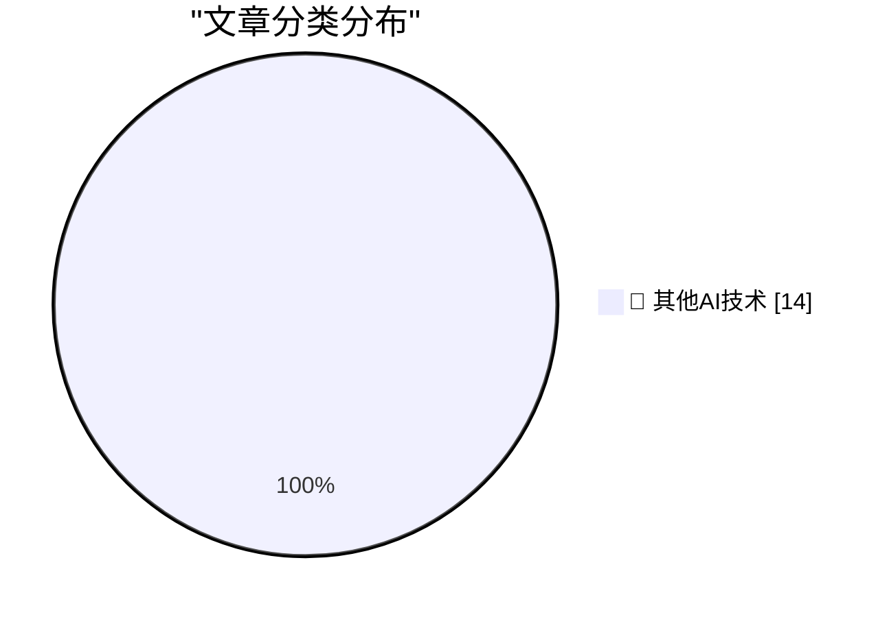

# 📰 AI 博客每日精选 — 2026-06-16

> 来自 98 个技术博客和社交媒体源，AI 精选 Top 14

## 🏆 今日必读

🥇 **New in the App Store: Personalized Recommendations**

[New in the App Store: Personalized Recommendations](https://techcrunch.com/2026/06/09/apples-app-store-rolls-out-personalized-recommendations/) — daringfireball.net · 6 小时前 · 🔬 其他AI技术

> New in the App Store: Personalized Recommendations

🥈 **[Sponsor] Mux — Video for Developers**

[[Sponsor] Mux — Video for Developers](https://www.mux.com/?utm_campaign=fireball&amp;utm_source=DF) — daringfireball.net · 20 小时前 · 🔬 其他AI技术

> [Sponsor] Mux — Video for Developers

🥉 **The Washington Post on the EU’s DMA Folly**

[The Washington Post on the EU’s DMA Folly](https://www.washingtonpost.com/opinions/2026/06/14/apple-withholding-siri-ai-europe-is-another-dma-failure/) — daringfireball.net · 20 小时前 · 🔬 其他AI技术

> The Washington Post on the EU’s DMA Folly

4️⃣ **Debugging on Prod**

[Debugging on Prod](https://idiallo.com/blog/debugging-on-prod) — idiallo.com · 2 小时前 · 🔬 其他AI技术

> Debugging on Prod

5️⃣ **Two Way TV - product photos of 1997's hottest gadget**

[Two Way TV - product photos of 1997's hottest gadget](https://shkspr.mobi/blog/2026/06/two-way-tv-product-photos-of-1997s-hottest-gadget/) — shkspr.mobi · 11 小时前 · 🔬 其他AI技术

> Two Way TV - product photos of 1997's hottest gadget

---

## 📊 数据概览

| 扫描源 | 抓取文章 | 时间范围 | 精选 |
|:---:|:---:|:---:|:---:|
| 64/98 | 1956 篇 → 14 篇 | 24h | **14 篇** |

### 分类分布

---

====================

## 🔬 其他AI技术

### 1. New in the App Store: Personalized Recommendations

[New in the App Store: Personalized Recommendations](https://techcrunch.com/2026/06/09/apples-app-store-rolls-out-personalized-recommendations/) — **daringfireball.net** · 6 小时前 · ⭐ 15/25

> New in the App Store: Personalized Recommendations

📌 其他AI技术

---

### 2. [Sponsor] Mux — Video for Developers

[[Sponsor] Mux — Video for Developers](https://www.mux.com/?utm_campaign=fireball&amp;utm_source=DF) — **daringfireball.net** · 20 小时前 · ⭐ 15/25

> [Sponsor] Mux — Video for Developers

📌 其他AI技术

---

### 3. The Washington Post on the EU’s DMA Folly

[The Washington Post on the EU’s DMA Folly](https://www.washingtonpost.com/opinions/2026/06/14/apple-withholding-siri-ai-europe-is-another-dma-failure/) — **daringfireball.net** · 20 小时前 · ⭐ 15/25

> The Washington Post on the EU’s DMA Folly

📌 其他AI技术

---

### 4. Debugging on Prod

[Debugging on Prod](https://idiallo.com/blog/debugging-on-prod) — **idiallo.com** · 2 小时前 · ⭐ 15/25

> Debugging on Prod

📌 其他AI技术

---

### 5. Two Way TV - product photos of 1997's hottest gadget

[Two Way TV - product photos of 1997's hottest gadget](https://shkspr.mobi/blog/2026/06/two-way-tv-product-photos-of-1997s-hottest-gadget/) — **shkspr.mobi** · 11 小时前 · ⭐ 15/25

> Two Way TV - product photos of 1997's hottest gadget

📌 其他AI技术

---

### 6. Would you like a drainer served at the very top of DuckDuckGo?

[Would you like a drainer served at the very top of DuckDuckGo?](https://timsh.org/drainer-at-the-top-of-duckduckgo/) — **timsh.org** · 9 小时前 · ⭐ 15/25

> Would you like a drainer served at the very top of DuckDuckGo?

📌 其他AI技术

---

### 7. 10Gb/s Ethernet: switching to a Broadcom SFP+ module

[10Gb/s Ethernet: switching to a Broadcom SFP+ module](https://www.gilesthomas.com/2026/06/10g-ethernet-switching-to-broadcom-sfp-plus) — **gilesthomas.com** · 4 小时前 · ⭐ 15/25

> 10Gb/s Ethernet: switching to a Broadcom SFP+ module

📌 其他AI技术

---

### 8. How Open Source Projects Change Hands

[How Open Source Projects Change Hands](https://nesbitt.io/2026/06/16/how-open-source-projects-change-hands.html) — **nesbitt.io** · 12 小时前 · ⭐ 15/25

> How Open Source Projects Change Hands

📌 其他AI技术

---

### 9. Ada Palmer – Machiavelli is the most misunderstood thinker of all time

[Ada Palmer – Machiavelli is the most misunderstood thinker of all time](https://www.dwarkesh.com/p/ada-palmer-2) — **dwarkesh.com** · 5 小时前 · ⭐ 15/25

> Ada Palmer – Machiavelli is the most misunderstood thinker of all time

📌 其他AI技术

---

### 10. Exclusive: OpenAI Losses Increased Nearly 8X in 2025, With Spending Hitting $34 Billion

[Exclusive: OpenAI Losses Increased Nearly 8X in 2025, With Spending Hitting $34 Billion](https://www.wheresyoured.at/exclusive-openai-financials/) — **wheresyoured.at** · 18 小时前 · ⭐ 15/25

> Exclusive: OpenAI Losses Increased Nearly 8X in 2025, With Spending Hitting $34 Billion

📌 其他AI技术

---

### 11. Apple Disk II launched June 1978

[Apple Disk II launched June 1978](https://dfarq.homeip.net/apple-disk-ii-launched-june-1978/?utm_source=rss&#038;utm_medium=rss&#038;utm_campaign=apple-disk-ii-launched-june-1978) — **dfarq.homeip.net** · 11 小时前 · ⭐ 15/25

> Apple Disk II launched June 1978

📌 其他AI技术

---

### 12. Do not invite big-tech to join your digital autonomy discussion

[Do not invite big-tech to join your digital autonomy discussion](https://berthub.eu/articles/posts/do-not-invite-big-tech-to-your-digital-autonomy-discussion/) — **berthub.eu** · 6 小时前 · ⭐ 15/25

> Do not invite big-tech to join your digital autonomy discussion

📌 其他AI技术

---

### 13. Lean Launch Pad 2026 @ Stanford – Lessons Learned Presentations

[Lean Launch Pad 2026 @ Stanford – Lessons Learned Presentations](https://steveblank.com/2026/06/16/lean-launch-pad-2026-stanford-lessons-learned-presentations/) — **steveblank.com** · 9 小时前 · ⭐ 15/25

> Lean Launch Pad 2026 @ Stanford – Lessons Learned Presentations

📌 其他AI技术

---

### 14. Key, in sight

[Key, in sight](https://aresluna.org/key-in-sight) — **aresluna.org** · 4 小时前 · ⭐ 15/25

> Key, in sight

📌 其他AI技术

---

====================

*生成于 2026-06-16 22:52 | 扫描 64 源 → 获取 1956 篇 → 精选 14 篇*
*基于 [Hacker News Popularity Contest 2025](https://refactoringenglish.com/tools/hn-popularity/) RSS 源列表，由 [Andrej Karpathy](https://x.com/karpathy) 推荐*
*由「懂点儿AI」制作，欢迎关注同名微信公众号获取更多 AI 实用技巧 💡*
