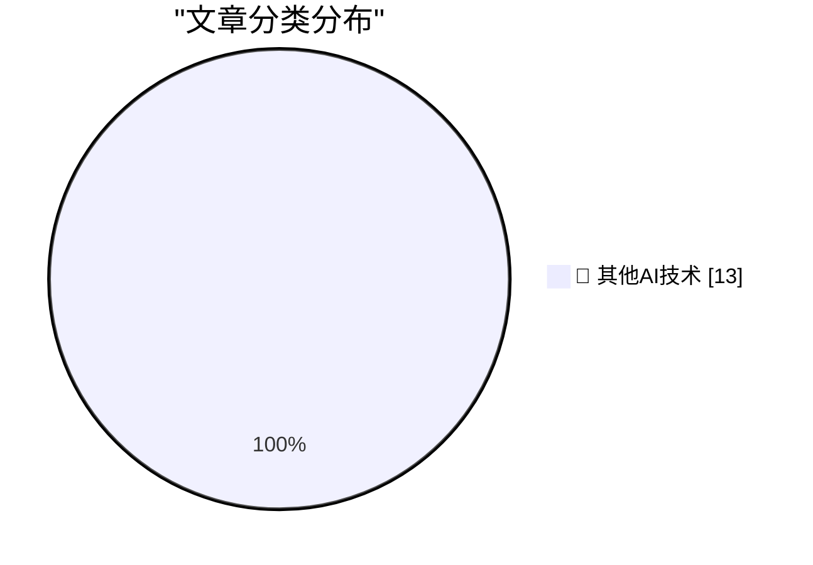

# 📰 AI 博客每日精选 — 2026-06-19

> 来自 98 个技术博客和社交媒体源，AI 精选 Top 13

## 🏆 今日必读

🥇 **Trump Mobile T1 Phone Is a Gold-Painted Two-Year-Old HTC U24 Pro**

[Trump Mobile T1 Phone Is a Gold-Painted Two-Year-Old HTC U24 Pro](https://www.nbcnews.com/tech/gadgets/trump-mobile-t1-phone-nearly-identical-htc-device-analysis-rcna349293) — daringfireball.net · 3 小时前 · 🔬 其他AI技术

> Trump Mobile T1 Phone Is a Gold-Painted Two-Year-Old HTC U24 Pro

🥈 **Fox to Buy Roku Streaming Service in $25 Billion Deal**

[Fox to Buy Roku Streaming Service in $25 Billion Deal](https://www.wsj.com/business/deals/fox-roku-deal-f6e564f9?st=mKdQwC&amp;reflink=desktopwebshare_permalink) — daringfireball.net · 3 小时前 · 🔬 其他AI技术

> Fox to Buy Roku Streaming Service in $25 Billion Deal

🥉 **Snap Launches Ad Campaign for Specs Starring Michael Caine**

[Snap Launches Ad Campaign for Specs Starring Michael Caine](https://www.reddit.com/r/funny/comments/1jk6onr/bloody_large_glasses_by_michael_caine/) — daringfireball.net · 5 小时前 · 🔬 其他AI技术

> Snap Launches Ad Campaign for Specs Starring Michael Caine

4️⃣ **Jerry Seinfeld Tries Out Snap’s Specs**

[Jerry Seinfeld Tries Out Snap’s Specs](https://youtu.be/siM8NW24QPs?t=217) — daringfireball.net · 5 小时前 · 🔬 其他AI技术

> Jerry Seinfeld Tries Out Snap’s Specs

5️⃣ **Domino’s Admitted Their Pizza Tasted Like Cardboard**

[Domino’s Admitted Their Pizza Tasted Like Cardboard](https://www.inc.com/jeff-haden/10-years-ago-cardboard-pizza-almost-killed-dominos-then-dominos-did-something-brilliant.html) — daringfireball.net · 6 小时前 · 🔬 其他AI技术

> Domino’s Admitted Their Pizza Tasted Like Cardboard

---

## 📊 数据概览

| 扫描源 | 抓取文章 | 时间范围 | 精选 |
|:---:|:---:|:---:|:---:|
| 64/98 | 1958 篇 → 13 篇 | 24h | **13 篇** |

### 分类分布

---

====================

## 🔬 其他AI技术

### 1. Trump Mobile T1 Phone Is a Gold-Painted Two-Year-Old HTC U24 Pro

[Trump Mobile T1 Phone Is a Gold-Painted Two-Year-Old HTC U24 Pro](https://www.nbcnews.com/tech/gadgets/trump-mobile-t1-phone-nearly-identical-htc-device-analysis-rcna349293) — **daringfireball.net** · 3 小时前 · ⭐ 15/25

> Trump Mobile T1 Phone Is a Gold-Painted Two-Year-Old HTC U24 Pro

📌 其他AI技术

---

### 2. Fox to Buy Roku Streaming Service in $25 Billion Deal

[Fox to Buy Roku Streaming Service in $25 Billion Deal](https://www.wsj.com/business/deals/fox-roku-deal-f6e564f9?st=mKdQwC&amp;reflink=desktopwebshare_permalink) — **daringfireball.net** · 3 小时前 · ⭐ 15/25

> Fox to Buy Roku Streaming Service in $25 Billion Deal

📌 其他AI技术

---

### 3. Snap Launches Ad Campaign for Specs Starring Michael Caine

[Snap Launches Ad Campaign for Specs Starring Michael Caine](https://www.reddit.com/r/funny/comments/1jk6onr/bloody_large_glasses_by_michael_caine/) — **daringfireball.net** · 5 小时前 · ⭐ 15/25

> Snap Launches Ad Campaign for Specs Starring Michael Caine

📌 其他AI技术

---

### 4. Jerry Seinfeld Tries Out Snap’s Specs

[Jerry Seinfeld Tries Out Snap’s Specs](https://youtu.be/siM8NW24QPs?t=217) — **daringfireball.net** · 5 小时前 · ⭐ 15/25

> Jerry Seinfeld Tries Out Snap’s Specs

📌 其他AI技术

---

### 5. Domino’s Admitted Their Pizza Tasted Like Cardboard

[Domino’s Admitted Their Pizza Tasted Like Cardboard](https://www.inc.com/jeff-haden/10-years-ago-cardboard-pizza-almost-killed-dominos-then-dominos-did-something-brilliant.html) — **daringfireball.net** · 6 小时前 · ⭐ 15/25

> Domino’s Admitted Their Pizza Tasted Like Cardboard

📌 其他AI技术

---

### 6. Verizon, Formerly Menace Mobile

[Verizon, Formerly Menace Mobile](https://www.youtube.com/watch?v=lzmntndEXWo) — **daringfireball.net** · 21 小时前 · ⭐ 15/25

> Verizon, Formerly Menace Mobile

📌 其他AI技术

---

### 7. Pluralistic: The Big Con (19 Jun 2026)

[Pluralistic: The Big Con (19 Jun 2026)](https://pluralistic.net/2026/06/19/too-big-to-fact-check/) — **pluralistic.net** · 1 小时前 · ⭐ 15/25

> Pluralistic: The Big Con (19 Jun 2026)

📌 其他AI技术

---

### 8. There Are No Instances in atproto

[There Are No Instances in atproto](https://overreacted.io/there-are-no-instances-in-atproto/) — **overreacted.io** · 22 小时前 · ⭐ 15/25

> There Are No Instances in atproto

📌 其他AI技术

---

### 9. The data black hole at the center of AI

[The data black hole at the center of AI](https://www.dwarkesh.com/p/the-sample-efficiency-black-hole-2) — **dwarkesh.com** · 5 小时前 · ⭐ 15/25

> The data black hole at the center of AI

📌 其他AI技术

---

### 10. Premium: The Silicon Valley Bubble (Part 2)

[Premium: The Silicon Valley Bubble (Part 2)](https://www.wheresyoured.at/premium-the-silicon-valley-bubble-part-2/) — **wheresyoured.at** · 4 小时前 · ⭐ 15/25

> Premium: The Silicon Valley Bubble (Part 2)

📌 其他AI技术

---

### 11. The Goldilocks Principle in Fantasy Strategy

[The Goldilocks Principle in Fantasy Strategy](https://www.filfre.net/2026/06/the-goldilocks-principle-in-fantasy-strategy/) — **filfre.net** · 6 小时前 · ⭐ 15/25

> The Goldilocks Principle in Fantasy Strategy

📌 其他AI技术

---

### 12. Full Page Paralysis

[Full Page Paralysis](https://blog.jim-nielsen.com/2026/full-page-paralysis/) — **blog.jim-nielsen.com** · 3 小时前 · ⭐ 15/25

> Full Page Paralysis

📌 其他AI技术

---

### 13. Jay Miner, Atari and Amiga computer designer

[Jay Miner, Atari and Amiga computer designer](https://dfarq.homeip.net/jay-miner-atari-and-amiga-computer-designer/?utm_source=rss&#038;utm_medium=rss&#038;utm_campaign=jay-miner-atari-and-amiga-computer-designer) — **dfarq.homeip.net** · 11 小时前 · ⭐ 15/25

> Jay Miner, Atari and Amiga computer designer

📌 其他AI技术

---

====================

*生成于 2026-06-19 22:02 | 扫描 64 源 → 获取 1958 篇 → 精选 13 篇*
*基于 [Hacker News Popularity Contest 2025](https://refactoringenglish.com/tools/hn-popularity/) RSS 源列表，由 [Andrej Karpathy](https://x.com/karpathy) 推荐*
*由「懂点儿AI」制作，欢迎关注同名微信公众号获取更多 AI 实用技巧 💡*
