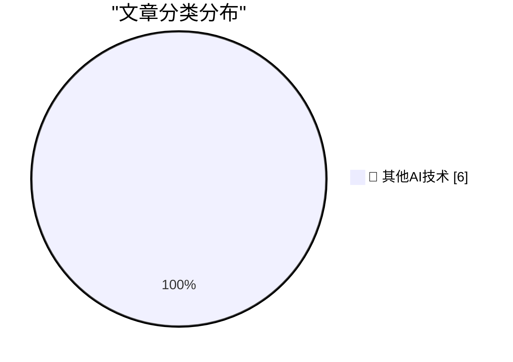

# 📰 AI 博客每日精选 — 2026-06-20

> 来自 98 个技术博客和社交媒体源，AI 精选 Top 6

## 🏆 今日必读

🥇 **Another One for the ‘Sorry, We Used to Be Crap’ Truth-in-Advertising File: Carlsberg Beer**

[Another One for the ‘Sorry, We Used to Be Crap’ Truth-in-Advertising File: Carlsberg Beer](https://www.independent.co.uk/news/business/news/carlsberg-probably-not-best-beer-in-world-lager-brewer-a8874016.html) — daringfireball.net · 20 小时前 · 🔬 其他AI技术

> Another One for the ‘Sorry, We Used to Be Crap’ Truth-in-Advertising File: Carlsberg Beer

🥈 **‘What’s the Deal With Old Guys and Giant Glasses?’**

[‘What’s the Deal With Old Guys and Giant Glasses?’](https://www.youtube.com/watch?v=8DYGxn6Xvt0) — daringfireball.net · 20 小时前 · 🔬 其他AI技术

> ‘What’s the Deal With Old Guys and Giant Glasses?’

🥉 **I know Kung-fu**

[I know Kung-fu](https://idiallo.com/blog/i-know-kung-fu) — idiallo.com · 18 小时前 · 🔬 其他AI技术

> I know Kung-fu

4️⃣ **Pluralistic: How the Epstein Class recruits (20 Jun 2026)**

[Pluralistic: How the Epstein Class recruits (20 Jun 2026)](https://pluralistic.net/2026/06/20/any-club-that-would-have-me/) — pluralistic.net · 5 小时前 · 🔬 其他AI技术

> Pluralistic: How the Epstein Class recruits (20 Jun 2026)

5️⃣ **Which Copyleft Licence is Suitable for an SVG?**

[Which Copyleft Licence is Suitable for an SVG?](https://shkspr.mobi/blog/2026/06/which-copyleft-licence-is-suitable-for-an-svg/) — shkspr.mobi · 10 小时前 · 🔬 其他AI技术

> Which Copyleft Licence is Suitable for an SVG?

---

## 📊 数据概览

| 扫描源 | 抓取文章 | 时间范围 | 精选 |
|:---:|:---:|:---:|:---:|
| 63/98 | 1928 篇 → 6 篇 | 24h | **6 篇** |

### 分类分布

---

====================

## 🔬 其他AI技术

### 1. Another One for the ‘Sorry, We Used to Be Crap’ Truth-in-Advertising File: Carlsberg Beer

[Another One for the ‘Sorry, We Used to Be Crap’ Truth-in-Advertising File: Carlsberg Beer](https://www.independent.co.uk/news/business/news/carlsberg-probably-not-best-beer-in-world-lager-brewer-a8874016.html) — **daringfireball.net** · 20 小时前 · ⭐ 15/25

> Another One for the ‘Sorry, We Used to Be Crap’ Truth-in-Advertising File: Carlsberg Beer

📌 其他AI技术

---

### 2. ‘What’s the Deal With Old Guys and Giant Glasses?’

[‘What’s the Deal With Old Guys and Giant Glasses?’](https://www.youtube.com/watch?v=8DYGxn6Xvt0) — **daringfireball.net** · 20 小时前 · ⭐ 15/25

> ‘What’s the Deal With Old Guys and Giant Glasses?’

📌 其他AI技术

---

### 3. I know Kung-fu

[I know Kung-fu](https://idiallo.com/blog/i-know-kung-fu) — **idiallo.com** · 18 小时前 · ⭐ 15/25

> I know Kung-fu

📌 其他AI技术

---

### 4. Pluralistic: How the Epstein Class recruits (20 Jun 2026)

[Pluralistic: How the Epstein Class recruits (20 Jun 2026)](https://pluralistic.net/2026/06/20/any-club-that-would-have-me/) — **pluralistic.net** · 5 小时前 · ⭐ 15/25

> Pluralistic: How the Epstein Class recruits (20 Jun 2026)

📌 其他AI技术

---

### 5. Which Copyleft Licence is Suitable for an SVG?

[Which Copyleft Licence is Suitable for an SVG?](https://shkspr.mobi/blog/2026/06/which-copyleft-licence-is-suitable-for-an-svg/) — **shkspr.mobi** · 10 小时前 · ⭐ 15/25

> Which Copyleft Licence is Suitable for an SVG?

📌 其他AI技术

---

### 6. This Week in Package Management: 20 June 2026

[This Week in Package Management: 20 June 2026](https://nesbitt.io/2026/06/20/this-week-in-package-management.html) — **nesbitt.io** · 12 小时前 · ⭐ 15/25

> This Week in Package Management: 20 June 2026

📌 其他AI技术

---

====================

*生成于 2026-06-20 22:04 | 扫描 63 源 → 获取 1928 篇 → 精选 6 篇*
*基于 [Hacker News Popularity Contest 2025](https://refactoringenglish.com/tools/hn-popularity/) RSS 源列表，由 [Andrej Karpathy](https://x.com/karpathy) 推荐*
*由「懂点儿AI」制作，欢迎关注同名微信公众号获取更多 AI 实用技巧 💡*
