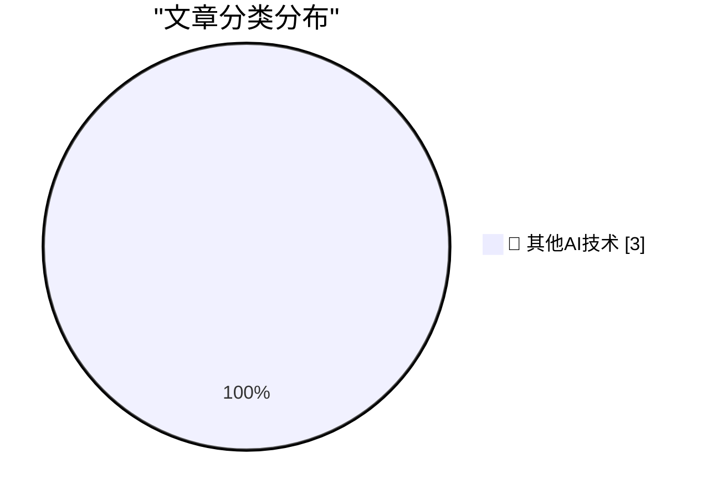

# 📰 AI 博客每日精选 — 2026-06-21

> 来自 98 个技术博客和社交媒体源，AI 精选 Top 3

## 🏆 今日必读

🥇 **Mux — Video for Developers**

[Mux — Video for Developers](https://www.mux.com/?utm_campaign=fireball&amp;utm_source=DF) — daringfireball.net · 36 分钟前 · 🔬 其他AI技术

> Mux — Video for Developers

🥈 **On Vulgar Materialism**

[On Vulgar Materialism](https://borretti.me/article/on-vulgar-materialism) — borretti.me · 22 小时前 · 🔬 其他AI技术

> On Vulgar Materialism

🥉 **The doom justifies the valuation**

[The doom justifies the valuation](https://geohot.github.io//blog/jekyll/update/2026/06/21/the-doom-justifies-the-valuation.html) — geohot.github.io · 15 小时前 · 🔬 其他AI技术

> The doom justifies the valuation

---

## 📊 数据概览

| 扫描源 | 抓取文章 | 时间范围 | 精选 |
|:---:|:---:|:---:|:---:|
| 63/98 | 1941 篇 → 3 篇 | 24h | **3 篇** |

### 分类分布

---

====================

## 🔬 其他AI技术

### 1. Mux — Video for Developers

[Mux — Video for Developers](https://www.mux.com/?utm_campaign=fireball&amp;utm_source=DF) — **daringfireball.net** · 36 分钟前 · ⭐ 15/25

> Mux — Video for Developers

📌 其他AI技术

---

### 2. On Vulgar Materialism

[On Vulgar Materialism](https://borretti.me/article/on-vulgar-materialism) — **borretti.me** · 22 小时前 · ⭐ 15/25

> On Vulgar Materialism

📌 其他AI技术

---

### 3. The doom justifies the valuation

[The doom justifies the valuation](https://geohot.github.io//blog/jekyll/update/2026/06/21/the-doom-justifies-the-valuation.html) — **geohot.github.io** · 15 小时前 · ⭐ 15/25

> The doom justifies the valuation

📌 其他AI技术

---

====================

*生成于 2026-06-21 22:11 | 扫描 63 源 → 获取 1941 篇 → 精选 3 篇*
*基于 [Hacker News Popularity Contest 2025](https://refactoringenglish.com/tools/hn-popularity/) RSS 源列表，由 [Andrej Karpathy](https://x.com/karpathy) 推荐*
*由「懂点儿AI」制作，欢迎关注同名微信公众号获取更多 AI 实用技巧 💡*
