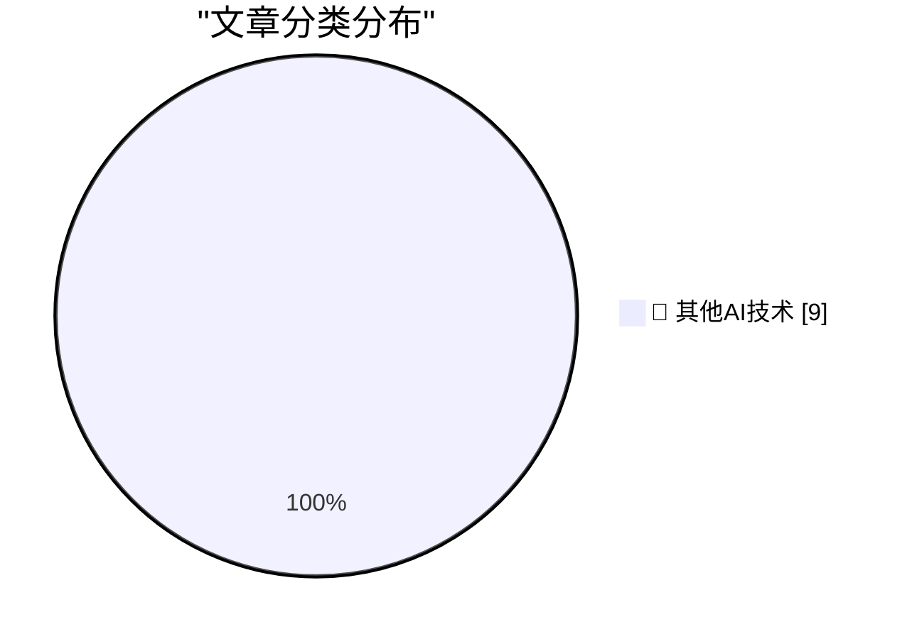

# 📰 AI 博客每日精选 — 2026-06-23

> 来自 98 个技术博客和社交媒体源，AI 精选 Top 9

## 🏆 今日必读

🥇 **The Talk Show: ‘Perp Walk for Selfies’**

[The Talk Show: ‘Perp Walk for Selfies’](https://daringfireball.net/thetalkshow/2026/06/23/ep-450) — daringfireball.net · 5 小时前 · 🔬 其他AI技术

> The Talk Show: ‘Perp Walk for Selfies’

🥈 **Ultra-Wide 0.5× Lenses Have Utility Beyond ‘Photography’**

[Ultra-Wide 0.5× Lenses Have Utility Beyond ‘Photography’](https://daringfireball.net/linked/2026/06/22/gurman-iphone-air-2) — daringfireball.net · 20 小时前 · 🔬 其他AI技术

> Ultra-Wide 0.5× Lenses Have Utility Beyond ‘Photography’

🥉 **Pluralistic: Spying on kids to save kids from spying is very, very stupid (23 Jun 2026)**

[Pluralistic: Spying on kids to save kids from spying is very, very stupid (23 Jun 2026)](https://pluralistic.net/2026/06/23/destroy-the-village/) — pluralistic.net · 10 小时前 · 🔬 其他AI技术

> Pluralistic: Spying on kids to save kids from spying is very, very stupid (23 Jun 2026)

4️⃣ **The worthlessness of vitamin D is mildly exaggerated**

[The worthlessness of vitamin D is mildly exaggerated](https://dynomight.net/vitamin-d/) — dynomight.net · 22 小时前 · 🔬 其他AI技术

> The worthlessness of vitamin D is mildly exaggerated

5️⃣ **The Coming Loop**

[The Coming Loop](https://lucumr.pocoo.org/2026/6/23/the-coming-loop/) — lucumr.pocoo.org · 22 小时前 · 🔬 其他AI技术

> The Coming Loop

---

## 📊 数据概览

| 扫描源 | 抓取文章 | 时间范围 | 精选 |
|:---:|:---:|:---:|:---:|
| 60/98 | 1892 篇 → 9 篇 | 24h | **9 篇** |

### 分类分布

---

====================

## 🔬 其他AI技术

### 1. The Talk Show: ‘Perp Walk for Selfies’

[The Talk Show: ‘Perp Walk for Selfies’](https://daringfireball.net/thetalkshow/2026/06/23/ep-450) — **daringfireball.net** · 5 小时前 · ⭐ 15/25

> The Talk Show: ‘Perp Walk for Selfies’

📌 其他AI技术

---

### 2. Ultra-Wide 0.5× Lenses Have Utility Beyond ‘Photography’

[Ultra-Wide 0.5× Lenses Have Utility Beyond ‘Photography’](https://daringfireball.net/linked/2026/06/22/gurman-iphone-air-2) — **daringfireball.net** · 20 小时前 · ⭐ 15/25

> Ultra-Wide 0.5× Lenses Have Utility Beyond ‘Photography’

📌 其他AI技术

---

### 3. Pluralistic: Spying on kids to save kids from spying is very, very stupid (23 Jun 2026)

[Pluralistic: Spying on kids to save kids from spying is very, very stupid (23 Jun 2026)](https://pluralistic.net/2026/06/23/destroy-the-village/) — **pluralistic.net** · 10 小时前 · ⭐ 15/25

> Pluralistic: Spying on kids to save kids from spying is very, very stupid (23 Jun 2026)

📌 其他AI技术

---

### 4. The worthlessness of vitamin D is mildly exaggerated

[The worthlessness of vitamin D is mildly exaggerated](https://dynomight.net/vitamin-d/) — **dynomight.net** · 22 小时前 · ⭐ 15/25

> The worthlessness of vitamin D is mildly exaggerated

📌 其他AI技术

---

### 5. The Coming Loop

[The Coming Loop](https://lucumr.pocoo.org/2026/6/23/the-coming-loop/) — **lucumr.pocoo.org** · 22 小时前 · ⭐ 15/25

> The Coming Loop

📌 其他AI技术

---

### 6. Sunsetting a Package Manager

[Sunsetting a Package Manager](https://nesbitt.io/2026/06/23/sunsetting-a-package-manager.html) — **nesbitt.io** · 12 小时前 · ⭐ 15/25

> Sunsetting a Package Manager

📌 其他AI技术

---

### 7. Cargo Culture

[Cargo Culture](https://www.wheresyoured.at/cargo-culture/) — **wheresyoured.at** · 6 小时前 · ⭐ 15/25

> Cargo Culture

📌 其他AI技术

---

### 8. Liminality

[Liminality](https://geohot.github.io//blog/jekyll/update/2026/06/23/liminality.html) — **geohot.github.io** · 15 小时前 · ⭐ 15/25

> Liminality

📌 其他AI技术

---

### 9. What went wrong with 3DO

[What went wrong with 3DO](https://dfarq.homeip.net/what-went-wrong-with-3do/?utm_source=rss&#038;utm_medium=rss&#038;utm_campaign=what-went-wrong-with-3do) — **dfarq.homeip.net** · 11 小时前 · ⭐ 15/25

> What went wrong with 3DO

📌 其他AI技术

---

====================

*生成于 2026-06-23 22:11 | 扫描 60 源 → 获取 1892 篇 → 精选 9 篇*
*基于 [Hacker News Popularity Contest 2025](https://refactoringenglish.com/tools/hn-popularity/) RSS 源列表，由 [Andrej Karpathy](https://x.com/karpathy) 推荐*
*由「懂点儿AI」制作，欢迎关注同名微信公众号获取更多 AI 实用技巧 💡*
