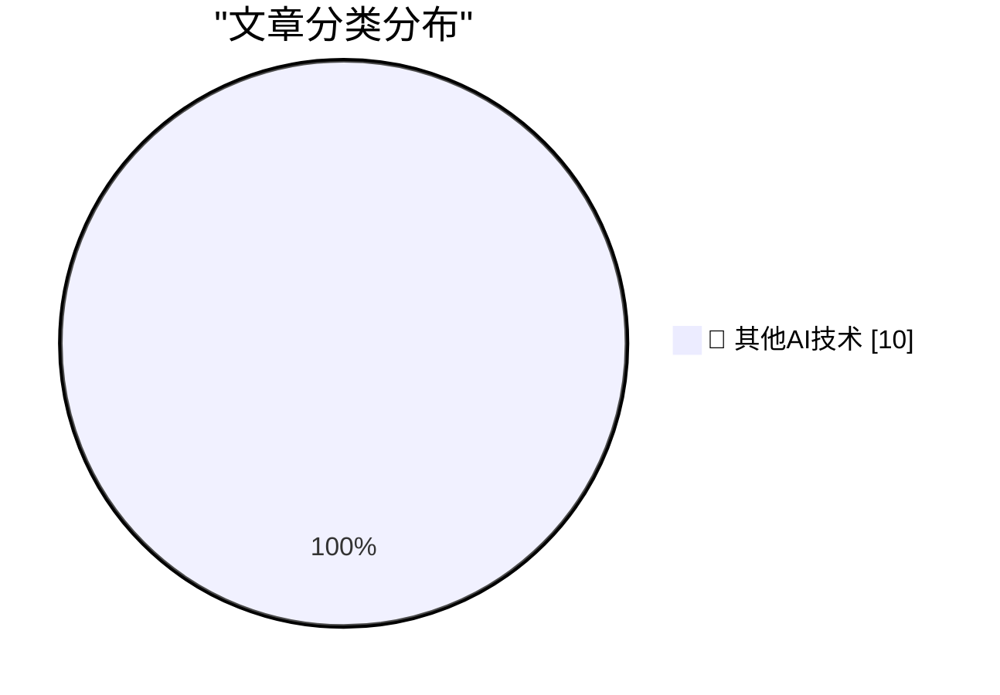

# 📰 AI 博客每日精选 — 2026-06-24

> 来自 98 个技术博客和社交媒体源，AI 精选 Top 10

## 🏆 今日必读

🥇 **Framework's 10G Ethernet module exposes USB-C's complexity**

[Framework's 10G Ethernet module exposes USB-C's complexity](https://www.jeffgeerling.com/blog/2026/framework-10g-ethernet-module-usb-c-complexity/) — jeffgeerling.com · 8 小时前 · 🔬 其他AI技术

> Framework's 10G Ethernet module exposes USB-C's complexity

🥈 **WebKit Always Enables the Copy Menu Item in Every App**

[WebKit Always Enables the Copy Menu Item in Every App](https://lapcatsoftware.com/articles/2026/6/5.html) — daringfireball.net · 22 分钟前 · 🔬 其他AI技术

> WebKit Always Enables the Copy Menu Item in Every App

🥉 **WebKit in Safari 27 Beta**

[WebKit in Safari 27 Beta](https://webkit.org/blog/17967/news-from-wwdc26-webkit-in-safari-27-beta/) — daringfireball.net · 3 小时前 · 🔬 其他AI技术

> WebKit in Safari 27 Beta

4️⃣ **[Sponsor] WorkOS: Agents Need Auth. There’s Now a Spec for It.**

[[Sponsor] WorkOS: Agents Need Auth. There’s Now a Spec for It.](http://workos.com/auth-md?utm_source=daringfireball&amp;utm_medium=newsletter&amp;utm_campaign=q32026) — daringfireball.net · 3 小时前 · 🔬 其他AI技术

> [Sponsor] WorkOS: Agents Need Auth. There’s Now a Spec for It.

5️⃣ **Designed in California: An Apple History Podcast**

[Designed in California: An Apple History Podcast](https://designed.fm/) — daringfireball.net · 6 小时前 · 🔬 其他AI技术

> Designed in California: An Apple History Podcast

---

## 📊 数据概览

| 扫描源 | 抓取文章 | 时间范围 | 精选 |
|:---:|:---:|:---:|:---:|
| 62/98 | 1932 篇 → 10 篇 | 24h | **10 篇** |

### 分类分布

---

====================

## 🔬 其他AI技术

### 1. Framework's 10G Ethernet module exposes USB-C's complexity

[Framework's 10G Ethernet module exposes USB-C's complexity](https://www.jeffgeerling.com/blog/2026/framework-10g-ethernet-module-usb-c-complexity/) — **jeffgeerling.com** · 8 小时前 · ⭐ 15/25

> Framework's 10G Ethernet module exposes USB-C's complexity

📌 其他AI技术

---

### 2. WebKit Always Enables the Copy Menu Item in Every App

[WebKit Always Enables the Copy Menu Item in Every App](https://lapcatsoftware.com/articles/2026/6/5.html) — **daringfireball.net** · 22 分钟前 · ⭐ 15/25

> WebKit Always Enables the Copy Menu Item in Every App

📌 其他AI技术

---

### 3. WebKit in Safari 27 Beta

[WebKit in Safari 27 Beta](https://webkit.org/blog/17967/news-from-wwdc26-webkit-in-safari-27-beta/) — **daringfireball.net** · 3 小时前 · ⭐ 15/25

> WebKit in Safari 27 Beta

📌 其他AI技术

---

### 4. [Sponsor] WorkOS: Agents Need Auth. There’s Now a Spec for It.

[[Sponsor] WorkOS: Agents Need Auth. There’s Now a Spec for It.](http://workos.com/auth-md?utm_source=daringfireball&amp;utm_medium=newsletter&amp;utm_campaign=q32026) — **daringfireball.net** · 3 小时前 · ⭐ 15/25

> [Sponsor] WorkOS: Agents Need Auth. There’s Now a Spec for It.

📌 其他AI技术

---

### 5. Designed in California: An Apple History Podcast

[Designed in California: An Apple History Podcast](https://designed.fm/) — **daringfireball.net** · 6 小时前 · ⭐ 15/25

> Designed in California: An Apple History Podcast

📌 其他AI技术

---

### 6. Auth0 PHP - manually authenticating JWT idTokens

[Auth0 PHP - manually authenticating JWT idTokens](https://shkspr.mobi/blog/2026/06/auth0-php-manually-authenticating-tokens/) — **shkspr.mobi** · 10 小时前 · ⭐ 15/25

> Auth0 PHP - manually authenticating JWT idTokens

📌 其他AI技术

---

### 7. "No way to prevent this" say users of only language where this regularly happens

["No way to prevent this" say users of only language where this regularly happens](https://xeiaso.net/shitposts/no-way-to-prevent-this/memory-safety/CVE-2026-55200/) — **xeiaso.net** · 22 小时前 · ⭐ 15/25

> "No way to prevent this" say users of only language where this regularly happens

📌 其他AI技术

---

### 8. Thoughts on Role Confusion

[Thoughts on Role Confusion](https://www.gilesthomas.com/2026/06/role-confusion) — **gilesthomas.com** · 2 小时前 · ⭐ 15/25

> Thoughts on Role Confusion

📌 其他AI技术

---

### 9. Blogging Can Just Be Stating The Obvious

[Blogging Can Just Be Stating The Obvious](https://blog.jim-nielsen.com/2026/blogging-stating-the-obvious/) — **blog.jim-nielsen.com** · 3 小时前 · ⭐ 15/25

> Blogging Can Just Be Stating The Obvious

📌 其他AI技术

---

### 10. Windows 98 shipped June 25, 1998

[Windows 98 shipped June 25, 1998](https://dfarq.homeip.net/windows-98-shipped-june-25-1998/?utm_source=rss&#038;utm_medium=rss&#038;utm_campaign=windows-98-shipped-june-25-1998) — **dfarq.homeip.net** · 11 小时前 · ⭐ 15/25

> Windows 98 shipped June 25, 1998

📌 其他AI技术

---

====================

*生成于 2026-06-24 22:15 | 扫描 62 源 → 获取 1932 篇 → 精选 10 篇*
*基于 [Hacker News Popularity Contest 2025](https://refactoringenglish.com/tools/hn-popularity/) RSS 源列表，由 [Andrej Karpathy](https://x.com/karpathy) 推荐*
*由「懂点儿AI」制作，欢迎关注同名微信公众号获取更多 AI 实用技巧 💡*
