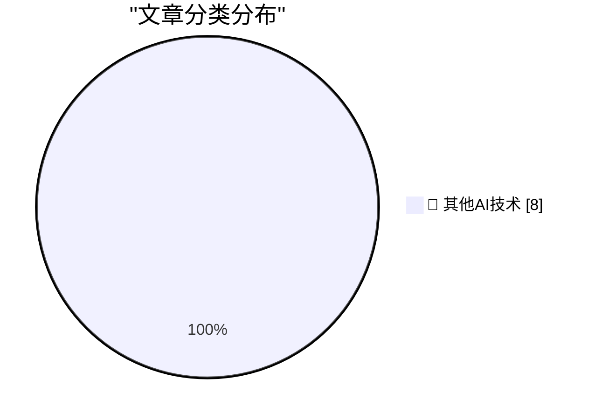

# 📰 AI 博客每日精选 — 2026-06-25

> 来自 98 个技术博客和社交媒体源，AI 精选 Top 8

## 🏆 今日必读

🥇 **Om Malik, 1966-2026**

[Om Malik, 1966-2026](https://om.co/2026/06/24/1966-2026/) — daringfireball.net · 1 小时前 · 🔬 其他AI技术

> Om Malik, 1966-2026

🥈 **Apple Raises Prices on Most Products by 15–25 Percent, but Not iPhones, Watches, or AirPods**

[Apple Raises Prices on Most Products by 15–25 Percent, but Not iPhones, Watches, or AirPods](https://www.wsj.com/tech/apple-raises-prices-on-macs-ipads-by-200-or-more-on-some-models-a7463f99?st=zse57R) — daringfireball.net · 5 小时前 · 🔬 其他AI技术

> Apple Raises Prices on Most Products by 15–25 Percent, but Not iPhones, Watches, or AirPods

🥉 **Pluralistic: Jailbreaking isn't theft (25 Jun 2026)**

[Pluralistic: Jailbreaking isn't theft (25 Jun 2026)](https://pluralistic.net/2026/06/25/thieve-different/) — pluralistic.net · 12 小时前 · 🔬 其他AI技术

> Pluralistic: Jailbreaking isn't theft (25 Jun 2026)

4️⃣ **"No way to prevent this" say users of only language where this regularly happens**

["No way to prevent this" say users of only language where this regularly happens](https://xeiaso.net/shitposts/no-way-to-prevent-this/memory-safety/CVE-2026-8461/) — xeiaso.net · 22 小时前 · 🔬 其他AI技术

> "No way to prevent this" say users of only language where this regularly happens

5️⃣ **Raymond’s hot take on Hainanese chicken**

[Raymond’s hot take on Hainanese chicken](https://devblogs.microsoft.com/oldnewthing/20260625-01/?p=112469) — devblogs.microsoft.com/oldnewthing · 8 小时前 · 🔬 其他AI技术

> Raymond’s hot take on Hainanese chicken

---

## 📊 数据概览

| 扫描源 | 抓取文章 | 时间范围 | 精选 |
|:---:|:---:|:---:|:---:|
| 64/98 | 1961 篇 → 8 篇 | 24h | **8 篇** |

### 分类分布

---

====================

## 🔬 其他AI技术

### 1. Om Malik, 1966-2026

[Om Malik, 1966-2026](https://om.co/2026/06/24/1966-2026/) — **daringfireball.net** · 1 小时前 · ⭐ 15/25

> Om Malik, 1966-2026

📌 其他AI技术

---

### 2. Apple Raises Prices on Most Products by 15–25 Percent, but Not iPhones, Watches, or AirPods

[Apple Raises Prices on Most Products by 15–25 Percent, but Not iPhones, Watches, or AirPods](https://www.wsj.com/tech/apple-raises-prices-on-macs-ipads-by-200-or-more-on-some-models-a7463f99?st=zse57R) — **daringfireball.net** · 5 小时前 · ⭐ 15/25

> Apple Raises Prices on Most Products by 15–25 Percent, but Not iPhones, Watches, or AirPods

📌 其他AI技术

---

### 3. Pluralistic: Jailbreaking isn't theft (25 Jun 2026)

[Pluralistic: Jailbreaking isn't theft (25 Jun 2026)](https://pluralistic.net/2026/06/25/thieve-different/) — **pluralistic.net** · 12 小时前 · ⭐ 15/25

> Pluralistic: Jailbreaking isn't theft (25 Jun 2026)

📌 其他AI技术

---

### 4. "No way to prevent this" say users of only language where this regularly happens

["No way to prevent this" say users of only language where this regularly happens](https://xeiaso.net/shitposts/no-way-to-prevent-this/memory-safety/CVE-2026-8461/) — **xeiaso.net** · 22 小时前 · ⭐ 15/25

> "No way to prevent this" say users of only language where this regularly happens

📌 其他AI技术

---

### 5. Raymond’s hot take on Hainanese chicken

[Raymond’s hot take on Hainanese chicken](https://devblogs.microsoft.com/oldnewthing/20260625-01/?p=112469) — **devblogs.microsoft.com/oldnewthing** · 8 小时前 · ⭐ 15/25

> Raymond’s hot take on Hainanese chicken

📌 其他AI技术

---

### 6. The case of the DLL that was not present in memory despite not being formally unloaded, part 1

[The case of the DLL that was not present in memory despite not being formally unloaded, part 1](https://devblogs.microsoft.com/oldnewthing/20260625-00/?p=112467) — **devblogs.microsoft.com/oldnewthing** · 8 小时前 · ⭐ 15/25

> The case of the DLL that was not present in memory despite not being formally unloaded, part 1

📌 其他AI技术

---

### 7. Scrutineer: scanning open source without flooding maintainers

[Scrutineer: scanning open source without flooding maintainers](https://nesbitt.io/2026/06/25/scrutineer.html) — **nesbitt.io** · 12 小时前 · ⭐ 15/25

> Scrutineer: scanning open source without flooding maintainers

📌 其他AI技术

---

### 8. VA Linux’s transformation after leaving the hardware business

[VA Linux’s transformation after leaving the hardware business](https://dfarq.homeip.net/va-linuxs-transformation-after-leaving-the-hardware-business/?utm_source=rss&#038;utm_medium=rss&#038;utm_campaign=va-linuxs-transformation-after-leaving-the-hardware-business) — **dfarq.homeip.net** · 11 小时前 · ⭐ 15/25

> VA Linux’s transformation after leaving the hardware business

📌 其他AI技术

---

====================

*生成于 2026-06-25 22:19 | 扫描 64 源 → 获取 1961 篇 → 精选 8 篇*
*基于 [Hacker News Popularity Contest 2025](https://refactoringenglish.com/tools/hn-popularity/) RSS 源列表，由 [Andrej Karpathy](https://x.com/karpathy) 推荐*
*由「懂点儿AI」制作，欢迎关注同名微信公众号获取更多 AI 实用技巧 💡*
