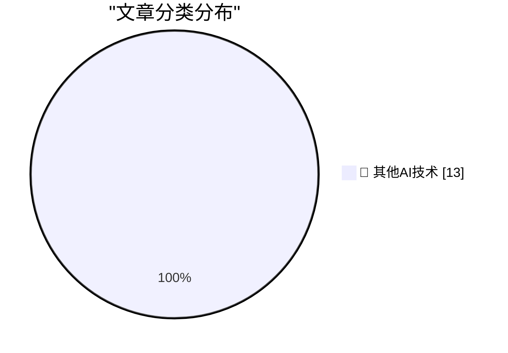

# 📰 AI 博客每日精选 — 2026-06-26

> 来自 98 个技术博客和社交媒体源，AI 精选 Top 13

## 🏆 今日必读

🥇 **Quickly apply LUTs (color grading) with ffmpeg**

[Quickly apply LUTs (color grading) with ffmpeg](https://www.jeffgeerling.com/blog/2026/apply-lut-color-grade-with-ffmpeg/) — jeffgeerling.com · 19 小时前 · 🔬 其他AI技术

> Quickly apply LUTs (color grading) with ffmpeg

🥈 **AI inference is obviously profitable**

[AI inference is obviously profitable](https://seangoedecke.com/ai-inference-is-obviously-profitable/) — seangoedecke.com · 22 小时前 · 🔬 其他AI技术

> AI inference is obviously profitable

🥉 **Apple’s Full Statement on Yesterday’s Price Increases**

[Apple’s Full Statement on Yesterday’s Price Increases](https://www.macrumors.com/2026/06/25/apple-explains-why-it-raised-prices/) — daringfireball.net · 5 小时前 · 🔬 其他AI技术

> Apple’s Full Statement on Yesterday’s Price Increases

4️⃣ **The Price-Hiked Apple TV 4K Is 4 Years Old**

[The Price-Hiked Apple TV 4K Is 4 Years Old](https://buyersguide.macrumors.com/#Apple_TV) — daringfireball.net · 6 小时前 · 🔬 其他AI技术

> The Price-Hiked Apple TV 4K Is 4 Years Old

5️⃣ **Apple Journal’s Atrocious Undo Bug Has Been Fixed (and SwiftUI, Per Se, Is Not to Blame)**

[Apple Journal’s Atrocious Undo Bug Has Been Fixed (and SwiftUI, Per Se, Is Not to Blame)](https://daringfireball.net/2026/06/swiftui_only_makes_it_easy_to_develop_bad_apps) — daringfireball.net · 23 小时前 · 🔬 其他AI技术

> Apple Journal’s Atrocious Undo Bug Has Been Fixed (and SwiftUI, Per Se, Is Not to Blame)

---

## 📊 数据概览

| 扫描源 | 抓取文章 | 时间范围 | 精选 |
|:---:|:---:|:---:|:---:|
| 63/98 | 1943 篇 → 13 篇 | 24h | **13 篇** |

### 分类分布

---

====================

## 🔬 其他AI技术

### 1. Quickly apply LUTs (color grading) with ffmpeg

[Quickly apply LUTs (color grading) with ffmpeg](https://www.jeffgeerling.com/blog/2026/apply-lut-color-grade-with-ffmpeg/) — **jeffgeerling.com** · 19 小时前 · ⭐ 15/25

> Quickly apply LUTs (color grading) with ffmpeg

📌 其他AI技术

---

### 2. AI inference is obviously profitable

[AI inference is obviously profitable](https://seangoedecke.com/ai-inference-is-obviously-profitable/) — **seangoedecke.com** · 22 小时前 · ⭐ 15/25

> AI inference is obviously profitable

📌 其他AI技术

---

### 3. Apple’s Full Statement on Yesterday’s Price Increases

[Apple’s Full Statement on Yesterday’s Price Increases](https://www.macrumors.com/2026/06/25/apple-explains-why-it-raised-prices/) — **daringfireball.net** · 5 小时前 · ⭐ 15/25

> Apple’s Full Statement on Yesterday’s Price Increases

📌 其他AI技术

---

### 4. The Price-Hiked Apple TV 4K Is 4 Years Old

[The Price-Hiked Apple TV 4K Is 4 Years Old](https://buyersguide.macrumors.com/#Apple_TV) — **daringfireball.net** · 6 小时前 · ⭐ 15/25

> The Price-Hiked Apple TV 4K Is 4 Years Old

📌 其他AI技术

---

### 5. Apple Journal’s Atrocious Undo Bug Has Been Fixed (and SwiftUI, Per Se, Is Not to Blame)

[Apple Journal’s Atrocious Undo Bug Has Been Fixed (and SwiftUI, Per Se, Is Not to Blame)](https://daringfireball.net/2026/06/swiftui_only_makes_it_easy_to_develop_bad_apps) — **daringfireball.net** · 23 小时前 · ⭐ 15/25

> Apple Journal’s Atrocious Undo Bug Has Been Fixed (and SwiftUI, Per Se, Is Not to Blame)

📌 其他AI技术

---

### 6. ★ Spensive Thoughts

[★ Spensive Thoughts](https://daringfireball.net/2026/06/spensive_thoughts) — **daringfireball.net** · 23 小时前 · ⭐ 15/25

> ★ Spensive Thoughts

📌 其他AI技术

---

### 7. Review: Gamrombo PS5 controller - including Linux set up ★★★★☆

[Review: Gamrombo PS5 controller - including Linux set up ★★★★☆](https://shkspr.mobi/blog/2026/06/review-gamrombo-ps5-controller-including-linux-set-up/) — **shkspr.mobi** · 10 小时前 · ⭐ 15/25

> Review: Gamrombo PS5 controller - including Linux set up ★★★★☆

📌 其他AI技术

---

### 8. Blink if you’re human

[Blink if you’re human](https://dynomight.net/blink/) — **dynomight.net** · 22 小时前 · ⭐ 15/25

> Blink if you’re human

📌 其他AI技术

---

### 9. Incident Report: CVE-2026-LGTM

[Incident Report: CVE-2026-LGTM](https://nesbitt.io/2026/06/26/incident-report-cve-2026-lgtm.html) — **nesbitt.io** · 17 小时前 · ⭐ 15/25

> Incident Report: CVE-2026-LGTM

📌 其他AI技术

---

### 10. The next big breakthrough will be AIs learning on the job

[The next big breakthrough will be AIs learning on the job](https://www.dwarkesh.com/p/the-next-paradigm) — **dwarkesh.com** · 6 小时前 · ⭐ 15/25

> The next big breakthrough will be AIs learning on the job

📌 其他AI技术

---

### 11. Premium: Notes From The Bubble, Volume 1

[Premium: Notes From The Bubble, Volume 1](https://www.wheresyoured.at/premium-notes-from-the-bubble-volume-1/) — **wheresyoured.at** · 3 小时前 · ⭐ 15/25

> Premium: Notes From The Bubble, Volume 1

📌 其他AI技术

---

### 12. This Week on The Analog Antiquarian

[This Week on The Analog Antiquarian](https://www.filfre.net/2026/06/this-week-on-the-analog-antiquarian/) — **filfre.net** · 6 小时前 · ⭐ 15/25

> This Week on The Analog Antiquarian

📌 其他AI技术

---

### 13. Spyglass: A web browsing pioneer’s IPO

[Spyglass: A web browsing pioneer’s IPO](https://dfarq.homeip.net/spyglass-a-web-browsing-pioneers-ipo/?utm_source=rss&#038;utm_medium=rss&#038;utm_campaign=spyglass-a-web-browsing-pioneers-ipo) — **dfarq.homeip.net** · 11 小时前 · ⭐ 15/25

> Spyglass: A web browsing pioneer’s IPO

📌 其他AI技术

---

====================

*生成于 2026-06-26 22:09 | 扫描 63 源 → 获取 1943 篇 → 精选 13 篇*
*基于 [Hacker News Popularity Contest 2025](https://refactoringenglish.com/tools/hn-popularity/) RSS 源列表，由 [Andrej Karpathy](https://x.com/karpathy) 推荐*
*由「懂点儿AI」制作，欢迎关注同名微信公众号获取更多 AI 实用技巧 💡*
