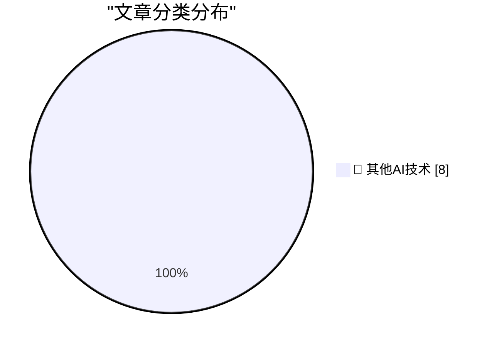

# 📰 AI 博客每日精选 — 2026-06-29

> 来自 98 个技术博客和社交媒体源，AI 精选 Top 8

## 🏆 今日必读

🥇 **Auth.md — an Open Protocol for Agent Registration From WorkOS**

[Auth.md — an Open Protocol for Agent Registration From WorkOS](https://workos.com/auth-md?utm_source=daringfireball&amp;utm_medium=newsletter&amp;utm_campaign=q22026) — daringfireball.net · 20 小时前 · 🔬 其他AI技术

> Auth.md — an Open Protocol for Agent Registration From WorkOS

🥈 **Daniel Agee: ‘Remembering Om’**

[Daniel Agee: ‘Remembering Om’](https://glass.photo/highlights/remembering-om) — daringfireball.net · 20 小时前 · 🔬 其他AI技术

> Daniel Agee: ‘Remembering Om’

🥉 **Matt Mullenweg: ‘All Roads Lead to Om’**

[Matt Mullenweg: ‘All Roads Lead to Om’](https://ma.tt/2026/06/om-forever/) — daringfireball.net · 20 小时前 · 🔬 其他AI技术

> Matt Mullenweg: ‘All Roads Lead to Om’

4️⃣ **The New York Times: ‘Om Malik, Whose Blog Shaped How Silicon Valley Saw Itself, Dies at 59’**

[The New York Times: ‘Om Malik, Whose Blog Shaped How Silicon Valley Saw Itself, Dies at 59’](https://www.nytimes.com/2026/06/26/technology/om-malik-dead.html?unlocked_article_code=1.t1A.AyPT.p7GhDrDcJSfa) — daringfireball.net · 21 小时前 · 🔬 其他AI技术

> The New York Times: ‘Om Malik, Whose Blog Shaped How Silicon Valley Saw Itself, Dies at 59’

5️⃣ **I turned my prologue into a short video**

[I turned my prologue into a short video](https://idiallo.com/byte-size/my-prologue-to-short-video) — idiallo.com · 19 小时前 · 🔬 其他AI技术

> I turned my prologue into a short video

---

## 📊 数据概览

| 扫描源 | 抓取文章 | 时间范围 | 精选 |
|:---:|:---:|:---:|:---:|
| 62/98 | 1936 篇 → 8 篇 | 24h | **8 篇** |

### 分类分布

---

====================

## 🔬 其他AI技术

### 1. Auth.md — an Open Protocol for Agent Registration From WorkOS

[Auth.md — an Open Protocol for Agent Registration From WorkOS](https://workos.com/auth-md?utm_source=daringfireball&amp;utm_medium=newsletter&amp;utm_campaign=q22026) — **daringfireball.net** · 20 小时前 · ⭐ 15/25

> Auth.md — an Open Protocol for Agent Registration From WorkOS

📌 其他AI技术

---

### 2. Daniel Agee: ‘Remembering Om’

[Daniel Agee: ‘Remembering Om’](https://glass.photo/highlights/remembering-om) — **daringfireball.net** · 20 小时前 · ⭐ 15/25

> Daniel Agee: ‘Remembering Om’

📌 其他AI技术

---

### 3. Matt Mullenweg: ‘All Roads Lead to Om’

[Matt Mullenweg: ‘All Roads Lead to Om’](https://ma.tt/2026/06/om-forever/) — **daringfireball.net** · 20 小时前 · ⭐ 15/25

> Matt Mullenweg: ‘All Roads Lead to Om’

📌 其他AI技术

---

### 4. The New York Times: ‘Om Malik, Whose Blog Shaped How Silicon Valley Saw Itself, Dies at 59’

[The New York Times: ‘Om Malik, Whose Blog Shaped How Silicon Valley Saw Itself, Dies at 59’](https://www.nytimes.com/2026/06/26/technology/om-malik-dead.html?unlocked_article_code=1.t1A.AyPT.p7GhDrDcJSfa) — **daringfireball.net** · 21 小时前 · ⭐ 15/25

> The New York Times: ‘Om Malik, Whose Blog Shaped How Silicon Valley Saw Itself, Dies at 59’

📌 其他AI技术

---

### 5. I turned my prologue into a short video

[I turned my prologue into a short video](https://idiallo.com/byte-size/my-prologue-to-short-video) — **idiallo.com** · 19 小时前 · ⭐ 15/25

> I turned my prologue into a short video

📌 其他AI技术

---

### 6. Pluralistic: Gemini is better than search because Google enshittified search (29 Jun 2026)

[Pluralistic: Gemini is better than search because Google enshittified search (29 Jun 2026)](https://pluralistic.net/2026/06/29/arsonist-firefighters/) — **pluralistic.net** · 5 小时前 · ⭐ 15/25

> Pluralistic: Gemini is better than search because Google enshittified search (29 Jun 2026)

📌 其他AI技术

---

### 7. Unbundling the standard library

[Unbundling the standard library](https://nesbitt.io/2026/06/29/unbundling-the-standard-library.html) — **nesbitt.io** · 12 小时前 · ⭐ 15/25

> Unbundling the standard library

📌 其他AI技术

---

### 8. What happened to Altavista

[What happened to Altavista](https://dfarq.homeip.net/what-happened-to-altavista/?utm_source=rss&#038;utm_medium=rss&#038;utm_campaign=what-happened-to-altavista) — **dfarq.homeip.net** · 11 小时前 · ⭐ 15/25

> What happened to Altavista

📌 其他AI技术

---

====================

*生成于 2026-06-29 22:08 | 扫描 62 源 → 获取 1936 篇 → 精选 8 篇*
*基于 [Hacker News Popularity Contest 2025](https://refactoringenglish.com/tools/hn-popularity/) RSS 源列表，由 [Andrej Karpathy](https://x.com/karpathy) 推荐*
*由「懂点儿AI」制作，欢迎关注同名微信公众号获取更多 AI 实用技巧 💡*
