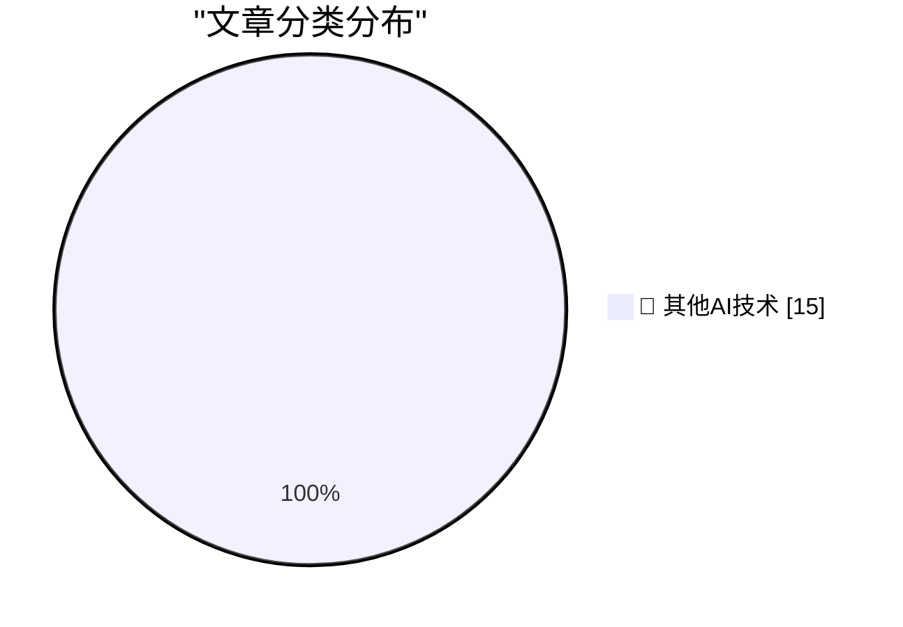

# 📰 AI 博客每日精选 — 2026-06-30

> 来自 98 个技术博客和社交媒体源，AI 精选 Top 15

## 🏆 今日必读

🥇 **Gnome**

[Gnome](https://lexfriedman.com/gnome/) — daringfireball.net · 1 小时前 · 🔬 其他AI技术

> Gnome

🥈 **Supreme Court Agrees to Review Apple’s Petition Regarding Civil Contempt Finding in ‘Apple v. Epic Games’**

[Supreme Court Agrees to Review Apple’s Petition Regarding Civil Contempt Finding in ‘Apple v. Epic Games’](https://www.supremecourt.gov/orders/courtorders/063026zor_3f14.pdf) — daringfireball.net · 2 小时前 · 🔬 其他AI技术

> Supreme Court Agrees to Review Apple’s Petition Regarding Civil Contempt Finding in ‘Apple v. Epic Games’

🥉 **Supreme Court Upholds Birthright Citizenship in 6-3 Decision**

[Supreme Court Upholds Birthright Citizenship in 6-3 Decision](https://talkingpointsmemo.com/edblog/the-birthright-citizenship-decision-is-more-evidence-for-court-reform/sharetoken/e2bf9547-fa9b-468c-8af3-aa09e72ca698) — daringfireball.net · 2 小时前 · 🔬 其他AI技术

> Supreme Court Upholds Birthright Citizenship in 6-3 Decision

4️⃣ **★ The Supreme Court Rules That Law Enforcement’s Use of ‘Geofence Warrant’ Was a ‘Search’ (But May Be Moot, Technically, Since 2024)**

[★ The Supreme Court Rules That Law Enforcement’s Use of ‘Geofence Warrant’ Was a ‘Search’ (But May Be Moot, Technically, Since 2024)](https://daringfireball.net/2026/06/scotus_geofence_warrant_search) — daringfireball.net · 3 小时前 · 🔬 其他AI技术

> ★ The Supreme Court Rules That Law Enforcement’s Use of ‘Geofence Warrant’ Was a ‘Search’ (But May Be Moot, Technically, Since 2024)

5️⃣ **Three Players From the Japanese Men’s National Team vs. 100 School Children**

[Three Players From the Japanese Men’s National Team vs. 100 School Children](https://x.com/BallStreet/status/950382135969566720) — daringfireball.net · 3 小时前 · 🔬 其他AI技术

> Three Players From the Japanese Men’s National Team vs. 100 School Children

---

## 📊 数据概览

| 扫描源 | 抓取文章 | 时间范围 | 精选 |
|:---:|:---:|:---:|:---:|
| 61/98 | 1904 篇 → 19 篇 | 24h | **15 篇** |

### 分类分布

---

====================

## 🔬 其他AI技术

### 1. Gnome

[Gnome](https://lexfriedman.com/gnome/) — **daringfireball.net** · 1 小时前 · ⭐ 15/25

> Gnome

📌 其他AI技术

---

### 2. Supreme Court Agrees to Review Apple’s Petition Regarding Civil Contempt Finding in ‘Apple v. Epic Games’

[Supreme Court Agrees to Review Apple’s Petition Regarding Civil Contempt Finding in ‘Apple v. Epic Games’](https://www.supremecourt.gov/orders/courtorders/063026zor_3f14.pdf) — **daringfireball.net** · 2 小时前 · ⭐ 15/25

> Supreme Court Agrees to Review Apple’s Petition Regarding Civil Contempt Finding in ‘Apple v. Epic Games’

📌 其他AI技术

---

### 3. Supreme Court Upholds Birthright Citizenship in 6-3 Decision

[Supreme Court Upholds Birthright Citizenship in 6-3 Decision](https://talkingpointsmemo.com/edblog/the-birthright-citizenship-decision-is-more-evidence-for-court-reform/sharetoken/e2bf9547-fa9b-468c-8af3-aa09e72ca698) — **daringfireball.net** · 2 小时前 · ⭐ 15/25

> Supreme Court Upholds Birthright Citizenship in 6-3 Decision

📌 其他AI技术

---

### 4. ★ The Supreme Court Rules That Law Enforcement’s Use of ‘Geofence Warrant’ Was a ‘Search’ (But May Be Moot, Technically, Since 2024)

[★ The Supreme Court Rules That Law Enforcement’s Use of ‘Geofence Warrant’ Was a ‘Search’ (But May Be Moot, Technically, Since 2024)](https://daringfireball.net/2026/06/scotus_geofence_warrant_search) — **daringfireball.net** · 3 小时前 · ⭐ 15/25

> ★ The Supreme Court Rules That Law Enforcement’s Use of ‘Geofence Warrant’ Was a ‘Search’ (But May Be Moot, Technically, Since 2024)

📌 其他AI技术

---

### 5. Three Players From the Japanese Men’s National Team vs. 100 School Children

[Three Players From the Japanese Men’s National Team vs. 100 School Children](https://x.com/BallStreet/status/950382135969566720) — **daringfireball.net** · 3 小时前 · ⭐ 15/25

> Three Players From the Japanese Men’s National Team vs. 100 School Children

📌 其他AI技术

---

### 6. CMA Consultation on Mobile App Steering and NFC Access

[CMA Consultation on Mobile App Steering and NFC Access](https://www.gov.uk/government/news/cma-consults-on-new-requirements-for-apple-and-googles-mobile-platforms) — **daringfireball.net** · 5 小时前 · ⭐ 15/25

> CMA Consultation on Mobile App Steering and NFC Access

📌 其他AI技术

---

### 7. U.K. Regulator Considers Requiring App Store to Allow Steering to the Web, and iOS NFC to Be Open

[U.K. Regulator Considers Requiring App Store to Allow Steering to the Web, and iOS NFC to Be Open](https://www.reuters.com/world/uk-regulator-proposes-easing-apple-google-app-store-payment-rules-2026-06-30/) — **daringfireball.net** · 6 小时前 · ⭐ 15/25

> U.K. Regulator Considers Requiring App Store to Allow Steering to the Web, and iOS NFC to Be Open

📌 其他AI技术

---

### 8. Data Breach at Indian Supplier Tata Electronics Exposes iPhone 18 Pro Details and Photos

[Data Breach at Indian Supplier Tata Electronics Exposes iPhone 18 Pro Details and Photos](https://www.reuters.com/business/media-telecom/apple-iphone-18-pro-supplier-list-parts-photos-exposed-tata-data-leak-2026-06-29/) — **daringfireball.net** · 21 小时前 · ⭐ 15/25

> Data Breach at Indian Supplier Tata Electronics Exposes iPhone 18 Pro Details and Photos

📌 其他AI技术

---

### 9. [Sponsor] Day One Journal

[[Sponsor] Day One Journal](https://dayoneapp.com/blog/introducing-daily-chat/) — **daringfireball.net** · 22 小时前 · ⭐ 15/25

> [Sponsor] Day One Journal

📌 其他AI技术

---

### 10. The Dating App Plot Device

[The Dating App Plot Device](https://idiallo.com/blog/dating-plot-device) — **idiallo.com** · 15 小时前 · ⭐ 15/25

> The Dating App Plot Device

📌 其他AI技术

---

### 11. Pluralistic: Jo Walton's "Everybody's Perfect" (30 Jun 2026)

[Pluralistic: Jo Walton's "Everybody's Perfect" (30 Jun 2026)](https://pluralistic.net/2026/06/30/serenissima/) — **pluralistic.net** · 10 小时前 · ⭐ 15/25

> Pluralistic: Jo Walton's "Everybody's Perfect" (30 Jun 2026)

📌 其他AI技术

---

### 12. Book Review: Fake Creativity by Blake Loch ★★★☆☆

[Book Review: Fake Creativity by Blake Loch ★★★☆☆](https://shkspr.mobi/blog/2026/06/book-review-fake-creativity-by-blake-loch/) — **shkspr.mobi** · 10 小时前 · ⭐ 15/25

> Book Review: Fake Creativity by Blake Loch ★★★☆☆

📌 其他AI技术

---

### 13. A compatibility note on the abuse of Windows window class extra bytes

[A compatibility note on the abuse of Windows window class extra bytes](https://devblogs.microsoft.com/oldnewthing/20260630-00/?p=112488) — **devblogs.microsoft.com/oldnewthing** · 8 小时前 · ⭐ 15/25

> A compatibility note on the abuse of Windows window class extra bytes

📌 其他AI技术

---

### 14. Writing an LLM from scratch, part 34a -- building a JAX training loop for an LLM training run

[Writing an LLM from scratch, part 34a -- building a JAX training loop for an LLM training run](https://www.gilesthomas.com/2026/06/llm-from-scratch-34a-building-a-jax-training-loop-for-an-llm-training-run) — **gilesthomas.com** · 3 小时前 · ⭐ 15/25

> Writing an LLM from scratch, part 34a -- building a JAX training loop for an LLM training run

📌 其他AI技术

---

### 15. Notes from June 2026

[Notes from June 2026](https://evanhahn.com/notes-from-june-2026/) — **evanhahn.com** · 22 小时前 · ⭐ 15/25

> Notes from June 2026

📌 其他AI技术

---

====================

*生成于 2026-06-30 22:14 | 扫描 61 源 → 获取 1904 篇 → 精选 15 篇*
*基于 [Hacker News Popularity Contest 2025](https://refactoringenglish.com/tools/hn-popularity/) RSS 源列表，由 [Andrej Karpathy](https://x.com/karpathy) 推荐*
*由「懂点儿AI」制作，欢迎关注同名微信公众号获取更多 AI 实用技巧 💡*
