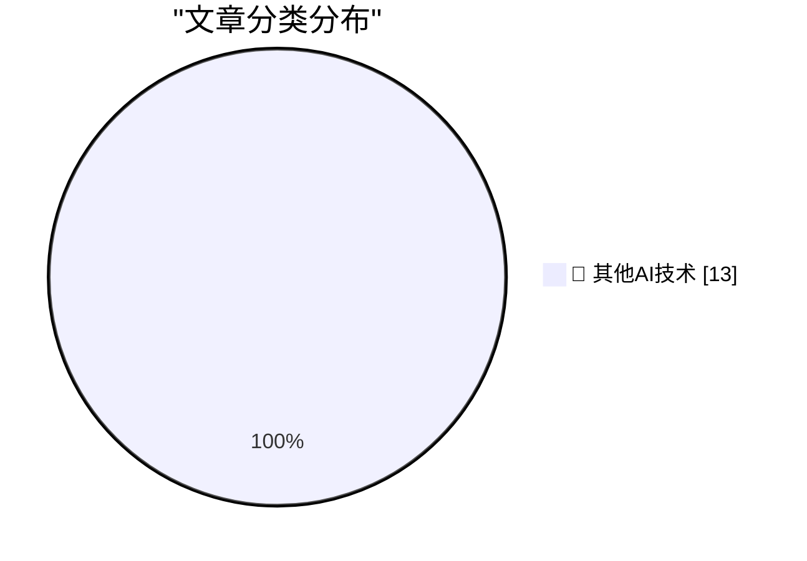

# 📰 AI 博客每日精选 — 2026-07-01

> 来自 98 个技术博客和社交媒体源，AI 精选 Top 13

## 🏆 今日必读

🥇 **PlayStation Plus and Xbox Game Pass Subscriptions**

[PlayStation Plus and Xbox Game Pass Subscriptions](https://daringfireball.net/linked/2026/07/01/valve-on-subsidizing-hardware) — daringfireball.net · 2 小时前 · 🔬 其他AI技术

> PlayStation Plus and Xbox Game Pass Subscriptions

🥈 **Valve Explains Why It Doesn’t Subsidize Its Hardware Platforms**

[Valve Explains Why It Doesn’t Subsidize Its Hardware Platforms](https://www.theverge.com/games/952004/valve-steam-machine-price-not-subsidizing) — daringfireball.net · 4 小时前 · 🔬 其他AI技术

> Valve Explains Why It Doesn’t Subsidize Its Hardware Platforms

🥉 **The Talk Show: ‘Taking Drugs to Get Fat’**

[The Talk Show: ‘Taking Drugs to Get Fat’](https://daringfireball.net/thetalkshow/2026/06/30/ep-451) — daringfireball.net · 6 小时前 · 🔬 其他AI技术

> The Talk Show: ‘Taking Drugs to Get Fat’

4️⃣ **404 Media: Vulnerability in iCloud’s ‘Hide My Email’ Reveals Peoples’ Real Email Addresses**

[404 Media: Vulnerability in iCloud’s ‘Hide My Email’ Reveals Peoples’ Real Email Addresses](https://www.404media.co/apple-hide-my-email-vulnerability-reveals-peoples-real-email-addresses/) — daringfireball.net · 7 小时前 · 🔬 其他AI技术

> 404 Media: Vulnerability in iCloud’s ‘Hide My Email’ Reveals Peoples’ Real Email Addresses

5️⃣ **Pluralistic: Technocarcinization (01 Jul 2026)**

[Pluralistic: Technocarcinization (01 Jul 2026)](https://pluralistic.net/2026/07/01/ontogeny/) — pluralistic.net · 7 小时前 · 🔬 其他AI技术

> Pluralistic: Technocarcinization (01 Jul 2026)

---

## 📊 数据概览

| 扫描源 | 抓取文章 | 时间范围 | 精选 |
|:---:|:---:|:---:|:---:|
| 63/98 | 1948 篇 → 13 篇 | 24h | **13 篇** |

### 分类分布

---

====================

## 🔬 其他AI技术

### 1. PlayStation Plus and Xbox Game Pass Subscriptions

[PlayStation Plus and Xbox Game Pass Subscriptions](https://daringfireball.net/linked/2026/07/01/valve-on-subsidizing-hardware) — **daringfireball.net** · 2 小时前 · ⭐ 15/25

> PlayStation Plus and Xbox Game Pass Subscriptions

📌 其他AI技术

---

### 2. Valve Explains Why It Doesn’t Subsidize Its Hardware Platforms

[Valve Explains Why It Doesn’t Subsidize Its Hardware Platforms](https://www.theverge.com/games/952004/valve-steam-machine-price-not-subsidizing) — **daringfireball.net** · 4 小时前 · ⭐ 15/25

> Valve Explains Why It Doesn’t Subsidize Its Hardware Platforms

📌 其他AI技术

---

### 3. The Talk Show: ‘Taking Drugs to Get Fat’

[The Talk Show: ‘Taking Drugs to Get Fat’](https://daringfireball.net/thetalkshow/2026/06/30/ep-451) — **daringfireball.net** · 6 小时前 · ⭐ 15/25

> The Talk Show: ‘Taking Drugs to Get Fat’

📌 其他AI技术

---

### 4. 404 Media: Vulnerability in iCloud’s ‘Hide My Email’ Reveals Peoples’ Real Email Addresses

[404 Media: Vulnerability in iCloud’s ‘Hide My Email’ Reveals Peoples’ Real Email Addresses](https://www.404media.co/apple-hide-my-email-vulnerability-reveals-peoples-real-email-addresses/) — **daringfireball.net** · 7 小时前 · ⭐ 15/25

> 404 Media: Vulnerability in iCloud’s ‘Hide My Email’ Reveals Peoples’ Real Email Addresses

📌 其他AI技术

---

### 5. Pluralistic: Technocarcinization (01 Jul 2026)

[Pluralistic: Technocarcinization (01 Jul 2026)](https://pluralistic.net/2026/07/01/ontogeny/) — **pluralistic.net** · 7 小时前 · ⭐ 15/25

> Pluralistic: Technocarcinization (01 Jul 2026)

📌 其他AI技术

---

### 6. It rather involved being on the other side of this airtight hatchway: Changing administrative settings

[It rather involved being on the other side of this airtight hatchway: Changing administrative settings](https://devblogs.microsoft.com/oldnewthing/20260701-00/?p=112498) — **devblogs.microsoft.com/oldnewthing** · 8 小时前 · ⭐ 15/25

> It rather involved being on the other side of this airtight hatchway: Changing administrative settings

📌 其他AI技术

---

### 7. The CRA is not about open source

[The CRA is not about open source](https://nesbitt.io/2026/07/01/the-cra-is-not-about-open-source.html) — **nesbitt.io** · 12 小时前 · ⭐ 15/25

> The CRA is not about open source

📌 其他AI技术

---

### 8. The Winning Essays for the Big Questions About AI

[The Winning Essays for the Big Questions About AI](https://www.dwarkesh.com/p/blog-prize-winners) — **dwarkesh.com** · 3 分钟前 · ⭐ 15/25

> The Winning Essays for the Big Questions About AI

📌 其他AI技术

---

### 9. The earliest surviving Tom’s Hardware Guide article

[The earliest surviving Tom’s Hardware Guide article](https://dfarq.homeip.net/the-earliest-surviving-toms-hardware-guide-article/?utm_source=rss&#038;utm_medium=rss&#038;utm_campaign=the-earliest-surviving-toms-hardware-guide-article) — **dfarq.homeip.net** · 11 小时前 · ⭐ 15/25

> The earliest surviving Tom’s Hardware Guide article

📌 其他AI技术

---

### 10. explaining myself through stories

[explaining myself through stories](https://jyn.dev/explaining-myself-through-stories/) — **jyn.dev** · 22 小时前 · ⭐ 15/25

> explaining myself through stories

📌 其他AI技术

---

### 11. Summary of reading: April - June 2026

[Summary of reading: April - June 2026](https://eli.thegreenplace.net/2026/summary-of-reading-april-june-2026/) — **eli.thegreenplace.net** · 20 小时前 · ⭐ 15/25

> Summary of reading: April - June 2026

📌 其他AI技术

---

### 12. Bulkdatasets AIVD en MIVD: de schaduw geheime dienst

[Bulkdatasets AIVD en MIVD: de schaduw geheime dienst](https://berthub.eu/articles/posts/de-schaduwgeheimedienst/) — **berthub.eu** · 13 小时前 · ⭐ 15/25

> Bulkdatasets AIVD en MIVD: de schaduw geheime dienst

📌 其他AI技术

---

### 13. Clickhouse is winning the Observability Wars

[Clickhouse is winning the Observability Wars](https://matduggan.com/clickhouse-is-winning-the-observability-wars/) — **matduggan.com** · 9 小时前 · ⭐ 15/25

> Clickhouse is winning the Observability Wars

📌 其他AI技术

---

====================

*生成于 2026-07-01 22:16 | 扫描 63 源 → 获取 1948 篇 → 精选 13 篇*
*基于 [Hacker News Popularity Contest 2025](https://refactoringenglish.com/tools/hn-popularity/) RSS 源列表，由 [Andrej Karpathy](https://x.com/karpathy) 推荐*
*由「懂点儿AI」制作，欢迎关注同名微信公众号获取更多 AI 实用技巧 💡*
