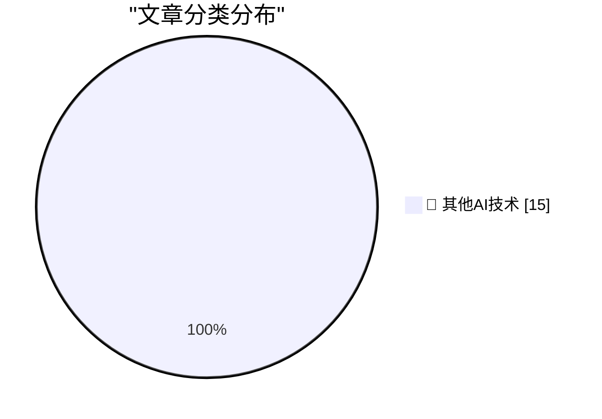

# 📰 AI 博客每日精选 — 2026-07-02

> 来自 98 个技术博客和社交媒体源，AI 精选 Top 15

## 🏆 今日必读

🥇 **Text AI watermarks will always be trivial to remove**

[Text AI watermarks will always be trivial to remove](https://seangoedecke.com/text-ai-watermarks/) — seangoedecke.com · 22 小时前 · 🔬 其他AI技术

> Text AI watermarks will always be trivial to remove

🥈 **Introducing the Safari MCP Server for Web Developers**

[Introducing the Safari MCP Server for Web Developers](https://webkit.org/blog/18136/introducing-the-safari-mcp-server-for-web-developers/) — daringfireball.net · 9 分钟前 · 🔬 其他AI技术

> Introducing the Safari MCP Server for Web Developers

🥉 **EveryMac Turns 30**

[EveryMac Turns 30](https://everymac.com/whatsnew/) — daringfireball.net · 33 分钟前 · 🔬 其他AI技术

> EveryMac Turns 30

4️⃣ **I Repeat Myself (5G vs. LTE Edition)**

[I Repeat Myself (5G vs. LTE Edition)](https://daringfireball.net/linked/2022/03/23/5g-battery-life) — daringfireball.net · 1 小时前 · 🔬 其他AI技术

> I Repeat Myself (5G vs. LTE Edition)

5️⃣ **Truth Social Is Still Just Trump’s Blog**

[Truth Social Is Still Just Trump’s Blog](https://daringfireball.net/2025/06/truth_social_is_just_trumps_blog) — daringfireball.net · 2 小时前 · 🔬 其他AI技术

> Truth Social Is Still Just Trump’s Blog

---

## 📊 数据概览

| 扫描源 | 抓取文章 | 时间范围 | 精选 |
|:---:|:---:|:---:|:---:|
| 64/98 | 1961 篇 → 19 篇 | 24h | **15 篇** |

### 分类分布

---

====================

## 🔬 其他AI技术

### 1. Text AI watermarks will always be trivial to remove

[Text AI watermarks will always be trivial to remove](https://seangoedecke.com/text-ai-watermarks/) — **seangoedecke.com** · 22 小时前 · ⭐ 15/25

> Text AI watermarks will always be trivial to remove

📌 其他AI技术

---

### 2. Introducing the Safari MCP Server for Web Developers

[Introducing the Safari MCP Server for Web Developers](https://webkit.org/blog/18136/introducing-the-safari-mcp-server-for-web-developers/) — **daringfireball.net** · 9 分钟前 · ⭐ 15/25

> Introducing the Safari MCP Server for Web Developers

📌 其他AI技术

---

### 3. EveryMac Turns 30

[EveryMac Turns 30](https://everymac.com/whatsnew/) — **daringfireball.net** · 33 分钟前 · ⭐ 15/25

> EveryMac Turns 30

📌 其他AI技术

---

### 4. I Repeat Myself (5G vs. LTE Edition)

[I Repeat Myself (5G vs. LTE Edition)](https://daringfireball.net/linked/2022/03/23/5g-battery-life) — **daringfireball.net** · 1 小时前 · ⭐ 15/25

> I Repeat Myself (5G vs. LTE Edition)

📌 其他AI技术

---

### 5. Truth Social Is Still Just Trump’s Blog

[Truth Social Is Still Just Trump’s Blog](https://daringfireball.net/2025/06/truth_social_is_just_trumps_blog) — **daringfireball.net** · 2 小时前 · ⭐ 15/25

> Truth Social Is Still Just Trump’s Blog

📌 其他AI技术

---

### 6. ‘A Perfect Reflection of Trump’s Washington’

[‘A Perfect Reflection of Trump’s Washington’](https://politicalwire.com/2026/06/19/a-perfect-reflection-of-trumps-washington/) — **daringfireball.net** · 2 小时前 · ⭐ 15/25

> ‘A Perfect Reflection of Trump’s Washington’

📌 其他AI技术

---

### 7. Claude Fable and Kayfabe

[Claude Fable and Kayfabe](https://www.anthropic.com/news/redeploying-fable-5) — **daringfireball.net** · 3 小时前 · ⭐ 15/25

> Claude Fable and Kayfabe

📌 其他AI技术

---

### 8. ‘Why Is Meta Destroying Its Engineering Organization?’

[‘Why Is Meta Destroying Its Engineering Organization?’](https://newsletter.pragmaticengineer.com/p/why-is-meta-destroying-its-engineering) — **daringfireball.net** · 4 小时前 · ⭐ 15/25

> ‘Why Is Meta Destroying Its Engineering Organization?’

📌 其他AI技术

---

### 9. MG Siegler Got Banned From WhatsApp for No Reason

[MG Siegler Got Banned From WhatsApp for No Reason](https://spyglass.org/whatsapp-ban/) — **daringfireball.net** · 5 小时前 · ⭐ 15/25

> MG Siegler Got Banned From WhatsApp for No Reason

📌 其他AI技术

---

### 10. Hackers Stole Instagram Accounts Simply by Asking Meta AI to Give Them Access

[Hackers Stole Instagram Accounts Simply by Asking Meta AI to Give Them Access](https://www.404media.co/hackers-simply-asked-meta-ai-to-give-them-access-to-high-profile-instagram-accounts-it-worked/) — **daringfireball.net** · 6 小时前 · ⭐ 15/25

> Hackers Stole Instagram Accounts Simply by Asking Meta AI to Give Them Access

📌 其他AI技术

---

### 11. ★ A Tale of Two Modems

[★ A Tale of Two Modems](https://daringfireball.net/2026/07/a_tale_of_two_modems) — **daringfireball.net** · 22 小时前 · ⭐ 15/25

> ★ A Tale of Two Modems

📌 其他AI技术

---

### 12. Pluralistic: The difference between "today's task" and "accretive work" (02 Jul 2026)

[Pluralistic: The difference between "today's task" and "accretive work" (02 Jul 2026)](https://pluralistic.net/2026/07/02/canonization/) — **pluralistic.net** · 14 小时前 · ⭐ 15/25

> Pluralistic: The difference between "today's task" and "accretive work" (02 Jul 2026)

📌 其他AI技术

---

### 13. This blog is written in en-GB

[This blog is written in en-GB](https://shkspr.mobi/blog/2026/07/this-blog-is-written-in-en-gb/) — **shkspr.mobi** · 10 小时前 · ⭐ 15/25

> This blog is written in en-GB

📌 其他AI技术

---

### 14. The case of the thread executing from an unloaded third-party DLL

[The case of the thread executing from an unloaded third-party DLL](https://devblogs.microsoft.com/oldnewthing/20260702-00/?p=112500) — **devblogs.microsoft.com/oldnewthing** · 8 小时前 · ⭐ 15/25

> The case of the thread executing from an unloaded third-party DLL

📌 其他AI技术

---

### 15. The Winning Essays for the Big Questions About AI

[The Winning Essays for the Big Questions About AI](https://www.dwarkesh.com/p/blog-prize-winners) — **dwarkesh.com** · 23 小时前 · ⭐ 15/25

> The Winning Essays for the Big Questions About AI

📌 其他AI技术

---

====================

*生成于 2026-07-02 22:04 | 扫描 64 源 → 获取 1961 篇 → 精选 15 篇*
*基于 [Hacker News Popularity Contest 2025](https://refactoringenglish.com/tools/hn-popularity/) RSS 源列表，由 [Andrej Karpathy](https://x.com/karpathy) 推荐*
*由「懂点儿AI」制作，欢迎关注同名微信公众号获取更多 AI 实用技巧 💡*
