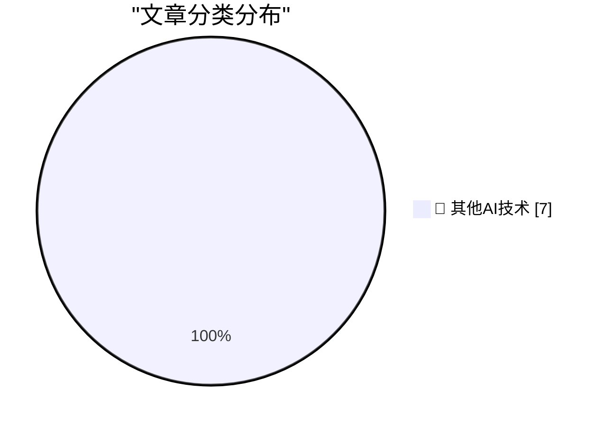

# 📰 AI 博客每日精选 — 2026-07-03

> 来自 98 个技术博客和社交媒体源，AI 精选 Top 7

## 🏆 今日必读

🥇 **★ Claude’s Criminally Bad Electron Mac App Is an Inside Job**

[★ Claude’s Criminally Bad Electron Mac App Is an Inside Job](https://daringfireball.net/2026/07/claudes_criminally_bad_mac_app_is_an_inside_job) — daringfireball.net · 39 分钟前 · 🔬 其他AI技术

> ★ Claude’s Criminally Bad Electron Mac App Is an Inside Job

🥈 **April Report From Ookla: ‘A Return to mmWave 5G’**

[April Report From Ookla: ‘A Return to mmWave 5G’](https://www.ookla.com/articles/a-return-to-mmwave-5g) — daringfireball.net · 23 小时前 · 🔬 其他AI技术

> April Report From Ookla: ‘A Return to mmWave 5G’

🥉 **Pluralistic: CARDiac, syntax coloring, view source and vibe code (03 Jul 2026)**

[Pluralistic: CARDiac, syntax coloring, view source and vibe code (03 Jul 2026)](https://pluralistic.net/2026/07/03/rod-logic/) — pluralistic.net · 13 小时前 · 🔬 其他AI技术

> Pluralistic: CARDiac, syntax coloring, view source and vibe code (03 Jul 2026)

4️⃣ **How did we conclude that CcNamespace.dll was the ringleader of a group of DLLs that unloaded prematurely?**

[How did we conclude that CcNamespace.dll was the ringleader of a group of DLLs that unloaded prematurely?](https://devblogs.microsoft.com/oldnewthing/20260703-00/?p=112504) — devblogs.microsoft.com/oldnewthing · 8 小时前 · 🔬 其他AI技术

> How did we conclude that CcNamespace.dll was the ringleader of a group of DLLs that unloaded prematurely?

5️⃣ **The Life and Times of Maxis, Part 1: SimEverything**

[The Life and Times of Maxis, Part 1: SimEverything](https://www.filfre.net/2026/07/the-life-and-times-of-maxis-part-1-simeverything/) — filfre.net · 6 小时前 · 🔬 其他AI技术

> The Life and Times of Maxis, Part 1: SimEverything

---

## 📊 数据概览

| 扫描源 | 抓取文章 | 时间范围 | 精选 |
|:---:|:---:|:---:|:---:|
| 60/98 | 1900 篇 → 7 篇 | 24h | **7 篇** |

### 分类分布

---

====================

## 🔬 其他AI技术

### 1. ★ Claude’s Criminally Bad Electron Mac App Is an Inside Job

[★ Claude’s Criminally Bad Electron Mac App Is an Inside Job](https://daringfireball.net/2026/07/claudes_criminally_bad_mac_app_is_an_inside_job) — **daringfireball.net** · 39 分钟前 · ⭐ 15/25

> ★ Claude’s Criminally Bad Electron Mac App Is an Inside Job

📌 其他AI技术

---

### 2. April Report From Ookla: ‘A Return to mmWave 5G’

[April Report From Ookla: ‘A Return to mmWave 5G’](https://www.ookla.com/articles/a-return-to-mmwave-5g) — **daringfireball.net** · 23 小时前 · ⭐ 15/25

> April Report From Ookla: ‘A Return to mmWave 5G’

📌 其他AI技术

---

### 3. Pluralistic: CARDiac, syntax coloring, view source and vibe code (03 Jul 2026)

[Pluralistic: CARDiac, syntax coloring, view source and vibe code (03 Jul 2026)](https://pluralistic.net/2026/07/03/rod-logic/) — **pluralistic.net** · 13 小时前 · ⭐ 15/25

> Pluralistic: CARDiac, syntax coloring, view source and vibe code (03 Jul 2026)

📌 其他AI技术

---

### 4. How did we conclude that CcNamespace.dll was the ringleader of a group of DLLs that unloaded prematurely?

[How did we conclude that CcNamespace.dll was the ringleader of a group of DLLs that unloaded prematurely?](https://devblogs.microsoft.com/oldnewthing/20260703-00/?p=112504) — **devblogs.microsoft.com/oldnewthing** · 8 小时前 · ⭐ 15/25

> How did we conclude that CcNamespace.dll was the ringleader of a group of DLLs that unloaded prematurely?

📌 其他AI技术

---

### 5. The Life and Times of Maxis, Part 1: SimEverything

[The Life and Times of Maxis, Part 1: SimEverything](https://www.filfre.net/2026/07/the-life-and-times-of-maxis-part-1-simeverything/) — **filfre.net** · 6 小时前 · ⭐ 15/25

> The Life and Times of Maxis, Part 1: SimEverything

📌 其他AI技术

---

### 6. Compute!’s Gazette magazine, 1983-1995

[Compute!’s Gazette magazine, 1983-1995](https://dfarq.homeip.net/computes-gazette-magazine-1983-1995/?utm_source=rss&#038;utm_medium=rss&#038;utm_campaign=computes-gazette-magazine-1983-1995) — **dfarq.homeip.net** · 11 小时前 · ⭐ 15/25

> Compute!’s Gazette magazine, 1983-1995

📌 其他AI技术

---

### 7. Midnight Train to Stockholm

[Midnight Train to Stockholm](https://matduggan.com/midnight-train-to-stockholm/) — **matduggan.com** · 9 小时前 · ⭐ 15/25

> Midnight Train to Stockholm

📌 其他AI技术

---

====================

*生成于 2026-07-03 22:03 | 扫描 60 源 → 获取 1900 篇 → 精选 7 篇*
*基于 [Hacker News Popularity Contest 2025](https://refactoringenglish.com/tools/hn-popularity/) RSS 源列表，由 [Andrej Karpathy](https://x.com/karpathy) 推荐*
*由「懂点儿AI」制作，欢迎关注同名微信公众号获取更多 AI 实用技巧 💡*
