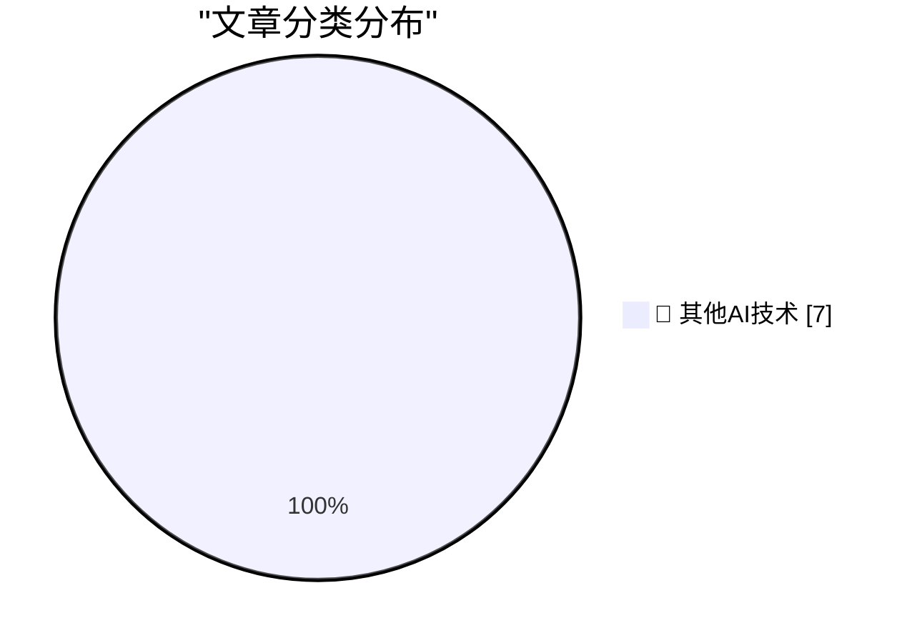

# 📰 AI 博客每日精选 — 2026-07-04

> 来自 98 个技术博客和社交媒体源，AI 精选 Top 7

## 🏆 今日必读

🥇 **Day One Journal**

[Day One Journal](https://dayoneapp.com/blog/introducing-daily-chat/) — daringfireball.net · 54 分钟前 · 🔬 其他AI技术

> Day One Journal

🥈 **From the DF Archive: ‘Electron and the Decline of Native Apps’**

[From the DF Archive: ‘Electron and the Decline of Native Apps’](https://daringfireball.net/2018/12/electron_and_the_decline_of_native_apps) — daringfireball.net · 2 小时前 · 🔬 其他AI技术

> From the DF Archive: ‘Electron and the Decline of Native Apps’

🥉 **Fantastical 4.1.15 Adds Calendar Mirroring**

[Fantastical 4.1.15 Adds Calendar Mirroring](https://flexibits.com/blog/2026/06/double-booked-never-heard-of-it-meet-calendar-mirroring-in-fantastical/) — daringfireball.net · 4 小时前 · 🔬 其他AI技术

> Fantastical 4.1.15 Adds Calendar Mirroring

4️⃣ **Combined 1D and 2D Barcodes**

[Combined 1D and 2D Barcodes](https://shkspr.mobi/blog/2026/07/combined-1d-and-2d-barcodes/) — shkspr.mobi · 10 小时前 · 🔬 其他AI技术

> Combined 1D and 2D Barcodes

5️⃣ **Better Models: Worse Tools**

[Better Models: Worse Tools](https://lucumr.pocoo.org/2026/7/4/better-models-worse-tools/) — lucumr.pocoo.org · 21 小时前 · 🔬 其他AI技术

> Better Models: Worse Tools

---

## 📊 数据概览

| 扫描源 | 抓取文章 | 时间范围 | 精选 |
|:---:|:---:|:---:|:---:|
| 63/98 | 1949 篇 → 7 篇 | 24h | **7 篇** |

### 分类分布

---

====================

## 🔬 其他AI技术

### 1. Day One Journal

[Day One Journal](https://dayoneapp.com/blog/introducing-daily-chat/) — **daringfireball.net** · 54 分钟前 · ⭐ 15/25

> Day One Journal

📌 其他AI技术

---

### 2. From the DF Archive: ‘Electron and the Decline of Native Apps’

[From the DF Archive: ‘Electron and the Decline of Native Apps’](https://daringfireball.net/2018/12/electron_and_the_decline_of_native_apps) — **daringfireball.net** · 2 小时前 · ⭐ 15/25

> From the DF Archive: ‘Electron and the Decline of Native Apps’

📌 其他AI技术

---

### 3. Fantastical 4.1.15 Adds Calendar Mirroring

[Fantastical 4.1.15 Adds Calendar Mirroring](https://flexibits.com/blog/2026/06/double-booked-never-heard-of-it-meet-calendar-mirroring-in-fantastical/) — **daringfireball.net** · 4 小时前 · ⭐ 15/25

> Fantastical 4.1.15 Adds Calendar Mirroring

📌 其他AI技术

---

### 4. Combined 1D and 2D Barcodes

[Combined 1D and 2D Barcodes](https://shkspr.mobi/blog/2026/07/combined-1d-and-2d-barcodes/) — **shkspr.mobi** · 10 小时前 · ⭐ 15/25

> Combined 1D and 2D Barcodes

📌 其他AI技术

---

### 5. Better Models: Worse Tools

[Better Models: Worse Tools](https://lucumr.pocoo.org/2026/7/4/better-models-worse-tools/) — **lucumr.pocoo.org** · 21 小时前 · ⭐ 15/25

> Better Models: Worse Tools

📌 其他AI技术

---

### 6. This Week in Package Management: 4 July 2026

[This Week in Package Management: 4 July 2026](https://nesbitt.io/2026/07/04/this-week-in-package-management.html) — **nesbitt.io** · 11 小时前 · ⭐ 15/25

> This Week in Package Management: 4 July 2026

📌 其他AI技术

---

### 7. megawatts by microwave

[megawatts by microwave](https://computer.rip/2026-07-04-microwave-and-power.html) — **computer.rip** · 21 小时前 · ⭐ 15/25

> megawatts by microwave

📌 其他AI技术

---

====================

*生成于 2026-07-04 21:57 | 扫描 63 源 → 获取 1949 篇 → 精选 7 篇*
*基于 [Hacker News Popularity Contest 2025](https://refactoringenglish.com/tools/hn-popularity/) RSS 源列表，由 [Andrej Karpathy](https://x.com/karpathy) 推荐*
*由「懂点儿AI」制作，欢迎关注同名微信公众号获取更多 AI 实用技巧 💡*
