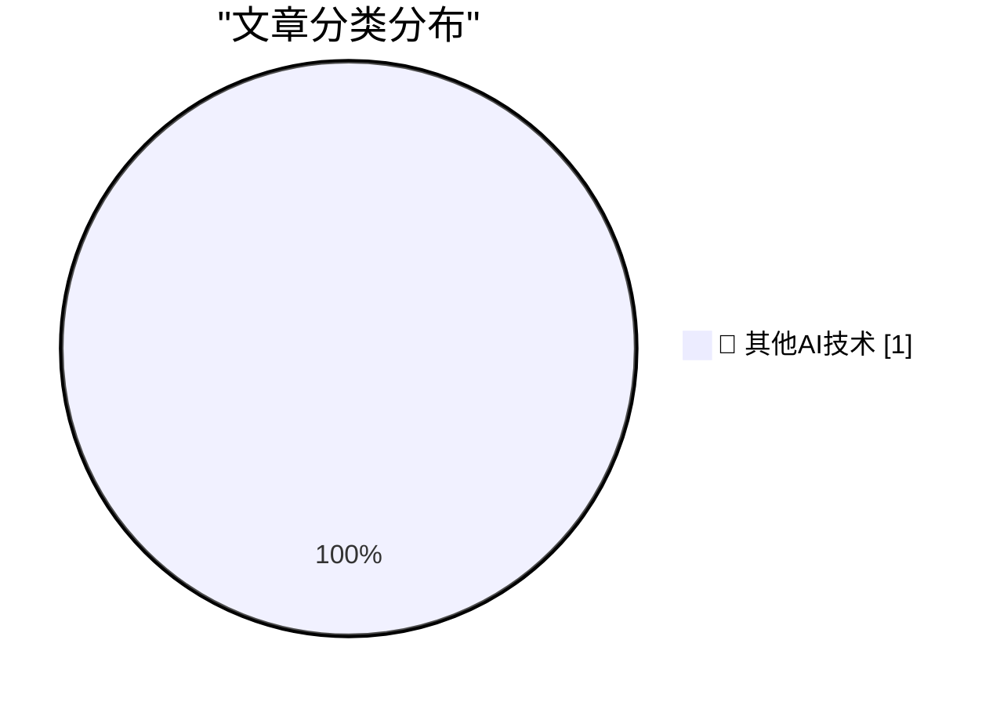

# 📰 AI 博客每日精选 — 2026-07-05

> 来自 98 个技术博客和社交媒体源，AI 精选 Top 1

## 📊 数据概览

| 扫描源 | 抓取文章 | 时间范围 | 精选 |
|:---:|:---:|:---:|:---:|
| 62/98 | 1919 篇 → 1 篇 | 24h | **1 篇** |

### 分类分布

---

====================

## 🔬 其他AI技术

### 1. Travel notes: PLDI Boulder

[Travel notes: PLDI Boulder](https://bernsteinbear.com/blog/travel-notes-pldi-boulder/?utm_source=rss) — **bernsteinbear.com** · 22 小时前 · ⭐ 15/25

> Travel notes: PLDI Boulder

📌 其他AI技术

---

====================

*生成于 2026-07-05 22:00 | 扫描 62 源 → 获取 1919 篇 → 精选 1 篇*
*基于 [Hacker News Popularity Contest 2025](https://refactoringenglish.com/tools/hn-popularity/) RSS 源列表，由 [Andrej Karpathy](https://x.com/karpathy) 推荐*
*由「懂点儿AI」制作，欢迎关注同名微信公众号获取更多 AI 实用技巧 💡*
