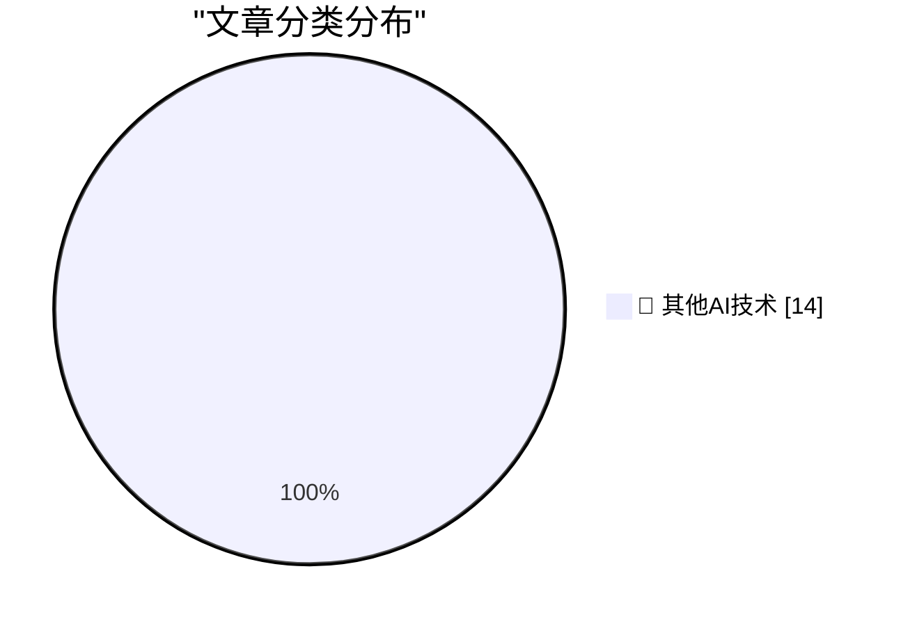

# 📰 AI 博客每日精选 — 2026-07-06

> 来自 98 个技术博客和社交媒体源，AI 精选 Top 14

## 🏆 今日必读

🥇 **C2PA only works if everything is signed**

[C2PA only works if everything is signed](https://seangoedecke.com/c2pa-only-works-if-everything-is-signed/) — seangoedecke.com · 22 小时前 · 🔬 其他AI技术

> C2PA only works if everything is signed

🥈 **Markdown Now Has a UTI in Apple’s Version 27 OSes**

[Markdown Now Has a UTI in Apple’s Version 27 OSes](https://developer.apple.com/documentation/uniformtypeidentifiers/uttype-swift.struct/markdown) — daringfireball.net · 1 小时前 · 🔬 其他AI技术

> Markdown Now Has a UTI in Apple’s Version 27 OSes

🥉 **Backblaze Versus Dropbox**

[Backblaze Versus Dropbox](https://mjtsai.com/blog/2025/12/19/backblaze-no-longer-backs-up-dropbox/) — daringfireball.net · 3 小时前 · 🔬 其他AI技术

> Backblaze Versus Dropbox

4️⃣ **Allen Pike, Back in November: ‘Why Is ChatGPT for Mac So Good?’**

[Allen Pike, Back in November: ‘Why Is ChatGPT for Mac So Good?’](https://allenpike.com/2025/why-is-chatgpt-so-good-claude/) — daringfireball.net · 4 小时前 · 🔬 其他AI技术

> Allen Pike, Back in November: ‘Why Is ChatGPT for Mac So Good?’

5️⃣ **ATP Member Special: Mac-Assed Mac Apps**

[ATP Member Special: Mac-Assed Mac Apps](https://atp.fm/atp-dev-mac-assed-mac-apps) — daringfireball.net · 4 小时前 · 🔬 其他AI技术

> ATP Member Special: Mac-Assed Mac Apps

---

## 📊 数据概览

| 扫描源 | 抓取文章 | 时间范围 | 精选 |
|:---:|:---:|:---:|:---:|
| 64/98 | 1962 篇 → 14 篇 | 24h | **14 篇** |

### 分类分布

---

====================

## 🔬 其他AI技术

### 1. C2PA only works if everything is signed

[C2PA only works if everything is signed](https://seangoedecke.com/c2pa-only-works-if-everything-is-signed/) — **seangoedecke.com** · 22 小时前 · ⭐ 15/25

> C2PA only works if everything is signed

📌 其他AI技术

---

### 2. Markdown Now Has a UTI in Apple’s Version 27 OSes

[Markdown Now Has a UTI in Apple’s Version 27 OSes](https://developer.apple.com/documentation/uniformtypeidentifiers/uttype-swift.struct/markdown) — **daringfireball.net** · 1 小时前 · ⭐ 15/25

> Markdown Now Has a UTI in Apple’s Version 27 OSes

📌 其他AI技术

---

### 3. Backblaze Versus Dropbox

[Backblaze Versus Dropbox](https://mjtsai.com/blog/2025/12/19/backblaze-no-longer-backs-up-dropbox/) — **daringfireball.net** · 3 小时前 · ⭐ 15/25

> Backblaze Versus Dropbox

📌 其他AI技术

---

### 4. Allen Pike, Back in November: ‘Why Is ChatGPT for Mac So Good?’

[Allen Pike, Back in November: ‘Why Is ChatGPT for Mac So Good?’](https://allenpike.com/2025/why-is-chatgpt-so-good-claude/) — **daringfireball.net** · 4 小时前 · ⭐ 15/25

> Allen Pike, Back in November: ‘Why Is ChatGPT for Mac So Good?’

📌 其他AI技术

---

### 5. ATP Member Special: Mac-Assed Mac Apps

[ATP Member Special: Mac-Assed Mac Apps](https://atp.fm/atp-dev-mac-assed-mac-apps) — **daringfireball.net** · 4 小时前 · ⭐ 15/25

> ATP Member Special: Mac-Assed Mac Apps

📌 其他AI技术

---

### 6. Maestral, the Open Source Splendidly Simple Mac Dropbox Client, Has Been Retired

[Maestral, the Open Source Splendidly Simple Mac Dropbox Client, Has Been Retired](https://maestral.app/) — **daringfireball.net** · 5 小时前 · ⭐ 15/25

> Maestral, the Open Source Splendidly Simple Mac Dropbox Client, Has Been Retired

📌 其他AI技术

---

### 7. Jason Snell Ends His Column, and 28-Year Run, at Macworld

[Jason Snell Ends His Column, and 28-Year Run, at Macworld](https://www.macworld.com/article/3175482) — **daringfireball.net** · 7 小时前 · ⭐ 15/25

> Jason Snell Ends His Column, and 28-Year Run, at Macworld

📌 其他AI技术

---

### 8. Amazon Basics, but for intellectual property.

[Amazon Basics, but for intellectual property.](https://idiallo.com/blog/amazon-basics-but-intellectual-property) — **idiallo.com** · 15 小时前 · ⭐ 15/25

> Amazon Basics, but for intellectual property.

📌 其他AI技术

---

### 9. I'm just so bored of AI

[I'm just so bored of AI](https://shkspr.mobi/blog/2026/07/im-just-so-bored-of-ai/) — **shkspr.mobi** · 10 小时前 · ⭐ 15/25

> I'm just so bored of AI

📌 其他AI技术

---

### 10. Life with hazard ratios

[Life with hazard ratios](https://dynomight.net/hazard-ratios/) — **dynomight.net** · 22 小时前 · ⭐ 15/25

> Life with hazard ratios

📌 其他AI技术

---

### 11. I opened a file with FILE_FLAG_DELETE_ON_CLOSE, but now I changed my mind

[I opened a file with FILE_FLAG_DELETE_ON_CLOSE, but now I changed my mind](https://devblogs.microsoft.com/oldnewthing/20260706-00/?p=112506) — **devblogs.microsoft.com/oldnewthing** · 8 小时前 · ⭐ 15/25

> I opened a file with FILE_FLAG_DELETE_ON_CLOSE, but now I changed my mind

📌 其他AI技术

---

### 12. Premium: The Hater's Guide To SoftBank

[Premium: The Hater's Guide To SoftBank](https://www.wheresyoured.at/premium-the-haters-guide-to-softbank/) — **wheresyoured.at** · 7 小时前 · ⭐ 15/25

> Premium: The Hater's Guide To SoftBank

📌 其他AI技术

---

### 13. Why IBM bought Lotus

[Why IBM bought Lotus](https://dfarq.homeip.net/why-ibm-bought-lotus/?utm_source=rss&#038;utm_medium=rss&#038;utm_campaign=why-ibm-bought-lotus) — **dfarq.homeip.net** · 11 小时前 · ⭐ 15/25

> Why IBM bought Lotus

📌 其他AI技术

---

### 14. GLM 5.2 and the coming AI margin collapse (part 1)

[GLM 5.2 and the coming AI margin collapse (part 1)](https://martinalderson.com/posts/the-upcoming-ai-margin-collapse-part-1-glm-5-2/?utm_source=rss&amp;utm_medium=rss&amp;utm_campaign=feed) — **martinalderson.com** · 22 小时前 · ⭐ 15/25

> GLM 5.2 and the coming AI margin collapse (part 1)

📌 其他AI技术

---

====================

*生成于 2026-07-06 22:12 | 扫描 64 源 → 获取 1962 篇 → 精选 14 篇*
*基于 [Hacker News Popularity Contest 2025](https://refactoringenglish.com/tools/hn-popularity/) RSS 源列表，由 [Andrej Karpathy](https://x.com/karpathy) 推荐*
*由「懂点儿AI」制作，欢迎关注同名微信公众号获取更多 AI 实用技巧 💡*
