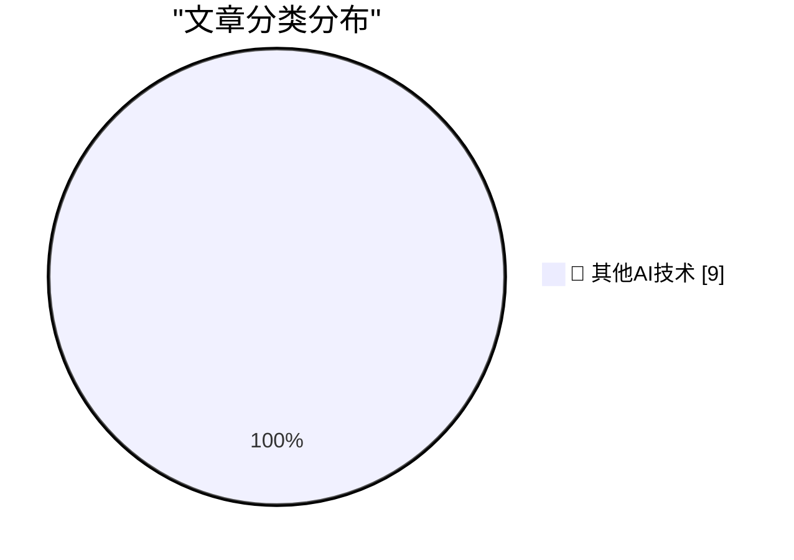

# 📰 AI 博客每日精选 — 2026-07-07

> 来自 98 个技术博客和社交媒体源，AI 精选 Top 9

## 🏆 今日必读

🥇 **Blog about things you don't understand yet**

[Blog about things you don't understand yet](https://seangoedecke.com/blog-about-things-you-dont-understand-yet/) — seangoedecke.com · 22 小时前 · 🔬 其他AI技术

> Blog about things you don't understand yet

🥈 **OS 27 Developer Beta 3 Enables New ‘Pace’ and ‘Expressivity’ Sliders for Siri’s New Voices**

[OS 27 Developer Beta 3 Enables New ‘Pace’ and ‘Expressivity’ Sliders for Siri’s New Voices](https://techcrunch.com/2026/07/06/you-can-now-customize-siris-pace-and-expressivity-in-the-latest-ios-27-beta/) — daringfireball.net · 6 小时前 · 🔬 其他AI技术

> OS 27 Developer Beta 3 Enables New ‘Pace’ and ‘Expressivity’ Sliders for Siri’s New Voices

🥉 **★ Apple Should Eliminate the App Icon ‘Squircle Jail’**

[★ Apple Should Eliminate the App Icon ‘Squircle Jail’](https://daringfireball.net/2026/07/eliminate_app_icon_squircle_jail) — daringfireball.net · 23 小时前 · 🔬 其他AI技术

> ★ Apple Should Eliminate the App Icon ‘Squircle Jail’

4️⃣ **Pluralistic: How US states and international trustbusters can beat Big Tech (07 Jul 2026)**

[Pluralistic: How US states and international trustbusters can beat Big Tech (07 Jul 2026)](https://pluralistic.net/2026/07/07/going-global/) — pluralistic.net · 9 小时前 · 🔬 其他AI技术

> Pluralistic: How US states and international trustbusters can beat Big Tech (07 Jul 2026)

5️⃣ **How did Windows 95 decide that a setup program ran?**

[How did Windows 95 decide that a setup program ran?](https://devblogs.microsoft.com/oldnewthing/20260707-00/?p=112508) — devblogs.microsoft.com/oldnewthing · 8 小时前 · 🔬 其他AI技术

> How did Windows 95 decide that a setup program ran?

---

## 📊 数据概览

| 扫描源 | 抓取文章 | 时间范围 | 精选 |
|:---:|:---:|:---:|:---:|
| 63/98 | 1951 篇 → 9 篇 | 24h | **9 篇** |

### 分类分布

---

====================

## 🔬 其他AI技术

### 1. Blog about things you don't understand yet

[Blog about things you don't understand yet](https://seangoedecke.com/blog-about-things-you-dont-understand-yet/) — **seangoedecke.com** · 22 小时前 · ⭐ 15/25

> Blog about things you don't understand yet

📌 其他AI技术

---

### 2. OS 27 Developer Beta 3 Enables New ‘Pace’ and ‘Expressivity’ Sliders for Siri’s New Voices

[OS 27 Developer Beta 3 Enables New ‘Pace’ and ‘Expressivity’ Sliders for Siri’s New Voices](https://techcrunch.com/2026/07/06/you-can-now-customize-siris-pace-and-expressivity-in-the-latest-ios-27-beta/) — **daringfireball.net** · 6 小时前 · ⭐ 15/25

> OS 27 Developer Beta 3 Enables New ‘Pace’ and ‘Expressivity’ Sliders for Siri’s New Voices

📌 其他AI技术

---

### 3. ★ Apple Should Eliminate the App Icon ‘Squircle Jail’

[★ Apple Should Eliminate the App Icon ‘Squircle Jail’](https://daringfireball.net/2026/07/eliminate_app_icon_squircle_jail) — **daringfireball.net** · 23 小时前 · ⭐ 15/25

> ★ Apple Should Eliminate the App Icon ‘Squircle Jail’

📌 其他AI技术

---

### 4. Pluralistic: How US states and international trustbusters can beat Big Tech (07 Jul 2026)

[Pluralistic: How US states and international trustbusters can beat Big Tech (07 Jul 2026)](https://pluralistic.net/2026/07/07/going-global/) — **pluralistic.net** · 9 小时前 · ⭐ 15/25

> Pluralistic: How US states and international trustbusters can beat Big Tech (07 Jul 2026)

📌 其他AI技术

---

### 5. How did Windows 95 decide that a setup program ran?

[How did Windows 95 decide that a setup program ran?](https://devblogs.microsoft.com/oldnewthing/20260707-00/?p=112508) — **devblogs.microsoft.com/oldnewthing** · 8 小时前 · ⭐ 15/25

> How did Windows 95 decide that a setup program ran?

📌 其他AI技术

---

### 6. Content addressing in package managers

[Content addressing in package managers](https://nesbitt.io/2026/07/07/content-addressing-in-package-managers.html) — **nesbitt.io** · 12 小时前 · ⭐ 15/25

> Content addressing in package managers

📌 其他AI技术

---

### 7. Let AI Burn

[Let AI Burn](https://www.wheresyoured.at/let-ai-burn/) — **wheresyoured.at** · 5 小时前 · ⭐ 15/25

> Let AI Burn

📌 其他AI技术

---

### 8. Ray Kassar, former Atari CEO

[Ray Kassar, former Atari CEO](https://dfarq.homeip.net/ray-kassar-former-atari-ceo/?utm_source=rss&#038;utm_medium=rss&#038;utm_campaign=ray-kassar-former-atari-ceo) — **dfarq.homeip.net** · 11 小时前 · ⭐ 15/25

> Ray Kassar, former Atari CEO

📌 其他AI技术

---

### 9. Kort geding aandeelhouders Solvinity

[Kort geding aandeelhouders Solvinity](https://berthub.eu/articles/posts/kort-geding-aandeelhouder-solvinity/) — **berthub.eu** · 12 小时前 · ⭐ 15/25

> Kort geding aandeelhouders Solvinity

📌 其他AI技术

---

====================

*生成于 2026-07-07 22:10 | 扫描 63 源 → 获取 1951 篇 → 精选 9 篇*
*基于 [Hacker News Popularity Contest 2025](https://refactoringenglish.com/tools/hn-popularity/) RSS 源列表，由 [Andrej Karpathy](https://x.com/karpathy) 推荐*
*由「懂点儿AI」制作，欢迎关注同名微信公众号获取更多 AI 实用技巧 💡*
