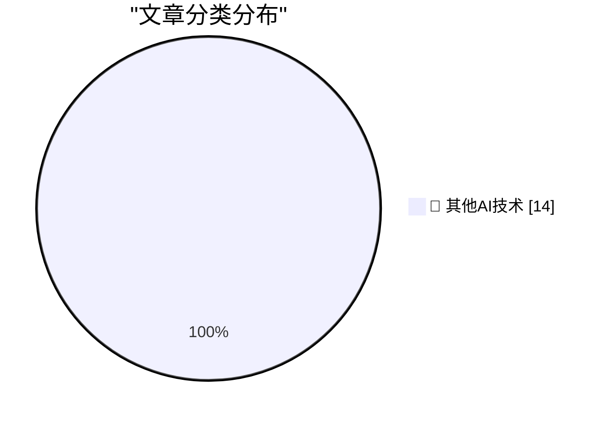

# 📰 AI 博客每日精选 — 2026-07-08

> 来自 98 个技术博客和社交媒体源，AI 精选 Top 14

## 🏆 今日必读

🥇 **The Special Value Pi 4 was extremely short-lived**

[The Special Value Pi 4 was extremely short-lived](https://www.jeffgeerling.com/blog/2026/special-value-pi-4-extremely-short-lived/) — jeffgeerling.com · 8 小时前 · 🔬 其他AI技术

> The Special Value Pi 4 was extremely short-lived

🥈 **Mac Apps Can Escape From Squircle Jail If They’re Not in the Mac App Store**

[Mac Apps Can Escape From Squircle Jail If They’re Not in the Mac App Store](https://tyler.io/2026/07/05/escape-from-squircle-jail/) — daringfireball.net · 59 分钟前 · 🔬 其他AI技术

> Mac Apps Can Escape From Squircle Jail If They’re Not in the Mac App Store

🥉 **‘Searching for SmarterChild’ Kickstarter**

[‘Searching for SmarterChild’ Kickstarter](https://www.kickstarter.com/projects/smarterchild/searching-for-smarterchild-a-feature-documentary/creator) — daringfireball.net · 2 小时前 · 🔬 其他AI技术

> ‘Searching for SmarterChild’ Kickstarter

4️⃣ **My Conversation With ELIZA**

[My Conversation With ELIZA](https://sites.google.com/view/elizaarchaeology/try-eliza?authuser=0) — daringfireball.net · 4 小时前 · 🔬 其他AI技术

> My Conversation With ELIZA

5️⃣ **The ELIZA Archaeology Project**

[The ELIZA Archaeology Project](https://findingeliza.org/) — daringfireball.net · 4 小时前 · 🔬 其他AI技术

> The ELIZA Archaeology Project

---

## 📊 数据概览

| 扫描源 | 抓取文章 | 时间范围 | 精选 |
|:---:|:---:|:---:|:---:|
| 64/98 | 1963 篇 → 14 篇 | 24h | **14 篇** |

### 分类分布

---

====================

## 🔬 其他AI技术

### 1. The Special Value Pi 4 was extremely short-lived

[The Special Value Pi 4 was extremely short-lived](https://www.jeffgeerling.com/blog/2026/special-value-pi-4-extremely-short-lived/) — **jeffgeerling.com** · 8 小时前 · ⭐ 15/25

> The Special Value Pi 4 was extremely short-lived

📌 其他AI技术

---

### 2. Mac Apps Can Escape From Squircle Jail If They’re Not in the Mac App Store

[Mac Apps Can Escape From Squircle Jail If They’re Not in the Mac App Store](https://tyler.io/2026/07/05/escape-from-squircle-jail/) — **daringfireball.net** · 59 分钟前 · ⭐ 15/25

> Mac Apps Can Escape From Squircle Jail If They’re Not in the Mac App Store

📌 其他AI技术

---

### 3. ‘Searching for SmarterChild’ Kickstarter

[‘Searching for SmarterChild’ Kickstarter](https://www.kickstarter.com/projects/smarterchild/searching-for-smarterchild-a-feature-documentary/creator) — **daringfireball.net** · 2 小时前 · ⭐ 15/25

> ‘Searching for SmarterChild’ Kickstarter

📌 其他AI技术

---

### 4. My Conversation With ELIZA

[My Conversation With ELIZA](https://sites.google.com/view/elizaarchaeology/try-eliza?authuser=0) — **daringfireball.net** · 4 小时前 · ⭐ 15/25

> My Conversation With ELIZA

📌 其他AI技术

---

### 5. The ELIZA Archaeology Project

[The ELIZA Archaeology Project](https://findingeliza.org/) — **daringfireball.net** · 4 小时前 · ⭐ 15/25

> The ELIZA Archaeology Project

📌 其他AI技术

---

### 6. App Icon Conventions From the Original Macintosh

[App Icon Conventions From the Original Macintosh](https://leancrew.com/all-this/2026/07/old-icons/) — **daringfireball.net** · 7 小时前 · ⭐ 15/25

> App Icon Conventions From the Original Macintosh

📌 其他AI技术

---

### 7. [Sponsor] WorkOS Pipes: More Context Makes for Smarter Products

[[Sponsor] WorkOS Pipes: More Context Makes for Smarter Products](https://workos.com/pipes?utm_source=daringfireball&amp;utm_medium=newsletter&amp;utm_campaign=q32026) — **daringfireball.net** · 7 小时前 · ⭐ 15/25

> [Sponsor] WorkOS Pipes: More Context Makes for Smarter Products

📌 其他AI技术

---

### 8. And Then the Billionaire Paid Off $550 Million of Our Debts

[And Then the Billionaire Paid Off $550 Million of Our Debts](https://idiallo.com/blog/billionaire-paid-off-550-million-dollars-of-our-debts) — **idiallo.com** · 14 小时前 · ⭐ 15/25

> And Then the Billionaire Paid Off $550 Million of Our Debts

📌 其他AI技术

---

### 9. A bug which only affected left-handed users

[A bug which only affected left-handed users](https://shkspr.mobi/blog/2026/07/a-bug-which-only-affected-left-handed-users/) — **shkspr.mobi** · 10 小时前 · ⭐ 15/25

> A bug which only affected left-handed users

📌 其他AI技术

---

### 10. Agents are monads (but not that kind)

[Agents are monads (but not that kind)](https://xeiaso.net/blog/2026/hyle-pneuma/) — **xeiaso.net** · 22 小时前 · ⭐ 15/25

> Agents are monads (but not that kind)

📌 其他AI技术

---

### 11. The other kind of control flow guard check: The combined validate and call

[The other kind of control flow guard check: The combined validate and call](https://devblogs.microsoft.com/oldnewthing/20260708-00/?p=112510) — **devblogs.microsoft.com/oldnewthing** · 8 小时前 · ⭐ 15/25

> The other kind of control flow guard check: The combined validate and call

📌 其他AI技术

---

### 12. Writing an LLM from scratch, part 34b -- from bigrams to GPT-2, one component at a time (in JAX)

[Writing an LLM from scratch, part 34b -- from bigrams to GPT-2, one component at a time (in JAX)](https://www.gilesthomas.com/2026/07/llm-from-scratch-34b-building-and-training-gpt-2-small-in-jax) — **gilesthomas.com** · 3 小时前 · ⭐ 15/25

> Writing an LLM from scratch, part 34b -- from bigrams to GPT-2, one component at a time (in JAX)

📌 其他AI技术

---

### 13. Family Feud: Mac-assed Mac App Edition

[Family Feud: Mac-assed Mac App Edition](https://blog.jim-nielsen.com/2026/mac-assed-family-feud/) — **blog.jim-nielsen.com** · 3 小时前 · ⭐ 15/25

> Family Feud: Mac-assed Mac App Edition

📌 其他AI技术

---

### 14. How Donkey Kong toppled Atari

[How Donkey Kong toppled Atari](https://dfarq.homeip.net/how-donkey-kong-toppled-atari/?utm_source=rss&#038;utm_medium=rss&#038;utm_campaign=how-donkey-kong-toppled-atari) — **dfarq.homeip.net** · 11 小时前 · ⭐ 15/25

> How Donkey Kong toppled Atari

📌 其他AI技术

---

====================

*生成于 2026-07-08 22:03 | 扫描 64 源 → 获取 1963 篇 → 精选 14 篇*
*基于 [Hacker News Popularity Contest 2025](https://refactoringenglish.com/tools/hn-popularity/) RSS 源列表，由 [Andrej Karpathy](https://x.com/karpathy) 推荐*
*由「懂点儿AI」制作，欢迎关注同名微信公众号获取更多 AI 实用技巧 💡*
