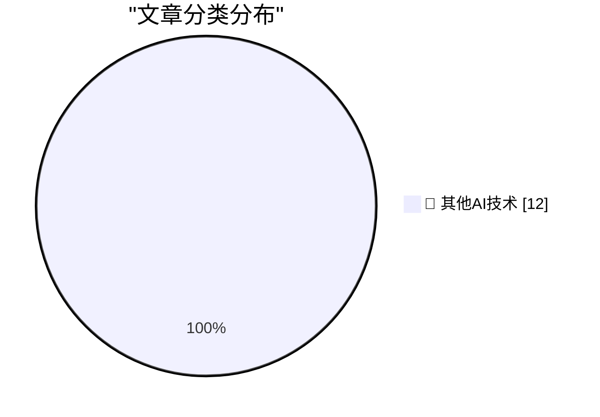

# 📰 AI 博客每日精选 — 2026-07-09

> 来自 98 个技术博客和社交媒体源，AI 精选 Top 12

## 🏆 今日必读

🥇 **Today’s the Day OpenAI Fucked Up the ChatGPT Mac App**

[Today’s the Day OpenAI Fucked Up the ChatGPT Mac App](https://9to5mac.com/2026/07/09/openai-announcing-the-next-chapter-for-chatgpt-today-watch-here/) — daringfireball.net · 2 小时前 · 🔬 其他AI技术

> Today’s the Day OpenAI Fucked Up the ChatGPT Mac App

🥈 **Apple’s Classic Mac Era Forays Into ‘Apps as Tiled Buttons’ Simplified Computing: At Ease and Launcher**

[Apple’s Classic Mac Era Forays Into ‘Apps as Tiled Buttons’ Simplified Computing: At Ease and Launcher](https://daringfireball.net/2026/07/whats_good_for_the_ios_goose_is_often_not_good_for_the_macos_gander) — daringfireball.net · 2 小时前 · 🔬 其他AI技术

> Apple’s Classic Mac Era Forays Into ‘Apps as Tiled Buttons’ Simplified Computing: At Ease and Launcher

🥉 **★ John Ternus Should Reverse Apple’s Slide Down the Advertising Slippery Slope**

[★ John Ternus Should Reverse Apple’s Slide Down the Advertising Slippery Slope](https://daringfireball.net/2026/07/ternus_apple_slippery_slope) — daringfireball.net · 3 小时前 · 🔬 其他AI技术

> ★ John Ternus Should Reverse Apple’s Slide Down the Advertising Slippery Slope

4️⃣ **Meta Sets Default for Instagram Accounts to Permit Content Reuse by AI**

[Meta Sets Default for Instagram Accounts to Permit Content Reuse by AI](https://www.nytimes.com/2026/07/08/technology/meta-instagram-ai.html?unlocked_article_code=1.wVA.Q5Do.Uvg5yPwCEB5H) — daringfireball.net · 8 小时前 · 🔬 其他AI技术

> Meta Sets Default for Instagram Accounts to Permit Content Reuse by AI

5️⃣ **★ What’s Good for the iOS Goose Is Often Not Good for the MacOS Gander**

[★ What’s Good for the iOS Goose Is Often Not Good for the MacOS Gander](https://daringfireball.net/2026/07/whats_good_for_the_ios_goose_is_often_not_good_for_the_macos_gander) — daringfireball.net · 20 小时前 · 🔬 其他AI技术

> ★ What’s Good for the iOS Goose Is Often Not Good for the MacOS Gander

---

## 📊 数据概览

| 扫描源 | 抓取文章 | 时间范围 | 精选 |
|:---:|:---:|:---:|:---:|
| 64/98 | 1963 篇 → 12 篇 | 24h | **12 篇** |

### 分类分布

---

====================

## 🔬 其他AI技术

### 1. Today’s the Day OpenAI Fucked Up the ChatGPT Mac App

[Today’s the Day OpenAI Fucked Up the ChatGPT Mac App](https://9to5mac.com/2026/07/09/openai-announcing-the-next-chapter-for-chatgpt-today-watch-here/) — **daringfireball.net** · 2 小时前 · ⭐ 15/25

> Today’s the Day OpenAI Fucked Up the ChatGPT Mac App

📌 其他AI技术

---

### 2. Apple’s Classic Mac Era Forays Into ‘Apps as Tiled Buttons’ Simplified Computing: At Ease and Launcher

[Apple’s Classic Mac Era Forays Into ‘Apps as Tiled Buttons’ Simplified Computing: At Ease and Launcher](https://daringfireball.net/2026/07/whats_good_for_the_ios_goose_is_often_not_good_for_the_macos_gander) — **daringfireball.net** · 2 小时前 · ⭐ 15/25

> Apple’s Classic Mac Era Forays Into ‘Apps as Tiled Buttons’ Simplified Computing: At Ease and Launcher

📌 其他AI技术

---

### 3. ★ John Ternus Should Reverse Apple’s Slide Down the Advertising Slippery Slope

[★ John Ternus Should Reverse Apple’s Slide Down the Advertising Slippery Slope](https://daringfireball.net/2026/07/ternus_apple_slippery_slope) — **daringfireball.net** · 3 小时前 · ⭐ 15/25

> ★ John Ternus Should Reverse Apple’s Slide Down the Advertising Slippery Slope

📌 其他AI技术

---

### 4. Meta Sets Default for Instagram Accounts to Permit Content Reuse by AI

[Meta Sets Default for Instagram Accounts to Permit Content Reuse by AI](https://www.nytimes.com/2026/07/08/technology/meta-instagram-ai.html?unlocked_article_code=1.wVA.Q5Do.Uvg5yPwCEB5H) — **daringfireball.net** · 8 小时前 · ⭐ 15/25

> Meta Sets Default for Instagram Accounts to Permit Content Reuse by AI

📌 其他AI技术

---

### 5. ★ What’s Good for the iOS Goose Is Often Not Good for the MacOS Gander

[★ What’s Good for the iOS Goose Is Often Not Good for the MacOS Gander](https://daringfireball.net/2026/07/whats_good_for_the_ios_goose_is_often_not_good_for_the_macos_gander) — **daringfireball.net** · 20 小时前 · ⭐ 15/25

> ★ What’s Good for the iOS Goose Is Often Not Good for the MacOS Gander

📌 其他AI技术

---

### 6. ‘Parry Encounters the Doctor’ — Chatbot on Chatbot Action Circa 1973

[‘Parry Encounters the Doctor’ — Chatbot on Chatbot Action Circa 1973](https://www.rfc-editor.org/info/rfc439/) — **daringfireball.net** · 23 小时前 · ⭐ 15/25

> ‘Parry Encounters the Doctor’ — Chatbot on Chatbot Action Circa 1973

📌 其他AI技术

---

### 7. Pluralistic: Post-political (09 Jul 2026)

[Pluralistic: Post-political (09 Jul 2026)](https://pluralistic.net/2026/07/08/wilhoitian/) — **pluralistic.net** · 15 小时前 · ⭐ 15/25

> Pluralistic: Post-political (09 Jul 2026)

📌 其他AI技术

---

### 8. The console wars have been lost

[The console wars have been lost](https://xeiaso.net/notes/2026/console-wars-lost/) — **xeiaso.net** · 22 小时前 · ⭐ 15/25

> The console wars have been lost

📌 其他AI技术

---

### 9. I’ve decoded a #pragma detect_mismatch error and fixed the mismatch, but I still get the error

[I’ve decoded a #pragma detect_mismatch error and fixed the mismatch, but I still get the error](https://devblogs.microsoft.com/oldnewthing/20260709-00/?p=112512) — **devblogs.microsoft.com/oldnewthing** · 8 小时前 · ⭐ 15/25

> I’ve decoded a #pragma detect_mismatch error and fixed the mismatch, but I still get the error

📌 其他AI技术

---

### 10. poppy the training box, part 1: the beginnings

[poppy the training box, part 1: the beginnings](https://www.gilesthomas.com/2026/07/poppy-the-training-box-1-the-beginnings) — **gilesthomas.com** · 21 小时前 · ⭐ 15/25

> poppy the training box, part 1: the beginnings

📌 其他AI技术

---

### 11. Unboxed: Zig

[Unboxed: Zig](https://nesbitt.io/2026/07/09/unboxed-zig.html) — **nesbitt.io** · 12 小时前 · ⭐ 15/25

> Unboxed: Zig

📌 其他AI技术

---

### 12. Monorail: Pioneering $999 PCs from 1996

[Monorail: Pioneering $999 PCs from 1996](https://dfarq.homeip.net/monorail-the-pioneering-999-pc-from-1996/?utm_source=rss&#038;utm_medium=rss&#038;utm_campaign=monorail-the-pioneering-999-pc-from-1996) — **dfarq.homeip.net** · 11 小时前 · ⭐ 15/25

> Monorail: Pioneering $999 PCs from 1996

📌 其他AI技术

---

====================

*生成于 2026-07-09 22:20 | 扫描 64 源 → 获取 1963 篇 → 精选 12 篇*
*基于 [Hacker News Popularity Contest 2025](https://refactoringenglish.com/tools/hn-popularity/) RSS 源列表，由 [Andrej Karpathy](https://x.com/karpathy) 推荐*
*由「懂点儿AI」制作，欢迎关注同名微信公众号获取更多 AI 实用技巧 💡*
