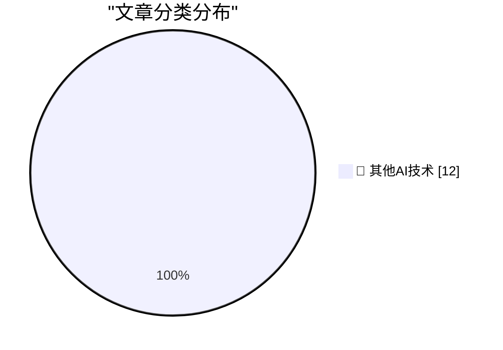

# 📰 AI 博客每日精选 — 2026-07-10

> 来自 98 个技术博客和社交媒体源，AI 精选 Top 12

## 🏆 今日必读

🥇 **QuadRF can spot drones and see WiFi through my wall**

[QuadRF can spot drones and see WiFi through my wall](https://www.jeffgeerling.com/blog/2026/quadrf-can-spot-drones-and-see-wifi-through-my-wall/) — jeffgeerling.com · 7 小时前 · 🔬 其他AI技术

> QuadRF can spot drones and see WiFi through my wall

🥈 **Apple Sues OpenAI, io, and Former Employees, Alleging Theft of Trade Secrets**

[Apple Sues OpenAI, io, and Former Employees, Alleging Theft of Trade Secrets](https://9to5mac.com/2026/07/10/apple-sues-openai-trade-secret-theft/) — daringfireball.net · 57 分钟前 · 🔬 其他AI技术

> Apple Sues OpenAI, io, and Former Employees, Alleging Theft of Trade Secrets

🥉 **Shocking No One, Fidji Simo, Would-Be Usurper, Is Out at OpenAI**

[Shocking No One, Fidji Simo, Would-Be Usurper, Is Out at OpenAI](https://www.wsj.com/tech/openai-top-executive-fidji-simo-to-step-down-c3daca47?st=NfBZTe) — daringfireball.net · 21 小时前 · 🔬 其他AI技术

> Shocking No One, Fidji Simo, Would-Be Usurper, Is Out at OpenAI

4️⃣ **Pluralistic: "Rights for robots" and the AI slavery fantasy (10 Jul 2026)**

[Pluralistic: "Rights for robots" and the AI slavery fantasy (10 Jul 2026)](https://pluralistic.net/2026/07/10/posthuman-as-in-no-humans/) — pluralistic.net · 12 小时前 · 🔬 其他AI技术

> Pluralistic: "Rights for robots" and the AI slavery fantasy (10 Jul 2026)

5️⃣ **Game Review: Lovers In A Dangerous Spacetime ★★★☆☆**

[Game Review: Lovers In A Dangerous Spacetime ★★★☆☆](https://shkspr.mobi/blog/2026/07/game-review-lovers-in-a-dangerous-spacetime/) — shkspr.mobi · 10 小时前 · 🔬 其他AI技术

> Game Review: Lovers In A Dangerous Spacetime ★★★☆☆

---

## 📊 数据概览

| 扫描源 | 抓取文章 | 时间范围 | 精选 |
|:---:|:---:|:---:|:---:|
| 65/98 | 1981 篇 → 12 篇 | 24h | **12 篇** |

### 分类分布

---

====================

## 🔬 其他AI技术

### 1. QuadRF can spot drones and see WiFi through my wall

[QuadRF can spot drones and see WiFi through my wall](https://www.jeffgeerling.com/blog/2026/quadrf-can-spot-drones-and-see-wifi-through-my-wall/) — **jeffgeerling.com** · 7 小时前 · ⭐ 15/25

> QuadRF can spot drones and see WiFi through my wall

📌 其他AI技术

---

### 2. Apple Sues OpenAI, io, and Former Employees, Alleging Theft of Trade Secrets

[Apple Sues OpenAI, io, and Former Employees, Alleging Theft of Trade Secrets](https://9to5mac.com/2026/07/10/apple-sues-openai-trade-secret-theft/) — **daringfireball.net** · 57 分钟前 · ⭐ 15/25

> Apple Sues OpenAI, io, and Former Employees, Alleging Theft of Trade Secrets

📌 其他AI技术

---

### 3. Shocking No One, Fidji Simo, Would-Be Usurper, Is Out at OpenAI

[Shocking No One, Fidji Simo, Would-Be Usurper, Is Out at OpenAI](https://www.wsj.com/tech/openai-top-executive-fidji-simo-to-step-down-c3daca47?st=NfBZTe) — **daringfireball.net** · 21 小时前 · ⭐ 15/25

> Shocking No One, Fidji Simo, Would-Be Usurper, Is Out at OpenAI

📌 其他AI技术

---

### 4. Pluralistic: "Rights for robots" and the AI slavery fantasy (10 Jul 2026)

[Pluralistic: "Rights for robots" and the AI slavery fantasy (10 Jul 2026)](https://pluralistic.net/2026/07/10/posthuman-as-in-no-humans/) — **pluralistic.net** · 12 小时前 · ⭐ 15/25

> Pluralistic: "Rights for robots" and the AI slavery fantasy (10 Jul 2026)

📌 其他AI技术

---

### 5. Game Review: Lovers In A Dangerous Spacetime ★★★☆☆

[Game Review: Lovers In A Dangerous Spacetime ★★★☆☆](https://shkspr.mobi/blog/2026/07/game-review-lovers-in-a-dangerous-spacetime/) — **shkspr.mobi** · 10 小时前 · ⭐ 15/25

> Game Review: Lovers In A Dangerous Spacetime ★★★☆☆

📌 其他AI技术

---

### 6. The case of the mysterious changes to integers when there shouldn’t have been any code generation effect

[The case of the mysterious changes to integers when there shouldn’t have been any code generation effect](https://devblogs.microsoft.com/oldnewthing/20260710-00/?p=112514) — **devblogs.microsoft.com/oldnewthing** · 7 小时前 · ⭐ 15/25

> The case of the mysterious changes to integers when there shouldn’t have been any code generation effect

📌 其他AI技术

---

### 7. Building intuition about LLM parameter counts

[Building intuition about LLM parameter counts](https://www.gilesthomas.com/2026/07/llm-parameter-counts) — **gilesthomas.com** · 29 分钟前 · ⭐ 15/25

> Building intuition about LLM parameter counts

📌 其他AI技术

---

### 8. Package Management as Org Chart

[Package Management as Org Chart](https://nesbitt.io/2026/07/10/package-management-as-org-chart.html) — **nesbitt.io** · 11 小时前 · ⭐ 15/25

> Package Management as Org Chart

📌 其他AI技术

---

### 9. Adam Brown – A deep but accessible introduction to general relativity

[Adam Brown – A deep but accessible introduction to general relativity](https://www.dwarkesh.com/p/adam-brown-gr) — **dwarkesh.com** · 5 小时前 · ⭐ 15/25

> Adam Brown – A deep but accessible introduction to general relativity

📌 其他AI技术

---

### 10. Premium: The Hater's Guide To The Memory Crisis

[Premium: The Hater's Guide To The Memory Crisis](https://www.wheresyoured.at/premium-the-haters-guide-to-the-memory-crisis/) — **wheresyoured.at** · 4 小时前 · ⭐ 15/25

> Premium: The Hater's Guide To The Memory Crisis

📌 其他AI技术

---

### 11. This Week on The Analog Antiquarian

[This Week on The Analog Antiquarian](https://www.filfre.net/2026/07/this-week-on-the-analog-antiquarian/) — **filfre.net** · 5 小时前 · ⭐ 15/25

> This Week on The Analog Antiquarian

📌 其他AI技术

---

### 12. Gary Kildall’s death investigation

[Gary Kildall’s death investigation](https://dfarq.homeip.net/gary-kildalls-death-investigation/?utm_source=rss&#038;utm_medium=rss&#038;utm_campaign=gary-kildalls-death-investigation) — **dfarq.homeip.net** · 10 小时前 · ⭐ 15/25

> Gary Kildall’s death investigation

📌 其他AI技术

---

====================

*生成于 2026-07-10 21:59 | 扫描 65 源 → 获取 1981 篇 → 精选 12 篇*
*基于 [Hacker News Popularity Contest 2025](https://refactoringenglish.com/tools/hn-popularity/) RSS 源列表，由 [Andrej Karpathy](https://x.com/karpathy) 推荐*
*由「懂点儿AI」制作，欢迎关注同名微信公众号获取更多 AI 实用技巧 💡*
