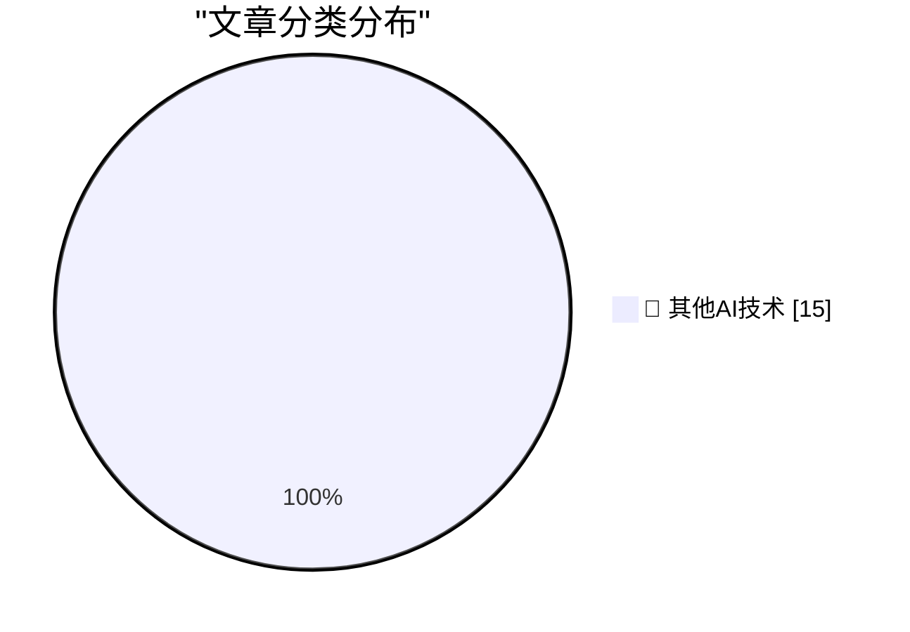

# 📰 AI 博客每日精选 — 2026-07-11

> 来自 98 个技术博客和社交媒体源，AI 精选 Top 15

## 🏆 今日必读

🥇 **★ Exactly Like Om Malik**

[★ Exactly Like Om Malik](https://daringfireball.net/2026/07/exactly_like_om_malik) — daringfireball.net · 2 小时前 · 🔬 其他AI技术

> ★ Exactly Like Om Malik

🥈 **Gurman on Tang Tan and Paul Meade**

[Gurman on Tang Tan and Paul Meade](https://www.bloomberg.com/news/articles/2026-07-11/openai-engineer-s-lol-moment-set-stage-for-legal-fight-with-apple) — daringfireball.net · 3 小时前 · 🔬 其他AI技术

> Gurman on Tang Tan and Paul Meade

🥉 **John Ternus Calls Sam Altman**

[John Ternus Calls Sam Altman](https://www.youtube.com/watch?v=ClASuxd8jQY) — daringfireball.net · 18 小时前 · 🔬 其他AI技术

> John Ternus Calls Sam Altman

4️⃣ **‘No Interest’**

[‘No Interest’](https://x.com/drewpusateri/status/2075708238650089981) — daringfireball.net · 18 小时前 · 🔬 其他AI技术

> ‘No Interest’

5️⃣ **Ice Cold**

[Ice Cold](https://www.threads.com/@alexheath/post/DaoI2jaEioX) — daringfireball.net · 18 小时前 · 🔬 其他AI技术

> Ice Cold

---

## 📊 数据概览

| 扫描源 | 抓取文章 | 时间范围 | 精选 |
|:---:|:---:|:---:|:---:|
| 60/98 | 1901 篇 → 15 篇 | 24h | **15 篇** |

### 分类分布

---

====================

## 🔬 其他AI技术

### 1. ★ Exactly Like Om Malik

[★ Exactly Like Om Malik](https://daringfireball.net/2026/07/exactly_like_om_malik) — **daringfireball.net** · 2 小时前 · ⭐ 15/25

> ★ Exactly Like Om Malik

📌 其他AI技术

---

### 2. Gurman on Tang Tan and Paul Meade

[Gurman on Tang Tan and Paul Meade](https://www.bloomberg.com/news/articles/2026-07-11/openai-engineer-s-lol-moment-set-stage-for-legal-fight-with-apple) — **daringfireball.net** · 3 小时前 · ⭐ 15/25

> Gurman on Tang Tan and Paul Meade

📌 其他AI技术

---

### 3. John Ternus Calls Sam Altman

[John Ternus Calls Sam Altman](https://www.youtube.com/watch?v=ClASuxd8jQY) — **daringfireball.net** · 18 小时前 · ⭐ 15/25

> John Ternus Calls Sam Altman

📌 其他AI技术

---

### 4. ‘No Interest’

[‘No Interest’](https://x.com/drewpusateri/status/2075708238650089981) — **daringfireball.net** · 18 小时前 · ⭐ 15/25

> ‘No Interest’

📌 其他AI技术

---

### 5. Ice Cold

[Ice Cold](https://www.threads.com/@alexheath/post/DaoI2jaEioX) — **daringfireball.net** · 18 小时前 · ⭐ 15/25

> Ice Cold

📌 其他AI技术

---

### 6. Ryanair Literally Sucks

[Ryanair Literally Sucks](https://apnews.com/article/greece-germany-ryanair-passenger-457c424f541152af1becdb387c90cfdd) — **daringfireball.net** · 18 小时前 · ⭐ 15/25

> Ryanair Literally Sucks

📌 其他AI技术

---

### 7. Newly Renamed Trump Airport in Palm Beach Has an AI Slop Logo

[Newly Renamed Trump Airport in Palm Beach Has an AI Slop Logo](https://futurism.com/artificial-intelligence/trump-airport-logo-ai) — **daringfireball.net** · 18 小时前 · ⭐ 15/25

> Newly Renamed Trump Airport in Palm Beach Has an AI Slop Logo

📌 其他AI技术

---

### 8. Mac OS 9’s Finder Had a ‘View as Buttons’ Mode

[Mac OS 9’s Finder Had a ‘View as Buttons’ Mode](https://www.cryan.com/blog/20240502.jsp) — **daringfireball.net** · 19 小时前 · ⭐ 15/25

> Mac OS 9’s Finder Had a ‘View as Buttons’ Mode

📌 其他AI技术

---

### 9. Squircle Jail Isn’t (Or at Least Shouldn’t Be) About Upcoming Touchscreen Macs

[Squircle Jail Isn’t (Or at Least Shouldn’t Be) About Upcoming Touchscreen Macs](https://daringfireball.net/2026/07/whats_good_for_the_ios_goose_is_often_not_good_for_the_macos_gander) — **daringfireball.net** · 19 小时前 · ⭐ 15/25

> Squircle Jail Isn’t (Or at Least Shouldn’t Be) About Upcoming Touchscreen Macs

📌 其他AI技术

---

### 10. Pluralistic: Workplace "flexibility" isn't (11 Jul 2026)

[Pluralistic: Workplace "flexibility" isn't (11 Jul 2026)](https://pluralistic.net/2026/07/11/your-risk/) — **pluralistic.net** · 12 小时前 · ⭐ 15/25

> Pluralistic: Workplace "flexibility" isn't (11 Jul 2026)

📌 其他AI技术

---

### 11. Prefer STRICT tables in SQLite

[Prefer STRICT tables in SQLite](https://evanhahn.com/prefer-strict-tables-in-sqlite/) — **evanhahn.com** · 21 小时前 · ⭐ 15/25

> Prefer STRICT tables in SQLite

📌 其他AI技术

---

### 12. This Week in Package Management: 11 July 2026

[This Week in Package Management: 11 July 2026](https://nesbitt.io/2026/07/11/this-week-in-package-management.html) — **nesbitt.io** · 11 小时前 · ⭐ 15/25

> This Week in Package Management: 11 July 2026

📌 其他AI技术

---

### 13. AI 2040 and the Cult of Intelligence

[AI 2040 and the Cult of Intelligence](https://geohot.github.io//blog/jekyll/update/2026/07/11/ai-2040.html) — **geohot.github.io** · 14 小时前 · ⭐ 15/25

> AI 2040 and the Cult of Intelligence

📌 其他AI技术

---

### 14. Dot product: Component vs. Geometric definition

[Dot product: Component vs. Geometric definition](https://eli.thegreenplace.net/2026/dot-product-component-vs-geometric-definition/) — **eli.thegreenplace.net** · 20 小时前 · ⭐ 15/25

> Dot product: Component vs. Geometric definition

📌 其他AI技术

---

### 15. Goede geluiden over digitale autonomie

[Goede geluiden over digitale autonomie](https://berthub.eu/articles/posts/goede-geluiden-over-digitale-autonomie/) — **berthub.eu** · 11 小时前 · ⭐ 15/25

> Goede geluiden over digitale autonomie

📌 其他AI技术

---

====================

*生成于 2026-07-11 21:45 | 扫描 60 源 → 获取 1901 篇 → 精选 15 篇*
*基于 [Hacker News Popularity Contest 2025](https://refactoringenglish.com/tools/hn-popularity/) RSS 源列表，由 [Andrej Karpathy](https://x.com/karpathy) 推荐*
*由「懂点儿AI」制作，欢迎关注同名微信公众号获取更多 AI 实用技巧 💡*
