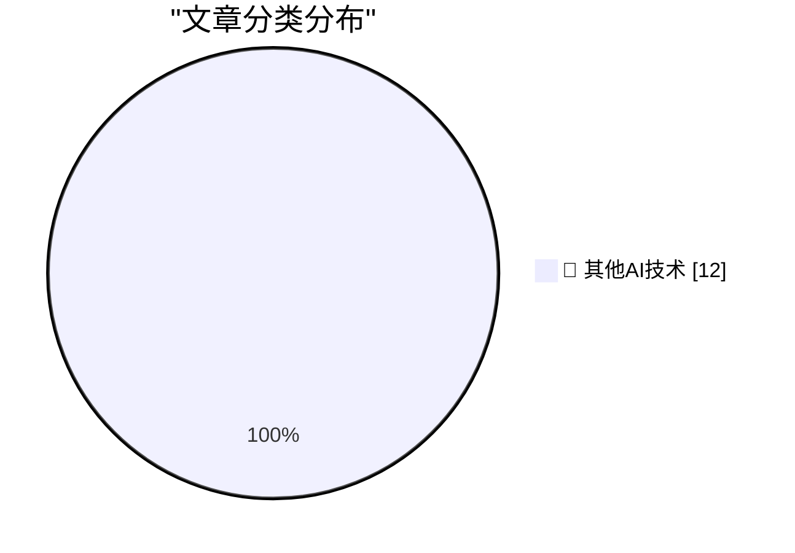

# 📰 AI 博客每日精选 — 2026-07-12

> 来自 98 个技术博客和社交媒体源，AI 精选 Top 12

## 🏆 今日必读

🥇 **Paulo Andrade: ‘A WWDC 27 Update on Building a Mac-Assed App With SwiftUI’**

[Paulo Andrade: ‘A WWDC 27 Update on Building a Mac-Assed App With SwiftUI’](https://pfandrade.me/blog/swiftui-mac-assed-wwdc27-update/) — daringfireball.net · 26 分钟前 · 🔬 其他AI技术

> Paulo Andrade: ‘A WWDC 27 Update on Building a Mac-Assed App With SwiftUI’

🥈 **How UIs Degrade Over Time**

[How UIs Degrade Over Time](https://grumpy.website/1723) — daringfireball.net · 1 小时前 · 🔬 其他AI技术

> How UIs Degrade Over Time

🥉 **‘Every Frame Perfect’**

[‘Every Frame Perfect’](https://tonsky.me/blog/every-frame-perfect/) — daringfireball.net · 1 小时前 · 🔬 其他AI技术

> ‘Every Frame Perfect’

4️⃣ **TwoMillionKit: Use Private Cloud Compute in MacOS 27 Foundation Models Without an Entitlement**

[TwoMillionKit: Use Private Cloud Compute in MacOS 27 Foundation Models Without an Entitlement](https://github.com/insidegui/TwoMillionKit) — daringfireball.net · 3 小时前 · 🔬 其他AI技术

> TwoMillionKit: Use Private Cloud Compute in MacOS 27 Foundation Models Without an Entitlement

5️⃣ **Sam Altman and Elon Musk Argue Over Who’s Running the Bigger Scam**

[Sam Altman and Elon Musk Argue Over Who’s Running the Bigger Scam](https://x.com/sama/status/2075982617976230043) — daringfireball.net · 3 小时前 · 🔬 其他AI技术

> Sam Altman and Elon Musk Argue Over Who’s Running the Bigger Scam

---

## 📊 数据概览

| 扫描源 | 抓取文章 | 时间范围 | 精选 |
|:---:|:---:|:---:|:---:|
| 65/98 | 1983 篇 → 12 篇 | 24h | **12 篇** |

### 分类分布

---

====================

## 🔬 其他AI技术

### 1. Paulo Andrade: ‘A WWDC 27 Update on Building a Mac-Assed App With SwiftUI’

[Paulo Andrade: ‘A WWDC 27 Update on Building a Mac-Assed App With SwiftUI’](https://pfandrade.me/blog/swiftui-mac-assed-wwdc27-update/) — **daringfireball.net** · 26 分钟前 · ⭐ 15/25

> Paulo Andrade: ‘A WWDC 27 Update on Building a Mac-Assed App With SwiftUI’

📌 其他AI技术

---

### 2. How UIs Degrade Over Time

[How UIs Degrade Over Time](https://grumpy.website/1723) — **daringfireball.net** · 1 小时前 · ⭐ 15/25

> How UIs Degrade Over Time

📌 其他AI技术

---

### 3. ‘Every Frame Perfect’

[‘Every Frame Perfect’](https://tonsky.me/blog/every-frame-perfect/) — **daringfireball.net** · 1 小时前 · ⭐ 15/25

> ‘Every Frame Perfect’

📌 其他AI技术

---

### 4. TwoMillionKit: Use Private Cloud Compute in MacOS 27 Foundation Models Without an Entitlement

[TwoMillionKit: Use Private Cloud Compute in MacOS 27 Foundation Models Without an Entitlement](https://github.com/insidegui/TwoMillionKit) — **daringfireball.net** · 3 小时前 · ⭐ 15/25

> TwoMillionKit: Use Private Cloud Compute in MacOS 27 Foundation Models Without an Entitlement

📌 其他AI技术

---

### 5. Sam Altman and Elon Musk Argue Over Who’s Running the Bigger Scam

[Sam Altman and Elon Musk Argue Over Who’s Running the Bigger Scam](https://x.com/sama/status/2075982617976230043) — **daringfireball.net** · 3 小时前 · ⭐ 15/25

> Sam Altman and Elon Musk Argue Over Who’s Running the Bigger Scam

📌 其他AI技术

---

### 6. Lunacy — Jeff Halter’s Lunatic Fringe Player

[Lunacy — Jeff Halter’s Lunatic Fringe Player](https://morphing.cloud/lunacy/) — **daringfireball.net** · 4 小时前 · ⭐ 15/25

> Lunacy — Jeff Halter’s Lunatic Fringe Player

📌 其他AI技术

---

### 7. Stacks — HyperCard Player for Modern MacOS

[Stacks — HyperCard Player for Modern MacOS](https://morphing.cloud/hypercard/) — **daringfireball.net** · 6 小时前 · ⭐ 15/25

> Stacks — HyperCard Player for Modern MacOS

📌 其他AI技术

---

### 8. Can Someone Explain to Me How to Get ‘ChatGPT Classic’?

[Can Someone Explain to Me How to Get ‘ChatGPT Classic’?](https://help.openai.com/en/articles/20001276-moving-to-the-new-chatgpt-desktop-app) — **daringfireball.net** · 23 小时前 · ⭐ 15/25

> Can Someone Explain to Me How to Get ‘ChatGPT Classic’?

📌 其他AI技术

---

### 9. OpenAI Help Center Describes What Is Wrong With the New ChatGPT

[OpenAI Help Center Describes What Is Wrong With the New ChatGPT](https://help.openai.com/en/articles/20001275-chatgpt-work-and-codex) — **daringfireball.net** · 23 小时前 · ⭐ 15/25

> OpenAI Help Center Describes What Is Wrong With the New ChatGPT

📌 其他AI技术

---

### 10. Benedict Evans on the New ‘Super App’ ChatGPT

[Benedict Evans on the New ‘Super App’ ChatGPT](https://www.threads.com/@benedictevans/post/Dano_uvDr8F) — **daringfireball.net** · 23 小时前 · ⭐ 15/25

> Benedict Evans on the New ‘Super App’ ChatGPT

📌 其他AI技术

---

### 11. Another Ridiculous Interrail Holiday - 6,379Km and 13 Countries over 7 weeks

[Another Ridiculous Interrail Holiday - 6,379Km and 13 Countries over 7 weeks](https://shkspr.mobi/blog/2026/07/another-ridiculous-interrail-holiday-6379km-and-13-countries-over-7-weeks/) — **shkspr.mobi** · 10 小时前 · ⭐ 15/25

> Another Ridiculous Interrail Holiday - 6,379Km and 13 Countries over 7 weeks

📌 其他AI技术

---

### 12. I love LLMs, I hate hype

[I love LLMs, I hate hype](https://geohot.github.io//blog/jekyll/update/2026/07/12/i-love-llms.html) — **geohot.github.io** · 14 小时前 · ⭐ 15/25

> I love LLMs, I hate hype

📌 其他AI技术

---

====================

*生成于 2026-07-12 21:45 | 扫描 65 源 → 获取 1983 篇 → 精选 12 篇*
*基于 [Hacker News Popularity Contest 2025](https://refactoringenglish.com/tools/hn-popularity/) RSS 源列表，由 [Andrej Karpathy](https://x.com/karpathy) 推荐*
*由「懂点儿AI」制作，欢迎关注同名微信公众号获取更多 AI 实用技巧 💡*
