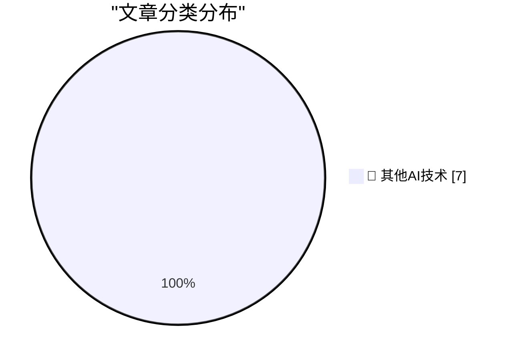

# 📰 AI 博客每日精选 — 2026-07-13

> 来自 98 个技术博客和社交媒体源，AI 精选 Top 7

## 🏆 今日必读

🥇 **Remember Musk’s Suit Alleging a Conspiracy Between Apple and OpenAI?**

[Remember Musk’s Suit Alleging a Conspiracy Between Apple and OpenAI?](https://arstechnica.com/tech-policy/2025/08/elon-musk-sues-apple-openai-to-block-exclusive-iphone-chatgpt-integration/) — daringfireball.net · 6 小时前 · 🔬 其他AI技术

> Remember Musk’s Suit Alleging a Conspiracy Between Apple and OpenAI?

🥈 **WorkOS Pipes**

[WorkOS Pipes](https://workos.com/pipes?utm_source=daringfireball&amp;utm_medium=newsletter&amp;utm_campaign=q32026) — daringfireball.net · 23 小时前 · 🔬 其他AI技术

> WorkOS Pipes

🥉 **Pluralistic: Why aren't AI companies competing directly with their customers? (13 Jul 2026)**

[Pluralistic: Why aren't AI companies competing directly with their customers? (13 Jul 2026)](https://pluralistic.net/2026/07/13/go-meta-meta/) — pluralistic.net · 13 小时前 · 🔬 其他AI技术

> Pluralistic: Why aren't AI companies competing directly with their customers? (13 Jul 2026)

4️⃣ **[RSS Club] Half a million steps is about 10 marathons**

[[RSS Club] Half a million steps is about 10 marathons](https://shkspr.mobi/blog/2026/07/rss-club-half-a-million-steps-is-about-10-marathons/) — shkspr.mobi · 10 小时前 · 🔬 其他AI技术

> [RSS Club] Half a million steps is about 10 marathons

5️⃣ **Why don’t we just make the entire stack out of guard pages?**

[Why don’t we just make the entire stack out of guard pages?](https://devblogs.microsoft.com/oldnewthing/20260713-00/?p=112528) — devblogs.microsoft.com/oldnewthing · 7 小时前 · 🔬 其他AI技术

> Why don’t we just make the entire stack out of guard pages?

---

## 📊 数据概览

| 扫描源 | 抓取文章 | 时间范围 | 精选 |
|:---:|:---:|:---:|:---:|
| 63/98 | 1942 篇 → 7 篇 | 24h | **7 篇** |

### 分类分布

---

====================

## 🔬 其他AI技术

### 1. Remember Musk’s Suit Alleging a Conspiracy Between Apple and OpenAI?

[Remember Musk’s Suit Alleging a Conspiracy Between Apple and OpenAI?](https://arstechnica.com/tech-policy/2025/08/elon-musk-sues-apple-openai-to-block-exclusive-iphone-chatgpt-integration/) — **daringfireball.net** · 6 小时前 · ⭐ 15/25

> Remember Musk’s Suit Alleging a Conspiracy Between Apple and OpenAI?

📌 其他AI技术

---

### 2. WorkOS Pipes

[WorkOS Pipes](https://workos.com/pipes?utm_source=daringfireball&amp;utm_medium=newsletter&amp;utm_campaign=q32026) — **daringfireball.net** · 23 小时前 · ⭐ 15/25

> WorkOS Pipes

📌 其他AI技术

---

### 3. Pluralistic: Why aren't AI companies competing directly with their customers? (13 Jul 2026)

[Pluralistic: Why aren't AI companies competing directly with their customers? (13 Jul 2026)](https://pluralistic.net/2026/07/13/go-meta-meta/) — **pluralistic.net** · 13 小时前 · ⭐ 15/25

> Pluralistic: Why aren't AI companies competing directly with their customers? (13 Jul 2026)

📌 其他AI技术

---

### 4. [RSS Club] Half a million steps is about 10 marathons

[[RSS Club] Half a million steps is about 10 marathons](https://shkspr.mobi/blog/2026/07/rss-club-half-a-million-steps-is-about-10-marathons/) — **shkspr.mobi** · 10 小时前 · ⭐ 15/25

> [RSS Club] Half a million steps is about 10 marathons

📌 其他AI技术

---

### 5. Why don’t we just make the entire stack out of guard pages?

[Why don’t we just make the entire stack out of guard pages?](https://devblogs.microsoft.com/oldnewthing/20260713-00/?p=112528) — **devblogs.microsoft.com/oldnewthing** · 7 小时前 · ⭐ 15/25

> Why don’t we just make the entire stack out of guard pages?

📌 其他AI技术

---

### 6. Mandatory Update: A Short Story

[Mandatory Update: A Short Story](https://micahflee.com/mandatory-update-a-short-story/) — **micahflee.com** · 6 小时前 · ⭐ 15/25

> Mandatory Update: A Short Story

📌 其他AI技术

---

### 7. Code Red worm, July 13, 2001

[Code Red worm, July 13, 2001](https://dfarq.homeip.net/code-red-worm-july-13-2001/?utm_source=rss&#038;utm_medium=rss&#038;utm_campaign=code-red-worm-july-13-2001) — **dfarq.homeip.net** · 10 小时前 · ⭐ 15/25

> Code Red worm, July 13, 2001

📌 其他AI技术

---

====================

*生成于 2026-07-13 21:53 | 扫描 63 源 → 获取 1942 篇 → 精选 7 篇*
*基于 [Hacker News Popularity Contest 2025](https://refactoringenglish.com/tools/hn-popularity/) RSS 源列表，由 [Andrej Karpathy](https://x.com/karpathy) 推荐*
*由「懂点儿AI」制作，欢迎关注同名微信公众号获取更多 AI 实用技巧 💡*
