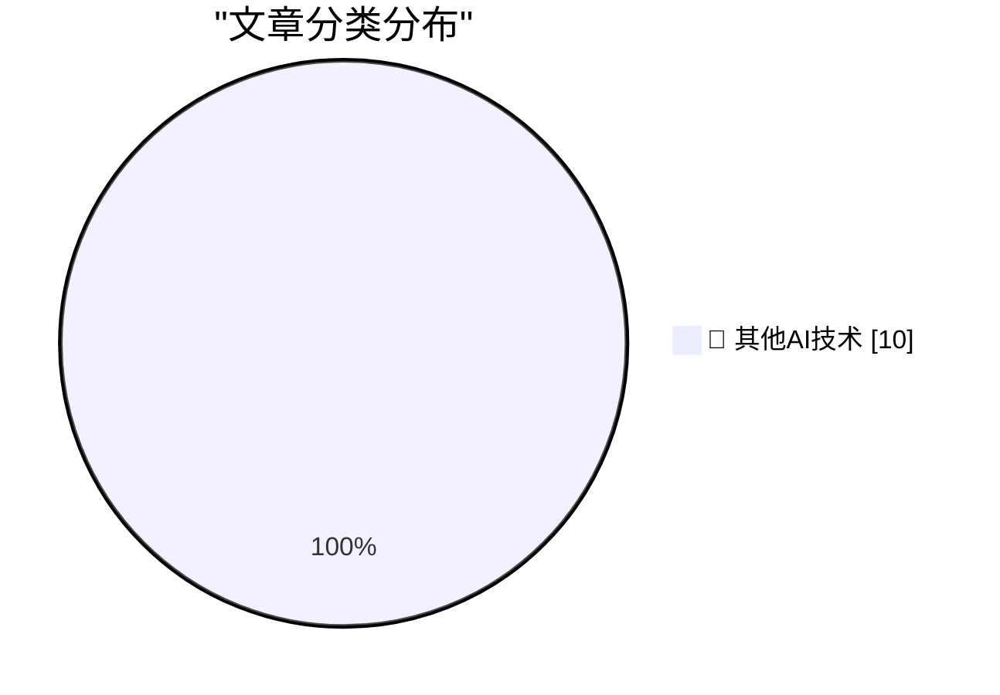

# 📰 AI 博客每日精选 — 2026-07-14

> 来自 98 个技术博客和社交媒体源，AI 精选 Top 10

## 🏆 今日必读

🥇 **What does "playing politics" mean for software engineers?**

[What does "playing politics" mean for software engineers?](https://seangoedecke.com/playing-politics/) — seangoedecke.com · 21 小时前 · 🔬 其他AI技术

> What does "playing politics" mean for software engineers?

🥈 **[Sponsor] Paper**

[[Sponsor] Paper](https://paper.design/?utm_source=df) — daringfireball.net · 16 小时前 · 🔬 其他AI技术

> [Sponsor] Paper

🥉 **Pluralistic: Gerontocracy's failure mode (14 Jul 2026)**

[Pluralistic: Gerontocracy's failure mode (14 Jul 2026)](https://pluralistic.net/2026/07/14/designated-survivor/) — pluralistic.net · 10 小时前 · 🔬 其他AI技术

> Pluralistic: Gerontocracy's failure mode (14 Jul 2026)

4️⃣ **I'm a USB-C Maximalist**

[I'm a USB-C Maximalist](https://shkspr.mobi/blog/2026/07/im-a-usb-c-maximalist/) — shkspr.mobi · 10 小时前 · 🔬 其他AI技术

> I'm a USB-C Maximalist

5️⃣ **Pseudpocalypse**

[Pseudpocalypse](https://dynomight.net/pseudpocalypse/) — dynomight.net · 21 小时前 · 🔬 其他AI技术

> Pseudpocalypse

---

## 📊 数据概览

| 扫描源 | 抓取文章 | 时间范围 | 精选 |
|:---:|:---:|:---:|:---:|
| 65/98 | 1985 篇 → 10 篇 | 24h | **10 篇** |

### 分类分布

---

====================

## 🔬 其他AI技术

### 1. What does "playing politics" mean for software engineers?

[What does "playing politics" mean for software engineers?](https://seangoedecke.com/playing-politics/) — **seangoedecke.com** · 21 小时前 · ⭐ 15/25

> What does "playing politics" mean for software engineers?

📌 其他AI技术

---

### 2. [Sponsor] Paper

[[Sponsor] Paper](https://paper.design/?utm_source=df) — **daringfireball.net** · 16 小时前 · ⭐ 15/25

> [Sponsor] Paper

📌 其他AI技术

---

### 3. Pluralistic: Gerontocracy's failure mode (14 Jul 2026)

[Pluralistic: Gerontocracy's failure mode (14 Jul 2026)](https://pluralistic.net/2026/07/14/designated-survivor/) — **pluralistic.net** · 10 小时前 · ⭐ 15/25

> Pluralistic: Gerontocracy's failure mode (14 Jul 2026)

📌 其他AI技术

---

### 4. I'm a USB-C Maximalist

[I'm a USB-C Maximalist](https://shkspr.mobi/blog/2026/07/im-a-usb-c-maximalist/) — **shkspr.mobi** · 10 小时前 · ⭐ 15/25

> I'm a USB-C Maximalist

📌 其他AI技术

---

### 5. Pseudpocalypse

[Pseudpocalypse](https://dynomight.net/pseudpocalypse/) — **dynomight.net** · 21 小时前 · ⭐ 15/25

> Pseudpocalypse

📌 其他AI技术

---

### 6. Presigned URLs are technically a security vuln

[Presigned URLs are technically a security vuln](https://www.tigrisdata.com/blog/presigned-urls-security-vuln/) — **xeiaso.net** · 21 小时前 · ⭐ 15/25

> Presigned URLs are technically a security vuln

📌 其他AI技术

---

### 7. Microspeak: Double-click and drill down

[Microspeak: Double-click and drill down](https://devblogs.microsoft.com/oldnewthing/20260714-00/?p=112532) — **devblogs.microsoft.com/oldnewthing** · 7 小时前 · ⭐ 15/25

> Microspeak: Double-click and drill down

📌 其他AI技术

---

### 8. Intuition for distribution differences

[Intuition for distribution differences](https://entropicthoughts.com/distribution-differences) — **entropicthoughts.com** · 23 小时前 · ⭐ 15/25

> Intuition for distribution differences

📌 其他AI技术

---

### 9. I'm still alive

[I'm still alive](https://buttondown.com/hillelwayne/archive/im-still-alive/) — **buttondown.com/hillelwayne** · 5 小时前 · ⭐ 15/25

> I'm still alive

📌 其他AI技术

---

### 10. Nintendo Famicom and the secret of Nintendo’s success

[Nintendo Famicom and the secret of Nintendo’s success](https://dfarq.homeip.net/nintendo-famicom-and-the-secret-of-nintendos-success/?utm_source=rss&#038;utm_medium=rss&#038;utm_campaign=nintendo-famicom-and-the-secret-of-nintendos-success) — **dfarq.homeip.net** · 10 小时前 · ⭐ 15/25

> Nintendo Famicom and the secret of Nintendo’s success

📌 其他AI技术

---

====================

*生成于 2026-07-14 21:55 | 扫描 65 源 → 获取 1985 篇 → 精选 10 篇*
*基于 [Hacker News Popularity Contest 2025](https://refactoringenglish.com/tools/hn-popularity/) RSS 源列表，由 [Andrej Karpathy](https://x.com/karpathy) 推荐*
*由「懂点儿AI」制作，欢迎关注同名微信公众号获取更多 AI 实用技巧 💡*
