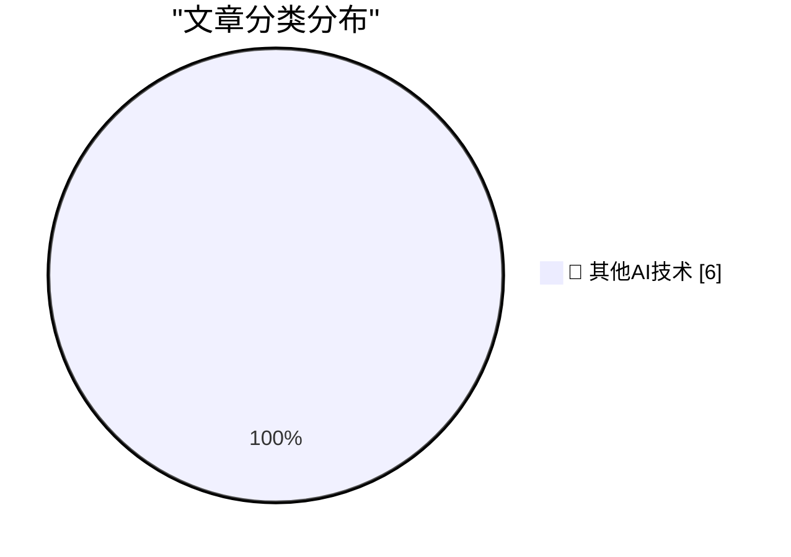

# 📰 AI 博客每日精选 — 2026-07-15

> 来自 98 个技术博客和社交媒体源，AI 精选 Top 6

## 🏆 今日必读

🥇 **They Prefer the App**

[They Prefer the App](https://idiallo.com/blog/they-prefer-the-app) — idiallo.com · 23 小时前 · 🔬 其他AI技术

> They Prefer the App

🥈 **The case of the invalid function pointer when shutting down the display control panel**

[The case of the invalid function pointer when shutting down the display control panel](https://devblogs.microsoft.com/oldnewthing/20260715-00/?p=112535) — devblogs.microsoft.com/oldnewthing · 7 小时前 · 🔬 其他AI技术

> The case of the invalid function pointer when shutting down the display control panel

🥉 **The OpenAI Bubble**

[The OpenAI Bubble](https://www.wheresyoured.at/the-openai-bubble/) — wheresyoured.at · 5 小时前 · 🔬 其他AI技术

> The OpenAI Bubble

4️⃣ **Reasons for Escom’s bankruptcy**

[Reasons for Escom’s bankruptcy](https://dfarq.homeip.net/reasons-for-escoms-bankruptcy/?utm_source=rss&#038;utm_medium=rss&#038;utm_campaign=reasons-for-escoms-bankruptcy) — dfarq.homeip.net · 10 小时前 · 🔬 其他AI技术

> Reasons for Escom’s bankruptcy

5️⃣ **Notes on the Fourier Transform**

[Notes on the Fourier Transform](https://eli.thegreenplace.net/2026/notes-on-the-fourier-transform/) — eli.thegreenplace.net · 18 小时前 · 🔬 其他AI技术

> Notes on the Fourier Transform

---

## 📊 数据概览

| 扫描源 | 抓取文章 | 时间范围 | 精选 |
|:---:|:---:|:---:|:---:|
| 62/98 | 1921 篇 → 6 篇 | 24h | **6 篇** |

### 分类分布

---

====================

## 🔬 其他AI技术

### 1. They Prefer the App

[They Prefer the App](https://idiallo.com/blog/they-prefer-the-app) — **idiallo.com** · 23 小时前 · ⭐ 15/25

> They Prefer the App

📌 其他AI技术

---

### 2. The case of the invalid function pointer when shutting down the display control panel

[The case of the invalid function pointer when shutting down the display control panel](https://devblogs.microsoft.com/oldnewthing/20260715-00/?p=112535) — **devblogs.microsoft.com/oldnewthing** · 7 小时前 · ⭐ 15/25

> The case of the invalid function pointer when shutting down the display control panel

📌 其他AI技术

---

### 3. The OpenAI Bubble

[The OpenAI Bubble](https://www.wheresyoured.at/the-openai-bubble/) — **wheresyoured.at** · 5 小时前 · ⭐ 15/25

> The OpenAI Bubble

📌 其他AI技术

---

### 4. Reasons for Escom’s bankruptcy

[Reasons for Escom’s bankruptcy](https://dfarq.homeip.net/reasons-for-escoms-bankruptcy/?utm_source=rss&#038;utm_medium=rss&#038;utm_campaign=reasons-for-escoms-bankruptcy) — **dfarq.homeip.net** · 10 小时前 · ⭐ 15/25

> Reasons for Escom’s bankruptcy

📌 其他AI技术

---

### 5. Notes on the Fourier Transform

[Notes on the Fourier Transform](https://eli.thegreenplace.net/2026/notes-on-the-fourier-transform/) — **eli.thegreenplace.net** · 18 小时前 · ⭐ 15/25

> Notes on the Fourier Transform

📌 其他AI技术

---

### 6. Ben je van de IT of niet?

[Ben je van de IT of niet?](https://berthub.eu/articles/posts/ben-je-van-de-it-of-niet/) — **berthub.eu** · 11 小时前 · ⭐ 15/25

> Ben je van de IT of niet?

📌 其他AI技术

---

====================

*生成于 2026-07-15 21:57 | 扫描 62 源 → 获取 1921 篇 → 精选 6 篇*
*基于 [Hacker News Popularity Contest 2025](https://refactoringenglish.com/tools/hn-popularity/) RSS 源列表，由 [Andrej Karpathy](https://x.com/karpathy) 推荐*
*由「懂点儿AI」制作，欢迎关注同名微信公众号获取更多 AI 实用技巧 💡*
