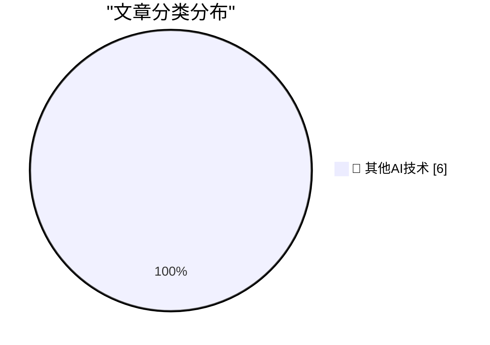

# 📰 AI 博客每日精选 — 2026-07-18

> 来自 98 个技术博客和社交媒体源，AI 精选 Top 6

## 🏆 今日必读

🥇 **Apple Books and Amazon Are Lousy With AI-Generated Books Ripping Off Legitimate Authors**

[Apple Books and Amazon Are Lousy With AI-Generated Books Ripping Off Legitimate Authors](https://thenewthings.com/p/apple-big-ai-book-slop-problem) — daringfireball.net · 21 小时前 · 🔬 其他AI技术

> Apple Books and Amazon Are Lousy With AI-Generated Books Ripping Off Legitimate Authors

🥈 **Google Runs Out of Appeals, Must Pay Record $4.7 Billion EU Antitrust Fine**

[Google Runs Out of Appeals, Must Pay Record $4.7 Billion EU Antitrust Fine](https://www.cnbc.com/2026/07/02/alphabet-google-android-eu-antitrust-fine-4-1-billion-euro-appeal.html) — daringfireball.net · 22 小时前 · 🔬 其他AI技术

> Google Runs Out of Appeals, Must Pay Record $4.7 Billion EU Antitrust Fine

🥉 **Book Review: A City on Mars - by Dr. Kelly Weinersmith and Zach Weinersmith ★★★★⯪**

[Book Review: A City on Mars - by Dr. Kelly Weinersmith and Zach Weinersmith ★★★★⯪](https://shkspr.mobi/blog/2026/07/book-review-a-city-on-mars-by-dr-kelly-weinersmith-and-zach-weinersmith/) — shkspr.mobi · 10 小时前 · 🔬 其他AI技术

> Book Review: A City on Mars - by Dr. Kelly Weinersmith and Zach Weinersmith ★★★★⯪

4️⃣ **This Week in Package Management: 18 July 2026**

[This Week in Package Management: 18 July 2026](https://nesbitt.io/2026/07/18/this-week-in-package-management.html) — nesbitt.io · 11 小时前 · 🔬 其他AI技术

> This Week in Package Management: 18 July 2026

5️⃣ **What's the deal with all the random weekly quota resets for agents lately?**

[What's the deal with all the random weekly quota resets for agents lately?](https://minimaxir.com/2026/07/agent-quota-reset/) — minimaxir.com · 2 小时前 · 🔬 其他AI技术

> What's the deal with all the random weekly quota resets for agents lately?

---

## 📊 数据概览

| 扫描源 | 抓取文章 | 时间范围 | 精选 |
|:---:|:---:|:---:|:---:|
| 62/98 | 1927 篇 → 6 篇 | 24h | **6 篇** |

### 分类分布

---

====================

## 🔬 其他AI技术

### 1. Apple Books and Amazon Are Lousy With AI-Generated Books Ripping Off Legitimate Authors

[Apple Books and Amazon Are Lousy With AI-Generated Books Ripping Off Legitimate Authors](https://thenewthings.com/p/apple-big-ai-book-slop-problem) — **daringfireball.net** · 21 小时前 · ⭐ 15/25

> Apple Books and Amazon Are Lousy With AI-Generated Books Ripping Off Legitimate Authors

📌 其他AI技术

---

### 2. Google Runs Out of Appeals, Must Pay Record $4.7 Billion EU Antitrust Fine

[Google Runs Out of Appeals, Must Pay Record $4.7 Billion EU Antitrust Fine](https://www.cnbc.com/2026/07/02/alphabet-google-android-eu-antitrust-fine-4-1-billion-euro-appeal.html) — **daringfireball.net** · 22 小时前 · ⭐ 15/25

> Google Runs Out of Appeals, Must Pay Record $4.7 Billion EU Antitrust Fine

📌 其他AI技术

---

### 3. Book Review: A City on Mars - by Dr. Kelly Weinersmith and Zach Weinersmith ★★★★⯪

[Book Review: A City on Mars - by Dr. Kelly Weinersmith and Zach Weinersmith ★★★★⯪](https://shkspr.mobi/blog/2026/07/book-review-a-city-on-mars-by-dr-kelly-weinersmith-and-zach-weinersmith/) — **shkspr.mobi** · 10 小时前 · ⭐ 15/25

> Book Review: A City on Mars - by Dr. Kelly Weinersmith and Zach Weinersmith ★★★★⯪

📌 其他AI技术

---

### 4. This Week in Package Management: 18 July 2026

[This Week in Package Management: 18 July 2026](https://nesbitt.io/2026/07/18/this-week-in-package-management.html) — **nesbitt.io** · 11 小时前 · ⭐ 15/25

> This Week in Package Management: 18 July 2026

📌 其他AI技术

---

### 5. What's the deal with all the random weekly quota resets for agents lately?

[What's the deal with all the random weekly quota resets for agents lately?](https://minimaxir.com/2026/07/agent-quota-reset/) — **minimaxir.com** · 2 小时前 · ⭐ 15/25

> What's the deal with all the random weekly quota resets for agents lately?

📌 其他AI技术

---

### 6. Make It Work vs. Make It Good

[Make It Work vs. Make It Good](https://blog.jim-nielsen.com/2026/make-it-work-make-it-good/) — **blog.jim-nielsen.com** · 2 小时前 · ⭐ 15/25

> Make It Work vs. Make It Good

📌 其他AI技术

---

====================

*生成于 2026-07-18 21:47 | 扫描 62 源 → 获取 1927 篇 → 精选 6 篇*
*基于 [Hacker News Popularity Contest 2025](https://refactoringenglish.com/tools/hn-popularity/) RSS 源列表，由 [Andrej Karpathy](https://x.com/karpathy) 推荐*
*由「懂点儿AI」制作，欢迎关注同名微信公众号获取更多 AI 实用技巧 💡*
