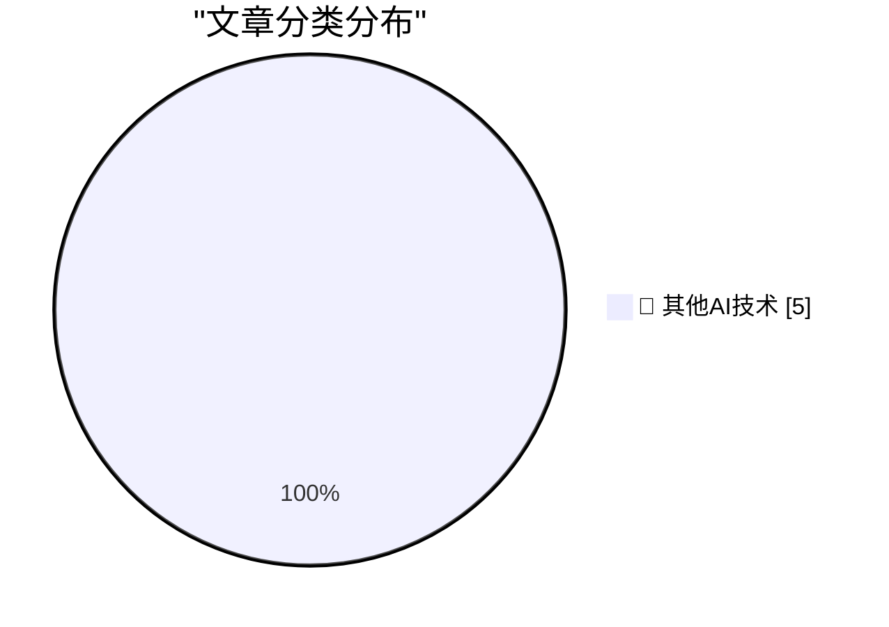

# 📰 AI 博客每日精选 — 2026-07-19

> 来自 98 个技术博客和社交媒体源，AI 精选 Top 5

## 🏆 今日必读

🥇 **Impro is a handbook for running a cult**

[Impro is a handbook for running a cult](https://seangoedecke.com/impro/) — seangoedecke.com · 21 小时前 · 🔬 其他AI技术

> Impro is a handbook for running a cult

🥈 **9to5Mac Uncovers Dozens of Disguised Gambling Apps on the App Store in Brazil**

[9to5Mac Uncovers Dozens of Disguised Gambling Apps on the App Store in Brazil](https://9to5mac.com/2026/07/17/investigation-reveals-dozens-of-disguised-gambling-apps-on-the-app-store-in-brazil/) — daringfireball.net · 4 小时前 · 🔬 其他AI技术

> 9to5Mac Uncovers Dozens of Disguised Gambling Apps on the App Store in Brazil

🥉 **★ Mornings in Cupertino Have the Aroma of Napalm Once Again**

[★ Mornings in Cupertino Have the Aroma of Napalm Once Again](https://daringfireball.net/2026/07/mornings_in_cupertino_have_the_aroma_of_napalm_once_again) — daringfireball.net · 21 小时前 · 🔬 其他AI技术

> ★ Mornings in Cupertino Have the Aroma of Napalm Once Again

4️⃣ **Apple Sends Letters to Dozens of Former Employees Now at OpenAI**

[Apple Sends Letters to Dozens of Former Employees Now at OpenAI](https://www.ft.com/content/1b8c9d52-88a9-426b-ba47-f1811f859166?syn-25a6b1a6=1) — daringfireball.net · 23 小时前 · 🔬 其他AI技术

> Apple Sends Letters to Dozens of Former Employees Now at OpenAI

5️⃣ **email encryption**

[email encryption](https://computer.rip/2026-07-19-email-encryption.html) — computer.rip · 21 小时前 · 🔬 其他AI技术

> email encryption

---

## 📊 数据概览

| 扫描源 | 抓取文章 | 时间范围 | 精选 |
|:---:|:---:|:---:|:---:|
| 65/98 | 1987 篇 → 5 篇 | 24h | **5 篇** |

### 分类分布

---

====================

## 🔬 其他AI技术

### 1. Impro is a handbook for running a cult

[Impro is a handbook for running a cult](https://seangoedecke.com/impro/) — **seangoedecke.com** · 21 小时前 · ⭐ 15/25

> Impro is a handbook for running a cult

📌 其他AI技术

---

### 2. 9to5Mac Uncovers Dozens of Disguised Gambling Apps on the App Store in Brazil

[9to5Mac Uncovers Dozens of Disguised Gambling Apps on the App Store in Brazil](https://9to5mac.com/2026/07/17/investigation-reveals-dozens-of-disguised-gambling-apps-on-the-app-store-in-brazil/) — **daringfireball.net** · 4 小时前 · ⭐ 15/25

> 9to5Mac Uncovers Dozens of Disguised Gambling Apps on the App Store in Brazil

📌 其他AI技术

---

### 3. ★ Mornings in Cupertino Have the Aroma of Napalm Once Again

[★ Mornings in Cupertino Have the Aroma of Napalm Once Again](https://daringfireball.net/2026/07/mornings_in_cupertino_have_the_aroma_of_napalm_once_again) — **daringfireball.net** · 21 小时前 · ⭐ 15/25

> ★ Mornings in Cupertino Have the Aroma of Napalm Once Again

📌 其他AI技术

---

### 4. Apple Sends Letters to Dozens of Former Employees Now at OpenAI

[Apple Sends Letters to Dozens of Former Employees Now at OpenAI](https://www.ft.com/content/1b8c9d52-88a9-426b-ba47-f1811f859166?syn-25a6b1a6=1) — **daringfireball.net** · 23 小时前 · ⭐ 15/25

> Apple Sends Letters to Dozens of Former Employees Now at OpenAI

📌 其他AI技术

---

### 5. email encryption

[email encryption](https://computer.rip/2026-07-19-email-encryption.html) — **computer.rip** · 21 小时前 · ⭐ 15/25

> email encryption

📌 其他AI技术

---

====================

*生成于 2026-07-19 21:48 | 扫描 65 源 → 获取 1987 篇 → 精选 5 篇*
*基于 [Hacker News Popularity Contest 2025](https://refactoringenglish.com/tools/hn-popularity/) RSS 源列表，由 [Andrej Karpathy](https://x.com/karpathy) 推荐*
*由「懂点儿AI」制作，欢迎关注同名微信公众号获取更多 AI 实用技巧 💡*
