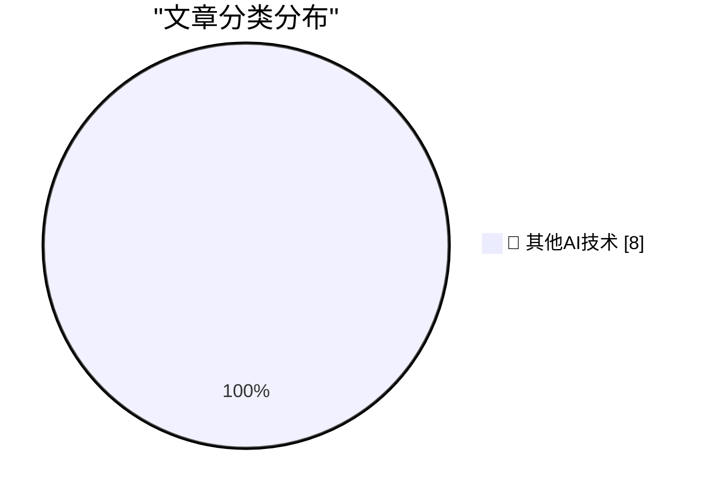

# 📰 AI 博客每日精选 — 2026-07-20

> 来自 98 个技术博客和社交媒体源，AI 精选 Top 8

## 🏆 今日必读

🥇 **‘Who’s Afraid of Chinese Models?’**

[‘Who’s Afraid of Chinese Models?’](https://stratechery.com/2026/whos-afraid-of-chinese-models/) — daringfireball.net · 5 小时前 · 🔬 其他AI技术

> ‘Who’s Afraid of Chinese Models?’

🥈 **Paper**

[Paper](https://paper.design/?utm_source=df) — daringfireball.net · 23 小时前 · 🔬 其他AI技术

> Paper

🥉 **Public Transport - Don't Make Me Think!**

[Public Transport - Don't Make Me Think!](https://shkspr.mobi/blog/2026/07/public-transport-dont-make-me-think/) — shkspr.mobi · 10 小时前 · 🔬 其他AI技术

> Public Transport - Don't Make Me Think!

4️⃣ **Making an agile version of a Windows Runtime delegate in C++/WinRT, part 1**

[Making an agile version of a Windows Runtime delegate in C++/WinRT, part 1](https://devblogs.microsoft.com/oldnewthing/20260720-00/?p=112545) — devblogs.microsoft.com/oldnewthing · 7 小时前 · 🔬 其他AI技术

> Making an agile version of a Windows Runtime delegate in C++/WinRT, part 1

5️⃣ **Memory Safety's Hardest Problem**

[Memory Safety's Hardest Problem](https://matklad.github.io/2026/07/20/memory-safety-hardest-problem.html) — matklad.github.io · 21 小时前 · 🔬 其他AI技术

> Memory Safety's Hardest Problem

---

## 📊 数据概览

| 扫描源 | 抓取文章 | 时间范围 | 精选 |
|:---:|:---:|:---:|:---:|
| 64/98 | 1970 篇 → 8 篇 | 24h | **8 篇** |

### 分类分布

---

====================

## 🔬 其他AI技术

### 1. ‘Who’s Afraid of Chinese Models?’

[‘Who’s Afraid of Chinese Models?’](https://stratechery.com/2026/whos-afraid-of-chinese-models/) — **daringfireball.net** · 5 小时前 · ⭐ 15/25

> ‘Who’s Afraid of Chinese Models?’

📌 其他AI技术

---

### 2. Paper

[Paper](https://paper.design/?utm_source=df) — **daringfireball.net** · 23 小时前 · ⭐ 15/25

> Paper

📌 其他AI技术

---

### 3. Public Transport - Don't Make Me Think!

[Public Transport - Don't Make Me Think!](https://shkspr.mobi/blog/2026/07/public-transport-dont-make-me-think/) — **shkspr.mobi** · 10 小时前 · ⭐ 15/25

> Public Transport - Don't Make Me Think!

📌 其他AI技术

---

### 4. Making an agile version of a Windows Runtime delegate in C++/WinRT, part 1

[Making an agile version of a Windows Runtime delegate in C++/WinRT, part 1](https://devblogs.microsoft.com/oldnewthing/20260720-00/?p=112545) — **devblogs.microsoft.com/oldnewthing** · 7 小时前 · ⭐ 15/25

> Making an agile version of a Windows Runtime delegate in C++/WinRT, part 1

📌 其他AI技术

---

### 5. Memory Safety's Hardest Problem

[Memory Safety's Hardest Problem](https://matklad.github.io/2026/07/20/memory-safety-hardest-problem.html) — **matklad.github.io** · 21 小时前 · ⭐ 15/25

> Memory Safety's Hardest Problem

📌 其他AI技术

---

### 6. The MCI Worldcom merger, bankruptcy, and scandal

[The MCI Worldcom merger, bankruptcy, and scandal](https://dfarq.homeip.net/the-mci-worldcom-merger-bankruptcy-and-scandal/?utm_source=rss&#038;utm_medium=rss&#038;utm_campaign=the-mci-worldcom-merger-bankruptcy-and-scandal) — **dfarq.homeip.net** · 10 小时前 · ⭐ 15/25

> The MCI Worldcom merger, bankruptcy, and scandal

📌 其他AI技术

---

### 7. OpenTK: nu ook met Internetconsultaties & notificaties

[OpenTK: nu ook met Internetconsultaties & notificaties](https://berthub.eu/articles/posts/opentk-internetconsultaties/) — **berthub.eu** · 10 小时前 · ⭐ 15/25

> OpenTK: nu ook met Internetconsultaties & notificaties

📌 其他AI技术

---

### 8. I added a blogroll

[I added a blogroll](https://matduggan.com/i-added-a-blogroll/) — **matduggan.com** · 10 小时前 · ⭐ 15/25

> I added a blogroll

📌 其他AI技术

---

====================

*生成于 2026-07-20 21:58 | 扫描 64 源 → 获取 1970 篇 → 精选 8 篇*
*基于 [Hacker News Popularity Contest 2025](https://refactoringenglish.com/tools/hn-popularity/) RSS 源列表，由 [Andrej Karpathy](https://x.com/karpathy) 推荐*
*由「懂点儿AI」制作，欢迎关注同名微信公众号获取更多 AI 实用技巧 💡*
