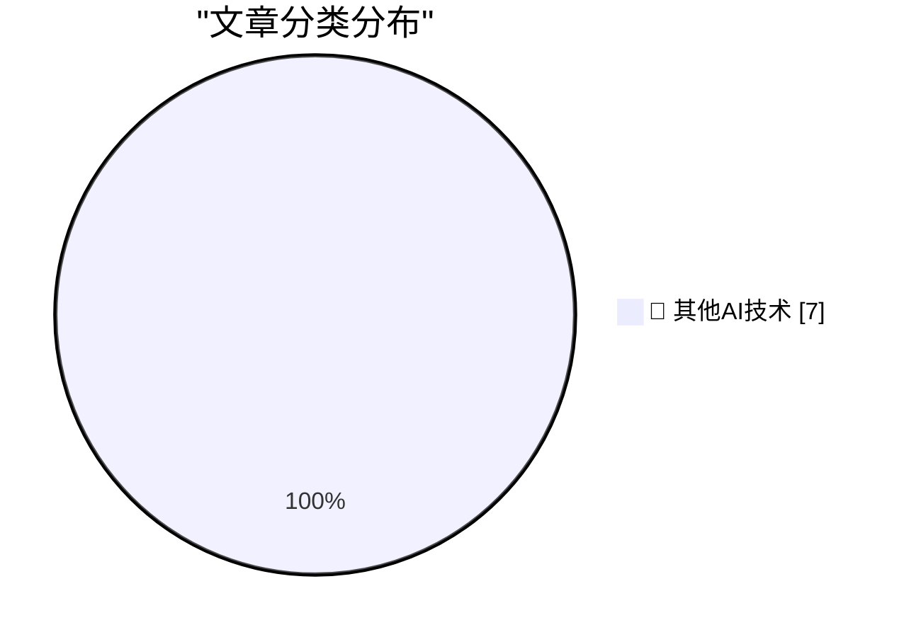

# 📰 AI 博客每日精选 — 2026-07-21

> 来自 98 个技术博客和社交媒体源，AI 精选 Top 7

## 🏆 今日必读

🥇 **[Sponsor] WorkOS MCP: Manage Your Auth Platform From Any AI Agent**

[[Sponsor] WorkOS MCP: Manage Your Auth Platform From Any AI Agent](https://workos.com/blog/management-mcp-server?utm_source=daringfireball&amp;utm_medium=newsletter&amp;utm_campaign=q32026) — daringfireball.net · 22 小时前 · 🔬 其他AI技术

> [Sponsor] WorkOS MCP: Manage Your Auth Platform From Any AI Agent

🥈 **Expensive Is Just a Brand Now**

[Expensive Is Just a Brand Now](https://idiallo.com/blog/expensive-is-just-branding) — idiallo.com · 23 小时前 · 🔬 其他AI技术

> Expensive Is Just a Brand Now

🥉 **Pluralistic: Dealing with dickovers (21 Jul 2026) dickovers**

[Pluralistic: Dealing with dickovers (21 Jul 2026) dickovers](https://pluralistic.net/2026/07/21/dickovers/) — pluralistic.net · 13 小时前 · 🔬 其他AI技术

> Pluralistic: Dealing with dickovers (21 Jul 2026) dickovers

4️⃣ **Making an agile version of a Windows Runtime delegate in C++/WinRT, part 2**

[Making an agile version of a Windows Runtime delegate in C++/WinRT, part 2](https://devblogs.microsoft.com/oldnewthing/20260721-00/?p=112550) — devblogs.microsoft.com/oldnewthing · 8 小时前 · 🔬 其他AI技术

> Making an agile version of a Windows Runtime delegate in C++/WinRT, part 2

5️⃣ **–end-of-options**

[–end-of-options](https://nesbitt.io/2026/07/21/end-of-options.html) — nesbitt.io · 12 小时前 · 🔬 其他AI技术

> –end-of-options

---

## 📊 数据概览

| 扫描源 | 抓取文章 | 时间范围 | 精选 |
|:---:|:---:|:---:|:---:|
| 65/98 | 1990 篇 → 7 篇 | 24h | **7 篇** |

### 分类分布

---

====================

## 🔬 其他AI技术

### 1. [Sponsor] WorkOS MCP: Manage Your Auth Platform From Any AI Agent

[[Sponsor] WorkOS MCP: Manage Your Auth Platform From Any AI Agent](https://workos.com/blog/management-mcp-server?utm_source=daringfireball&amp;utm_medium=newsletter&amp;utm_campaign=q32026) — **daringfireball.net** · 22 小时前 · ⭐ 15/25

> [Sponsor] WorkOS MCP: Manage Your Auth Platform From Any AI Agent

📌 其他AI技术

---

### 2. Expensive Is Just a Brand Now

[Expensive Is Just a Brand Now](https://idiallo.com/blog/expensive-is-just-branding) — **idiallo.com** · 23 小时前 · ⭐ 15/25

> Expensive Is Just a Brand Now

📌 其他AI技术

---

### 3. Pluralistic: Dealing with dickovers (21 Jul 2026) dickovers

[Pluralistic: Dealing with dickovers (21 Jul 2026) dickovers](https://pluralistic.net/2026/07/21/dickovers/) — **pluralistic.net** · 13 小时前 · ⭐ 15/25

> Pluralistic: Dealing with dickovers (21 Jul 2026) dickovers

📌 其他AI技术

---

### 4. Making an agile version of a Windows Runtime delegate in C++/WinRT, part 2

[Making an agile version of a Windows Runtime delegate in C++/WinRT, part 2](https://devblogs.microsoft.com/oldnewthing/20260721-00/?p=112550) — **devblogs.microsoft.com/oldnewthing** · 8 小时前 · ⭐ 15/25

> Making an agile version of a Windows Runtime delegate in C++/WinRT, part 2

📌 其他AI技术

---

### 5. –end-of-options

[–end-of-options](https://nesbitt.io/2026/07/21/end-of-options.html) — **nesbitt.io** · 12 小时前 · ⭐ 15/25

> –end-of-options

📌 其他AI技术

---

### 6. The First Microsoft Product

[The First Microsoft Product](https://dfarq.homeip.net/the-first-microsoft-product/?utm_source=rss&#038;utm_medium=rss&#038;utm_campaign=the-first-microsoft-product) — **dfarq.homeip.net** · 11 小时前 · ⭐ 15/25

> The First Microsoft Product

📌 其他AI技术

---

### 7. Kan een Amerikaans bedrijf met encryptie de Amerikaanse overheid buiten de deur houden?

[Kan een Amerikaans bedrijf met encryptie de Amerikaanse overheid buiten de deur houden?](https://berthub.eu/articles/posts/kan-een-amerikaans-bedrijf-zo-versleutelen-dat-amerikanen-er-niet-bijkunnen/) — **berthub.eu** · 8 小时前 · ⭐ 15/25

> Kan een Amerikaans bedrijf met encryptie de Amerikaanse overheid buiten de deur houden?

📌 其他AI技术

---

====================

*生成于 2026-07-21 22:01 | 扫描 65 源 → 获取 1990 篇 → 精选 7 篇*
*基于 [Hacker News Popularity Contest 2025](https://refactoringenglish.com/tools/hn-popularity/) RSS 源列表，由 [Andrej Karpathy](https://x.com/karpathy) 推荐*
*由「懂点儿AI」制作，欢迎关注同名微信公众号获取更多 AI 实用技巧 💡*
