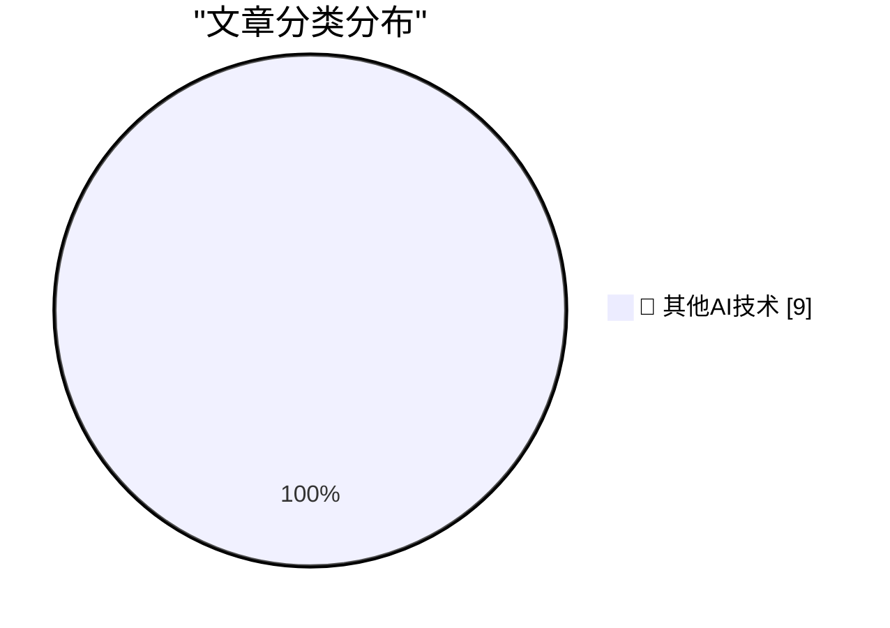

# 📰 AI 博客每日精选 — 2026-07-22

> 来自 98 个技术博客和社交媒体源，AI 精选 Top 9

## 🏆 今日必读

🥇 **Open Sauce and GPS time were my summer AI Antiseptics**

[Open Sauce and GPS time were my summer AI Antiseptics](https://www.jeffgeerling.com/blog/2026/open-sauce-gps-time-badge/) — jeffgeerling.com · 8 小时前 · 🔬 其他AI技术

> Open Sauce and GPS time were my summer AI Antiseptics

🥈 **★ European Commission: ‘Guidance to Google for AI Interoperability on Android & Sharing of Google Search’**

[★ European Commission: ‘Guidance to Google for AI Interoperability on Android & Sharing of Google Search’](https://daringfireball.net/2026/07/ec_google_guidance_android_ai_and_search_sharing) — daringfireball.net · 23 小时前 · 🔬 其他AI技术

> ★ European Commission: ‘Guidance to Google for AI Interoperability on Android & Sharing of Google Search’

🥉 **Pluralistic: Trump's America can't even win a rigged game (22 Jul 2026)**

[Pluralistic: Trump's America can't even win a rigged game (22 Jul 2026)](https://pluralistic.net/2026/07/22/table-flipper/) — pluralistic.net · 13 小时前 · 🔬 其他AI技术

> Pluralistic: Trump's America can't even win a rigged game (22 Jul 2026)

4️⃣ **Scattered thoughts on social geolocation**

[Scattered thoughts on social geolocation](https://shkspr.mobi/blog/2026/07/scattered-thoughts-on-social-geolocation/) — shkspr.mobi · 10 小时前 · 🔬 其他AI技术

> Scattered thoughts on social geolocation

5️⃣ **Everyone Should Know SIMD**

[Everyone Should Know SIMD](https://mitchellh.com/writing/everyone-should-know-simd) — mitchellh.com · 22 小时前 · 🔬 其他AI技术

> Everyone Should Know SIMD

---

## 📊 数据概览

| 扫描源 | 抓取文章 | 时间范围 | 精选 |
|:---:|:---:|:---:|:---:|
| 64/98 | 1974 篇 → 9 篇 | 24h | **9 篇** |

### 分类分布

---

====================

## 🔬 其他AI技术

### 1. Open Sauce and GPS time were my summer AI Antiseptics

[Open Sauce and GPS time were my summer AI Antiseptics](https://www.jeffgeerling.com/blog/2026/open-sauce-gps-time-badge/) — **jeffgeerling.com** · 8 小时前 · ⭐ 15/25

> Open Sauce and GPS time were my summer AI Antiseptics

📌 其他AI技术

---

### 2. ★ European Commission: ‘Guidance to Google for AI Interoperability on Android & Sharing of Google Search’

[★ European Commission: ‘Guidance to Google for AI Interoperability on Android & Sharing of Google Search’](https://daringfireball.net/2026/07/ec_google_guidance_android_ai_and_search_sharing) — **daringfireball.net** · 23 小时前 · ⭐ 15/25

> ★ European Commission: ‘Guidance to Google for AI Interoperability on Android & Sharing of Google Search’

📌 其他AI技术

---

### 3. Pluralistic: Trump's America can't even win a rigged game (22 Jul 2026)

[Pluralistic: Trump's America can't even win a rigged game (22 Jul 2026)](https://pluralistic.net/2026/07/22/table-flipper/) — **pluralistic.net** · 13 小时前 · ⭐ 15/25

> Pluralistic: Trump's America can't even win a rigged game (22 Jul 2026)

📌 其他AI技术

---

### 4. Scattered thoughts on social geolocation

[Scattered thoughts on social geolocation](https://shkspr.mobi/blog/2026/07/scattered-thoughts-on-social-geolocation/) — **shkspr.mobi** · 10 小时前 · ⭐ 15/25

> Scattered thoughts on social geolocation

📌 其他AI技术

---

### 5. Everyone Should Know SIMD

[Everyone Should Know SIMD](https://mitchellh.com/writing/everyone-should-know-simd) — **mitchellh.com** · 22 小时前 · ⭐ 15/25

> Everyone Should Know SIMD

📌 其他AI技术

---

### 6. Does creatine make you smarter?

[Does creatine make you smarter?](https://dynomight.net/creatine/) — **dynomight.net** · 22 小时前 · ⭐ 15/25

> Does creatine make you smarter?

📌 其他AI技术

---

### 7. The Subprime Data Center Crisis

[The Subprime Data Center Crisis](https://www.wheresyoured.at/the-subprime-data-center-crisis/) — **wheresyoured.at** · 5 小时前 · ⭐ 15/25

> The Subprime Data Center Crisis

📌 其他AI技术

---

### 8. Amiga 1000: Ten years ahead of its time

[Amiga 1000: Ten years ahead of its time](https://dfarq.homeip.net/amiga-1000-ten-years-ahead-of-its-time/?utm_source=rss&#038;utm_medium=rss&#038;utm_campaign=amiga-1000-ten-years-ahead-of-its-time) — **dfarq.homeip.net** · 11 小时前 · ⭐ 15/25

> Amiga 1000: Ten years ahead of its time

📌 其他AI技术

---

### 9. Announcing the Portal open beta

[Announcing the Portal open beta](https://keygen.sh/blog/announcing-portal-open-beta/) — **keygen.sh** · 17 小时前 · ⭐ 15/25

> Announcing the Portal open beta

📌 其他AI技术

---

====================

*生成于 2026-07-22 22:02 | 扫描 64 源 → 获取 1974 篇 → 精选 9 篇*
*基于 [Hacker News Popularity Contest 2025](https://refactoringenglish.com/tools/hn-popularity/) RSS 源列表，由 [Andrej Karpathy](https://x.com/karpathy) 推荐*
*由「懂点儿AI」制作，欢迎关注同名微信公众号获取更多 AI 实用技巧 💡*
