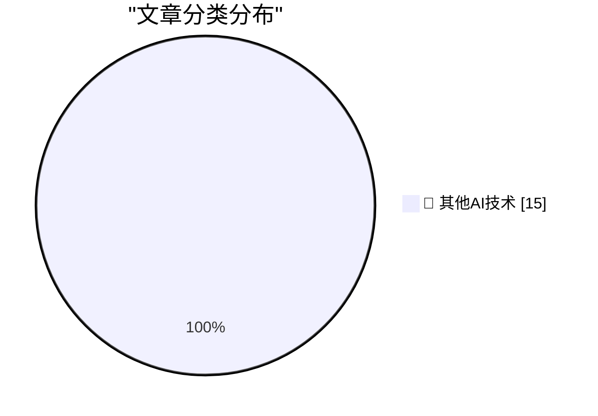

# 📰 AI 博客每日精选 — 2026-07-23

> 来自 98 个技术博客和社交媒体源，AI 精选 Top 15

## 🏆 今日必读

🥇 **Bond Movie Filming Locations Map**

[Bond Movie Filming Locations Map](https://department-m.agency/) — daringfireball.net · 2 小时前 · 🔬 其他AI技术

> Bond Movie Filming Locations Map

🥈 **★ The Ads on Apple News Continue to Suck, but at Least There Are a Lot of Them**

[★ The Ads on Apple News Continue to Suck, but at Least There Are a Lot of Them](https://daringfireball.net/2026/07/ads_on_apple_news_suck) — daringfireball.net · 2 小时前 · 🔬 其他AI技术

> ★ The Ads on Apple News Continue to Suck, but at Least There Are a Lot of Them

🥉 **John Dvorak on Computer Chronicles in 1987 to Discuss the Then-New IBM PS/2**

[John Dvorak on Computer Chronicles in 1987 to Discuss the Then-New IBM PS/2](https://www.youtube.com/watch?v=uY2WF_sPecI) — daringfireball.net · 4 小时前 · 🔬 其他AI技术

> John Dvorak on Computer Chronicles in 1987 to Discuss the Then-New IBM PS/2

4️⃣ **John Dvorak Drops Dead at 80**

[John Dvorak Drops Dead at 80](https://appleinsider.com/articles/26/07/23/famed-technology-journalist-john-c-dvorak-dies-aged-80) — daringfireball.net · 4 小时前 · 🔬 其他AI技术

> John Dvorak Drops Dead at 80

5️⃣ **Flighty New Connection Assistant Feature**

[Flighty New Connection Assistant Feature](https://9to5mac.com/2026/07/07/flighty-update-adds-powerful-new-connection-assistant-feature/) — daringfireball.net · 6 小时前 · 🔬 其他AI技术

> Flighty New Connection Assistant Feature

---

## 📊 数据概览

| 扫描源 | 抓取文章 | 时间范围 | 精选 |
|:---:|:---:|:---:|:---:|
| 76/98 | 2719 篇 → 15 篇 | 24h | **15 篇** |

### 分类分布

---

====================

## 🔬 其他AI技术

### 1. Bond Movie Filming Locations Map

[Bond Movie Filming Locations Map](https://department-m.agency/) — **daringfireball.net** · 2 小时前 · ⭐ 15/25

> Bond Movie Filming Locations Map

📌 其他AI技术

---

### 2. ★ The Ads on Apple News Continue to Suck, but at Least There Are a Lot of Them

[★ The Ads on Apple News Continue to Suck, but at Least There Are a Lot of Them](https://daringfireball.net/2026/07/ads_on_apple_news_suck) — **daringfireball.net** · 2 小时前 · ⭐ 15/25

> ★ The Ads on Apple News Continue to Suck, but at Least There Are a Lot of Them

📌 其他AI技术

---

### 3. John Dvorak on Computer Chronicles in 1987 to Discuss the Then-New IBM PS/2

[John Dvorak on Computer Chronicles in 1987 to Discuss the Then-New IBM PS/2](https://www.youtube.com/watch?v=uY2WF_sPecI) — **daringfireball.net** · 4 小时前 · ⭐ 15/25

> John Dvorak on Computer Chronicles in 1987 to Discuss the Then-New IBM PS/2

📌 其他AI技术

---

### 4. John Dvorak Drops Dead at 80

[John Dvorak Drops Dead at 80](https://appleinsider.com/articles/26/07/23/famed-technology-journalist-john-c-dvorak-dies-aged-80) — **daringfireball.net** · 4 小时前 · ⭐ 15/25

> John Dvorak Drops Dead at 80

📌 其他AI技术

---

### 5. Flighty New Connection Assistant Feature

[Flighty New Connection Assistant Feature](https://9to5mac.com/2026/07/07/flighty-update-adds-powerful-new-connection-assistant-feature/) — **daringfireball.net** · 6 小时前 · ⭐ 15/25

> Flighty New Connection Assistant Feature

📌 其他AI技术

---

### 6. Pluralistic: California's privacy obstacle course (23 Jul 2026)

[Pluralistic: California's privacy obstacle course (23 Jul 2026)](https://pluralistic.net/2026/07/23/drop-a-dime/) — **pluralistic.net** · 11 小时前 · ⭐ 15/25

> Pluralistic: California's privacy obstacle course (23 Jul 2026)

📌 其他AI技术

---

### 7. Package Name Prefixes

[Package Name Prefixes](https://nesbitt.io/2026/07/23/package-name-prefixes.html) — **nesbitt.io** · 22 小时前 · ⭐ 15/25

> Package Name Prefixes

📌 其他AI技术

---

### 8. LLMs break down in funny ways when told the Jacobian Conjecture counterargument

[LLMs break down in funny ways when told the Jacobian Conjecture counterargument](https://minimaxir.com/2026/07/jacobian-conjecture/) — **minimaxir.com** · 5 小时前 · ⭐ 15/25

> LLMs break down in funny ways when told the Jacobian Conjecture counterargument

📌 其他AI技术

---

### 9. The Caldera-Microsoft Lawsuit of 1996

[The Caldera-Microsoft Lawsuit of 1996](https://dfarq.homeip.net/the-caldera-microsoft-lawsuit-of-1996/?utm_source=rss&#038;utm_medium=rss&#038;utm_campaign=the-caldera-microsoft-lawsuit-of-1996) — **dfarq.homeip.net** · 11 小时前 · ⭐ 15/25

> The Caldera-Microsoft Lawsuit of 1996

📌 其他AI技术

---

### 10. Met het Oog op Morgen: Uitgebroken AI?

[Met het Oog op Morgen: Uitgebroken AI?](https://berthub.eu/articles/posts/ai-met-het-oog-op-morgen/) — **berthub.eu** · 13 小时前 · ⭐ 15/25

> Met het Oog op Morgen: Uitgebroken AI?

📌 其他AI技术

---

### 11. Protect your secrets. 🔐 Join us July 28 for a GitHub Security webinar exploring secret leak trends, public exposure monitoring, and practical steps...

[Protect your secrets. 🔐 Join us July 28 for a GitHub Security webinar exploring secret leak trends, public exposure monitoring, and practical steps...](https://x.com/github/status/2080331924653158414) — **𝕏 @GitHub** · 5 小时前 · ⭐ 15/25

> Protect your secrets. 🔐 Join us July 28 for a GitHub Security webinar exploring secret leak trends, public exposure monitoring, and practical steps...

📌 其他AI技术

---

### 12. AI made code cheaper to write. The cost of owning it? Not so much. For small, bounded requests, a first patch can replace scope debates with evidence:...

[AI made code cheaper to write. The cost of owning it? Not so much. For small, bounded requests, a first patch can replace scope debates with evidence:...](https://x.com/github/status/2080090520970203414) — **𝕏 @GitHub** · 21 小时前 · ⭐ 15/25

> AI made code cheaper to write. The cost of owning it? Not so much. For small, bounded requests, a first patch can replace scope debates with evidence:...

📌 其他AI技术

---

### 13. RT Akshay Kothari: Big release for consultants, agencies, systems integrators, and channel partners. You can now set up a client’s entire workspace b...

[RT Akshay Kothari: Big release for consultants, agencies, systems integrators, and channel partners. You can now set up a client’s entire workspace b...](https://x.com/NotionHQ/status/2080366394638815377) — **𝕏 @NotionHQ** · 4 小时前 · ⭐ 15/25

> RT Akshay Kothari: Big release for consultants, agencies, systems integrators, and channel partners. You can now set up a client’s entire workspace b...

📌 其他AI技术

---

### 14. Understanding Slack user roles early can save a lot of confusion later. 💡🔐 Knowing what Owners, Admins, Members, and Guests can do makes workspa...

[Understanding Slack user roles early can save a lot of confusion later. 💡🔐 Knowing what Owners, Admins, Members, and Guests can do makes workspa...](https://x.com/SlackHQ/status/2080397656258441314) — **𝕏 @SlackHQ** · 1 小时前 · ⭐ 15/25

> Understanding Slack user roles early can save a lot of confusion later. 💡🔐 Knowing what Owners, Admins, Members, and Guests can do makes workspa...

📌 其他AI技术

---

### 15. Think Google Chat is just for quick pings? 💬 From deep ecosystem integrations to hidden shortcuts, @WIRED shares 9 tips to help you unlock the full...

[Think Google Chat is just for quick pings? 💬 From deep ecosystem integrations to hidden shortcuts, @WIRED shares 9 tips to help you unlock the full...](https://x.com/GoogleWorkspace/status/2080383199885078754) — **𝕏 @GoogleWorkspace** · 1 小时前 · ⭐ 15/25

> Think Google Chat is just for quick pings? 💬 From deep ecosystem integrations to hidden shortcuts, @WIRED shares 9 tips to help you unlock the full...

📌 其他AI技术

---

====================

*生成于 2026-07-23 22:02 | 扫描 76 源 → 获取 2719 篇 → 精选 15 篇*
*基于 [Hacker News Popularity Contest 2025](https://refactoringenglish.com/tools/hn-popularity/) RSS 源列表，由 [Andrej Karpathy](https://x.com/karpathy) 推荐*
*由「懂点儿AI」制作，欢迎关注同名微信公众号获取更多 AI 实用技巧 💡*
