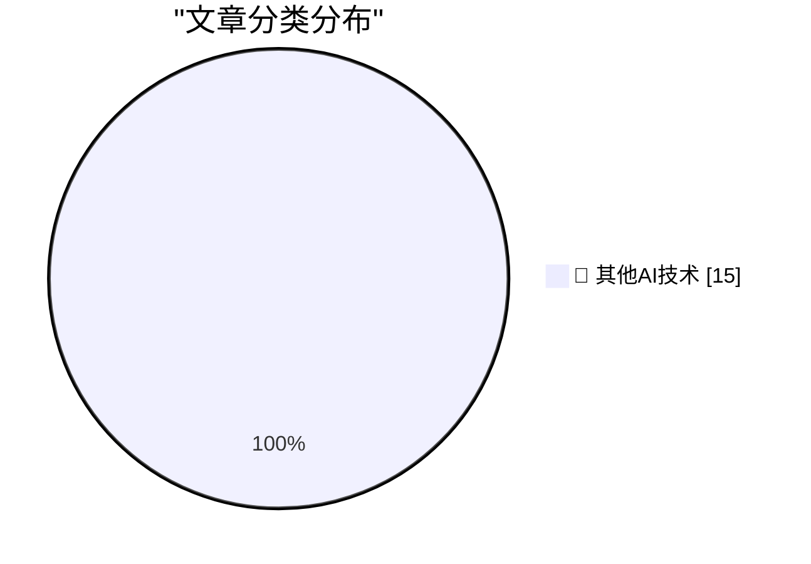

# 📰 AI 博客每日精选 — 2026-07-24

> 来自 98 个技术博客和社交媒体源，AI 精选 Top 15

## 🏆 今日必读

🥇 **★ Regarding Ad Blockers and Daring Fireball**

[★ Regarding Ad Blockers and Daring Fireball](https://daringfireball.net/2026/07/regarding_ad_blockers_and_daring_fireball) — daringfireball.net · 1 小时前 · 🔬 其他AI技术

> ★ Regarding Ad Blockers and Daring Fireball

🥈 **Coiner of ‘Enshittification’ Endorses ‘Dickover’**

[Coiner of ‘Enshittification’ Endorses ‘Dickover’](https://pluralistic.net/2026/07/21/dickovers/) — daringfireball.net · 3 小时前 · 🔬 其他AI技术

> Coiner of ‘Enshittification’ Endorses ‘Dickover’

🥉 **Dickover of the Week: Tomtoc**

[Dickover of the Week: Tomtoc](https://daringfireball.net/2026/05/what_is_a_dickover) — daringfireball.net · 5 小时前 · 🔬 其他AI技术

> Dickover of the Week: Tomtoc

4️⃣ **Sixers Sign LeBron James**

[Sixers Sign LeBron James](https://www.inquirer.com/sixers/live/lebron-james-signs-philadelphia-76ers-contract-salary-roster-updates-reaction-20260724.html) — daringfireball.net · 5 小时前 · 🔬 其他AI技术

> Sixers Sign LeBron James

5️⃣ **The Talk Show: ‘A Scam Held Together With Patriotism and Golden Paint’**

[The Talk Show: ‘A Scam Held Together With Patriotism and Golden Paint’](https://daringfireball.net/thetalkshow/2026/07/23/ep-452) — daringfireball.net · 6 小时前 · 🔬 其他AI技术

> The Talk Show: ‘A Scam Held Together With Patriotism and Golden Paint’

---

## 📊 数据概览

| 扫描源 | 抓取文章 | 时间范围 | 精选 |
|:---:|:---:|:---:|:---:|
| 77/98 | 2731 篇 → 25 篇 | 24h | **15 篇** |

### 分类分布

---

====================

## 🔬 其他AI技术

### 1. ★ Regarding Ad Blockers and Daring Fireball

[★ Regarding Ad Blockers and Daring Fireball](https://daringfireball.net/2026/07/regarding_ad_blockers_and_daring_fireball) — **daringfireball.net** · 1 小时前 · ⭐ 15/25

> ★ Regarding Ad Blockers and Daring Fireball

📌 其他AI技术

---

### 2. Coiner of ‘Enshittification’ Endorses ‘Dickover’

[Coiner of ‘Enshittification’ Endorses ‘Dickover’](https://pluralistic.net/2026/07/21/dickovers/) — **daringfireball.net** · 3 小时前 · ⭐ 15/25

> Coiner of ‘Enshittification’ Endorses ‘Dickover’

📌 其他AI技术

---

### 3. Dickover of the Week: Tomtoc

[Dickover of the Week: Tomtoc](https://daringfireball.net/2026/05/what_is_a_dickover) — **daringfireball.net** · 5 小时前 · ⭐ 15/25

> Dickover of the Week: Tomtoc

📌 其他AI技术

---

### 4. Sixers Sign LeBron James

[Sixers Sign LeBron James](https://www.inquirer.com/sixers/live/lebron-james-signs-philadelphia-76ers-contract-salary-roster-updates-reaction-20260724.html) — **daringfireball.net** · 5 小时前 · ⭐ 15/25

> Sixers Sign LeBron James

📌 其他AI技术

---

### 5. The Talk Show: ‘A Scam Held Together With Patriotism and Golden Paint’

[The Talk Show: ‘A Scam Held Together With Patriotism and Golden Paint’](https://daringfireball.net/thetalkshow/2026/07/23/ep-452) — **daringfireball.net** · 6 小时前 · ⭐ 15/25

> The Talk Show: ‘A Scam Held Together With Patriotism and Golden Paint’

📌 其他AI技术

---

### 6. Index 01 Is In Mass Production!

[Index 01 Is In Mass Production!](https://repebble.com/blog/index-01-is-in-mass-production) — **ericmigi.com** · 22 小时前 · ⭐ 15/25

> Index 01 Is In Mass Production!

📌 其他AI技术

---

### 7. Have you read it?

[Have you read it?](https://idiallo.com/byte-size/have-you-read-your-own-article) — **idiallo.com** · 13 小时前 · ⭐ 15/25

> Have you read it?

📌 其他AI技术

---

### 8. Pluralistic: AI solipsists and AI cynics (24 Jul 2026)

[Pluralistic: AI solipsists and AI cynics (24 Jul 2026)](https://pluralistic.net/2026/07/24/supplemental-income/) — **pluralistic.net** · 11 小时前 · ⭐ 15/25

> Pluralistic: AI solipsists and AI cynics (24 Jul 2026)

📌 其他AI技术

---

### 9. Book Review: Foreign Fruit - A Personal History of the Orange by Katie Goh ★⯪☆☆☆

[Book Review: Foreign Fruit - A Personal History of the Orange by Katie Goh ★⯪☆☆☆](https://shkspr.mobi/blog/2026/07/book-review-foreign-fruit-a-personal-history-of-the-orange-by-katie-goh/) — **shkspr.mobi** · 10 小时前 · ⭐ 15/25

> Book Review: Foreign Fruit - A Personal History of the Orange by Katie Goh ★⯪☆☆☆

📌 其他AI技术

---

### 10. Making an agile version of a Windows Runtime delegate in C++/WinRT, part 5

[Making an agile version of a Windows Runtime delegate in C++/WinRT, part 5](https://devblogs.microsoft.com/oldnewthing/20260724-00/?p=112562) — **devblogs.microsoft.com/oldnewthing** · 8 小时前 · ⭐ 15/25

> Making an agile version of a Windows Runtime delegate in C++/WinRT, part 5

📌 其他AI技术

---

### 11. Codeberg Divides

[Codeberg Divides](https://lucumr.pocoo.org/2026/7/24/codeberg-divides/) — **lucumr.pocoo.org** · 22 小时前 · ⭐ 15/25

> Codeberg Divides

📌 其他AI技术

---

### 12. Interview with a Maintainer

[Interview with a Maintainer](https://nesbitt.io/2026/07/24/interview-with-a-maintainer.html) — **nesbitt.io** · 13 小时前 · ⭐ 15/25

> Interview with a Maintainer

📌 其他AI技术

---

### 13. Premium: The Hater’s Guide To Oracle (Part 2)

[Premium: The Hater’s Guide To Oracle (Part 2)](https://www.wheresyoured.at/premium-the-haters-guide-to-oracle-part-2/) — **wheresyoured.at** · 5 小时前 · ⭐ 15/25

> Premium: The Hater’s Guide To Oracle (Part 2)

📌 其他AI技术

---

### 14. This Week on The Analog Antiquarian

[This Week on The Analog Antiquarian](https://www.filfre.net/2026/07/this-week-on-the-analog-antiquarian/) — **filfre.net** · 5 小时前 · ⭐ 15/25

> This Week on The Analog Antiquarian

📌 其他AI技术

---

### 15. Podcast Notes: Ed Catmull on David Senra

[Podcast Notes: Ed Catmull on David Senra](https://blog.jim-nielsen.com/2026/podcast-notes-ed-catmull/) — **blog.jim-nielsen.com** · 3 小时前 · ⭐ 15/25

> Podcast Notes: Ed Catmull on David Senra

📌 其他AI技术

---

====================

*生成于 2026-07-24 22:02 | 扫描 77 源 → 获取 2731 篇 → 精选 15 篇*
*基于 [Hacker News Popularity Contest 2025](https://refactoringenglish.com/tools/hn-popularity/) RSS 源列表，由 [Andrej Karpathy](https://x.com/karpathy) 推荐*
*由「懂点儿AI」制作，欢迎关注同名微信公众号获取更多 AI 实用技巧 💡*
