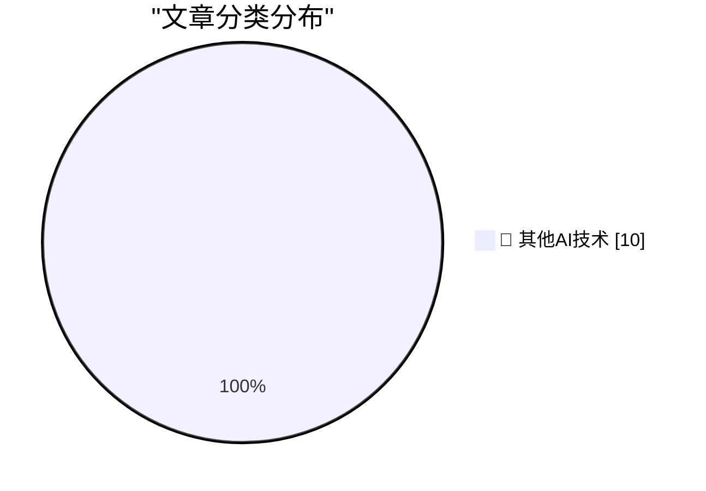

# 📰 AI 博客每日精选 — 2026-07-25

> 来自 98 个技术博客和社交媒体源，AI 精选 Top 10

## 🏆 今日必读

🥇 **‘AI Mania Is Eviscerating Global Decision-Making’**

[‘AI Mania Is Eviscerating Global Decision-Making’](https://ludic.mataroa.blog/blog/ai-mania-is-eviscerating-global-decision-making/) — daringfireball.net · 3 小时前 · 🔬 其他AI技术

> ‘AI Mania Is Eviscerating Global Decision-Making’

🥈 **EU Fines Google $1 Billion for DMA Competition Violations, Including Making Search Results More Useful**

[EU Fines Google $1 Billion for DMA Competition Violations, Including Making Search Results More Useful](https://digital-markets-act.ec.europa.eu/commission-fines-google-eur890-million-breaches-digital-markets-act-2026-07-23_en) — daringfireball.net · 4 小时前 · 🔬 其他AI技术

> EU Fines Google $1 Billion for DMA Competition Violations, Including Making Search Results More Useful

🥉 **Court Grants SerpApi’s Motion to Dismiss Google Lawsuit**

[Court Grants SerpApi’s Motion to Dismiss Google Lawsuit](https://serpapi.com/blog/google-v-serpapi-the-court-granted-our-motion-to-dismiss/) — daringfireball.net · 4 小时前 · 🔬 其他AI技术

> Court Grants SerpApi’s Motion to Dismiss Google Lawsuit

4️⃣ **Apple Maps to Power Navigation Experience for Ford’s New EVs**

[Apple Maps to Power Navigation Experience for Ford’s New EVs](https://www.apple.com/newsroom/2026/07/apple-maps-to-power-navigation-experience-for-ford-uev-platform/) — daringfireball.net · 5 小时前 · 🔬 其他AI技术

> Apple Maps to Power Navigation Experience for Ford’s New EVs

5️⃣ **Measles Cases Hit New Record in U.S., as Stupid-Americans Reject Vaccines**

[Measles Cases Hit New Record in U.S., as Stupid-Americans Reject Vaccines](https://www.nytimes.com/2026/07/24/well/measles-record-united-states-numbers.html?unlocked_article_code=1.0VA.4jBf.vqAYN4Bwu807) — daringfireball.net · 5 小时前 · 🔬 其他AI技术

> Measles Cases Hit New Record in U.S., as Stupid-Americans Reject Vaccines

---

## 📊 数据概览

| 扫描源 | 抓取文章 | 时间范围 | 精选 |
|:---:|:---:|:---:|:---:|
| 76/98 | 2716 篇 → 10 篇 | 24h | **10 篇** |

### 分类分布

---

====================

## 🔬 其他AI技术

### 1. ‘AI Mania Is Eviscerating Global Decision-Making’

[‘AI Mania Is Eviscerating Global Decision-Making’](https://ludic.mataroa.blog/blog/ai-mania-is-eviscerating-global-decision-making/) — **daringfireball.net** · 3 小时前 · ⭐ 15/25

> ‘AI Mania Is Eviscerating Global Decision-Making’

📌 其他AI技术

---

### 2. EU Fines Google $1 Billion for DMA Competition Violations, Including Making Search Results More Useful

[EU Fines Google $1 Billion for DMA Competition Violations, Including Making Search Results More Useful](https://digital-markets-act.ec.europa.eu/commission-fines-google-eur890-million-breaches-digital-markets-act-2026-07-23_en) — **daringfireball.net** · 4 小时前 · ⭐ 15/25

> EU Fines Google $1 Billion for DMA Competition Violations, Including Making Search Results More Useful

📌 其他AI技术

---

### 3. Court Grants SerpApi’s Motion to Dismiss Google Lawsuit

[Court Grants SerpApi’s Motion to Dismiss Google Lawsuit](https://serpapi.com/blog/google-v-serpapi-the-court-granted-our-motion-to-dismiss/) — **daringfireball.net** · 4 小时前 · ⭐ 15/25

> Court Grants SerpApi’s Motion to Dismiss Google Lawsuit

📌 其他AI技术

---

### 4. Apple Maps to Power Navigation Experience for Ford’s New EVs

[Apple Maps to Power Navigation Experience for Ford’s New EVs](https://www.apple.com/newsroom/2026/07/apple-maps-to-power-navigation-experience-for-ford-uev-platform/) — **daringfireball.net** · 5 小时前 · ⭐ 15/25

> Apple Maps to Power Navigation Experience for Ford’s New EVs

📌 其他AI技术

---

### 5. Measles Cases Hit New Record in U.S., as Stupid-Americans Reject Vaccines

[Measles Cases Hit New Record in U.S., as Stupid-Americans Reject Vaccines](https://www.nytimes.com/2026/07/24/well/measles-record-united-states-numbers.html?unlocked_article_code=1.0VA.4jBf.vqAYN4Bwu807) — **daringfireball.net** · 5 小时前 · ⭐ 15/25

> Measles Cases Hit New Record in U.S., as Stupid-Americans Reject Vaccines

📌 其他AI技术

---

### 6. bIRC — A New Native IRC Client for Mac

[bIRC — A New Native IRC Client for Mac](https://birc.app/) — **daringfireball.net** · 6 小时前 · ⭐ 15/25

> bIRC — A New Native IRC Client for Mac

📌 其他AI技术

---

### 7. Pluralistic: Apple's robo-repo (25 Jul 2026)

[Pluralistic: Apple's robo-repo (25 Jul 2026)](https://pluralistic.net/2026/07/25/cruel-cruelty-oh-cruelty/) — **pluralistic.net** · 11 小时前 · ⭐ 15/25

> Pluralistic: Apple's robo-repo (25 Jul 2026)

📌 其他AI技术

---

### 8. Benchmarking Qwen 3.6 35B MoE (3B active) on an RTX 3090

[Benchmarking Qwen 3.6 35B MoE (3B active) on an RTX 3090](https://www.gilesthomas.com/2026/07/benchmarking-qwen-3-6-35b-moe-rtx-3090) — **gilesthomas.com** · 22 小时前 · ⭐ 15/25

> Benchmarking Qwen 3.6 35B MoE (3B active) on an RTX 3090

📌 其他AI技术

---

### 9. This Week in Package Management: 25 July 2026

[This Week in Package Management: 25 July 2026](https://nesbitt.io/2026/07/25/this-week-in-package-management.html) — **nesbitt.io** · 11 小时前 · ⭐ 15/25

> This Week in Package Management: 25 July 2026

📌 其他AI技术

---

### 10. GitHub had 14,000+ internal repositories, but fewer than half had a clear owner. In under 45 days, we validated ownership for every active repo and ar...

[GitHub had 14,000+ internal repositories, but fewer than half had a clear owner. In under 45 days, we validated ownership for every active repo and ar...](https://x.com/github/status/2080796424824885502) — **𝕏 @GitHub** · 22 小时前 · ⭐ 15/25

> GitHub had 14,000+ internal repositories, but fewer than half had a clear owner. In under 45 days, we validated ownership for every active repo and ar...

📌 其他AI技术

---

====================

*生成于 2026-07-25 21:52 | 扫描 76 源 → 获取 2716 篇 → 精选 10 篇*
*基于 [Hacker News Popularity Contest 2025](https://refactoringenglish.com/tools/hn-popularity/) RSS 源列表，由 [Andrej Karpathy](https://x.com/karpathy) 推荐*
*由「懂点儿AI」制作，欢迎关注同名微信公众号获取更多 AI 实用技巧 💡*
