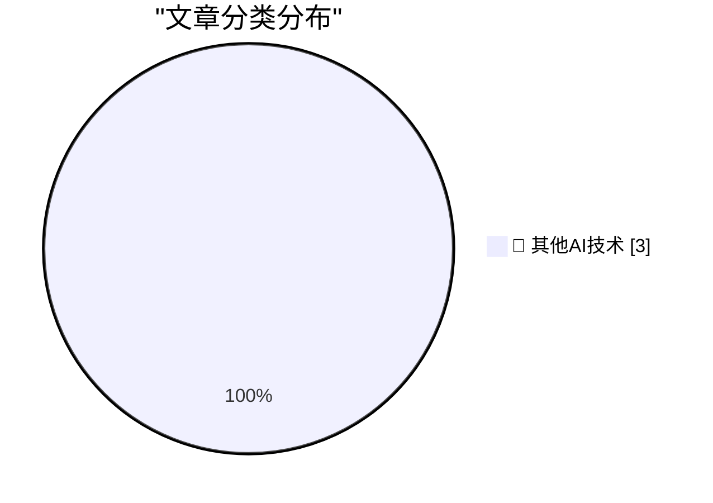

# 📰 AI 博客每日精选 — 2026-07-26

> 来自 98 个技术博客和社交媒体源，AI 精选 Top 3

## 🏆 今日必读

🥇 **Why $550 Million Medical Debt only Cost $5.5 Million**

[Why $550 Million Medical Debt only Cost $5.5 Million](https://idiallo.com/byte-size/550-million-only-cost-5-million) — idiallo.com · 2 小时前 · 🔬 其他AI技术

> Why $550 Million Medical Debt only Cost $5.5 Million

🥈 **Book Review: Dungeon Crawler Carl by Matt Dinniman ★★⯪☆☆**

[Book Review: Dungeon Crawler Carl by Matt Dinniman ★★⯪☆☆](https://shkspr.mobi/blog/2026/07/book-review-dungeon-crawler-carl-by-matt-dinniman/) — shkspr.mobi · 10 小时前 · 🔬 其他AI技术

> Book Review: Dungeon Crawler Carl by Matt Dinniman ★★⯪☆☆

🥉 **GitHub’s Bug Bounty Program is evolving to prioritize high-quality, high-impact research. Learn about our next chapter: new VIP program, restructured...**

[GitHub’s Bug Bounty Program is evolving to prioritize high-quality, high-impact research. Learn about our next chapter: new VIP program, restructured...](https://x.com/github/status/2081205367380250653) — 𝕏 @GitHub · 19 小时前 · 🔬 其他AI技术

> GitHub’s Bug Bounty Program is evolving to prioritize high-quality, high-impact research. Learn about our next chapter: new VIP program, restructured...

---

## 📊 数据概览

| 扫描源 | 抓取文章 | 时间范围 | 精选 |
|:---:|:---:|:---:|:---:|
| 78/98 | 2747 篇 → 3 篇 | 24h | **3 篇** |

### 分类分布

---

====================

## 🔬 其他AI技术

### 1. Why $550 Million Medical Debt only Cost $5.5 Million

[Why $550 Million Medical Debt only Cost $5.5 Million](https://idiallo.com/byte-size/550-million-only-cost-5-million) — **idiallo.com** · 2 小时前 · ⭐ 15/25

> Why $550 Million Medical Debt only Cost $5.5 Million

📌 其他AI技术

---

### 2. Book Review: Dungeon Crawler Carl by Matt Dinniman ★★⯪☆☆

[Book Review: Dungeon Crawler Carl by Matt Dinniman ★★⯪☆☆](https://shkspr.mobi/blog/2026/07/book-review-dungeon-crawler-carl-by-matt-dinniman/) — **shkspr.mobi** · 10 小时前 · ⭐ 15/25

> Book Review: Dungeon Crawler Carl by Matt Dinniman ★★⯪☆☆

📌 其他AI技术

---

### 3. GitHub’s Bug Bounty Program is evolving to prioritize high-quality, high-impact research. Learn about our next chapter: new VIP program, restructured...

[GitHub’s Bug Bounty Program is evolving to prioritize high-quality, high-impact research. Learn about our next chapter: new VIP program, restructured...](https://x.com/github/status/2081205367380250653) — **𝕏 @GitHub** · 19 小时前 · ⭐ 15/25

> GitHub’s Bug Bounty Program is evolving to prioritize high-quality, high-impact research. Learn about our next chapter: new VIP program, restructured...

📌 其他AI技术

---

====================

*生成于 2026-07-26 21:56 | 扫描 78 源 → 获取 2747 篇 → 精选 3 篇*
*基于 [Hacker News Popularity Contest 2025](https://refactoringenglish.com/tools/hn-popularity/) RSS 源列表，由 [Andrej Karpathy](https://x.com/karpathy) 推荐*
*由「懂点儿AI」制作，欢迎关注同名微信公众号获取更多 AI 实用技巧 💡*
