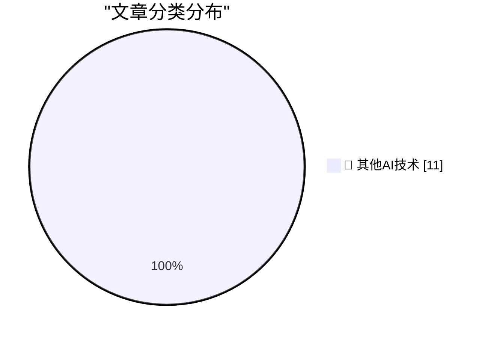

# 📰 AI 博客每日精选 — 2026-07-27

> 来自 98 个技术博客和社交媒体源，AI 精选 Top 11

## 🏆 今日必读

🥇 **★ Ads in Software Are Like Stickers on Laptops**

[★ Ads in Software Are Like Stickers on Laptops](https://daringfireball.net/2026/07/ads_in_software_are_like_stickers_on_laptops) — daringfireball.net · 5 小时前 · 🔬 其他AI技术

> ★ Ads in Software Are Like Stickers on Laptops

🥈 **WorkOS MCP**

[WorkOS MCP](https://workos.com/blog/management-mcp-server?utm_source=daringfireball&amp;utm_medium=newsletter&amp;utm_campaign=q32026) — daringfireball.net · 5 小时前 · 🔬 其他AI技术

> WorkOS MCP

🥉 **Pluralistic: How the EU can punish Google (despite Trump) (27 Jul 2026)**

[Pluralistic: How the EU can punish Google (despite Trump) (27 Jul 2026)](https://pluralistic.net/2026/07/27/eucd-6/) — pluralistic.net · 11 小时前 · 🔬 其他AI技术

> Pluralistic: How the EU can punish Google (despite Trump) (27 Jul 2026)

4️⃣ **Making an agile version of a Windows Runtime delegate in C++/WinRT, part 6**

[Making an agile version of a Windows Runtime delegate in C++/WinRT, part 6](https://devblogs.microsoft.com/oldnewthing/20260727-00/?p=112566) — devblogs.microsoft.com/oldnewthing · 8 小时前 · 🔬 其他AI技术

> Making an agile version of a Windows Runtime delegate in C++/WinRT, part 6

5️⃣ **Can the Tide of AI Investment Lift All Boats on the Web?**

[Can the Tide of AI Investment Lift All Boats on the Web?](https://blog.jim-nielsen.com/2026/tide-lifts-all-boats/) — blog.jim-nielsen.com · 3 小时前 · 🔬 其他AI技术

> Can the Tide of AI Investment Lift All Boats on the Web?

---

## 📊 数据概览

| 扫描源 | 抓取文章 | 时间范围 | 精选 |
|:---:|:---:|:---:|:---:|
| 77/98 | 2716 篇 → 11 篇 | 24h | **11 篇** |

### 分类分布

---

====================

## 🔬 其他AI技术

### 1. ★ Ads in Software Are Like Stickers on Laptops

[★ Ads in Software Are Like Stickers on Laptops](https://daringfireball.net/2026/07/ads_in_software_are_like_stickers_on_laptops) — **daringfireball.net** · 5 小时前 · ⭐ 15/25

> ★ Ads in Software Are Like Stickers on Laptops

📌 其他AI技术

---

### 2. WorkOS MCP

[WorkOS MCP](https://workos.com/blog/management-mcp-server?utm_source=daringfireball&amp;utm_medium=newsletter&amp;utm_campaign=q32026) — **daringfireball.net** · 5 小时前 · ⭐ 15/25

> WorkOS MCP

📌 其他AI技术

---

### 3. Pluralistic: How the EU can punish Google (despite Trump) (27 Jul 2026)

[Pluralistic: How the EU can punish Google (despite Trump) (27 Jul 2026)](https://pluralistic.net/2026/07/27/eucd-6/) — **pluralistic.net** · 11 小时前 · ⭐ 15/25

> Pluralistic: How the EU can punish Google (despite Trump) (27 Jul 2026)

📌 其他AI技术

---

### 4. Making an agile version of a Windows Runtime delegate in C++/WinRT, part 6

[Making an agile version of a Windows Runtime delegate in C++/WinRT, part 6](https://devblogs.microsoft.com/oldnewthing/20260727-00/?p=112566) — **devblogs.microsoft.com/oldnewthing** · 8 小时前 · ⭐ 15/25

> Making an agile version of a Windows Runtime delegate in C++/WinRT, part 6

📌 其他AI技术

---

### 5. Can the Tide of AI Investment Lift All Boats on the Web?

[Can the Tide of AI Investment Lift All Boats on the Web?](https://blog.jim-nielsen.com/2026/tide-lifts-all-boats/) — **blog.jim-nielsen.com** · 3 小时前 · ⭐ 15/25

> Can the Tide of AI Investment Lift All Boats on the Web?

📌 其他AI技术

---

### 6. Advantages and disadvantages of Windows NT 3.1

[Advantages and disadvantages of Windows NT 3.1](https://dfarq.homeip.net/advantages-and-disadvantages-of-windows-nt-3-1/?utm_source=rss&#038;utm_medium=rss&#038;utm_campaign=advantages-and-disadvantages-of-windows-nt-3-1) — **dfarq.homeip.net** · 11 小时前 · ⭐ 15/25

> Advantages and disadvantages of Windows NT 3.1

📌 其他AI技术

---

### 7. GPT-Live in ChatGPT Voice is now available to Edu, Business, and Enterprise plans globally.

[GPT-Live in ChatGPT Voice is now available to Edu, Business, and Enterprise plans globally.](https://x.com/OpenAI/status/2081794871795589485) — **𝕏 @OpenAI** · 4 小时前 · ⭐ 15/25

> GPT-Live in ChatGPT Voice is now available to Edu, Business, and Enterprise plans globally.

📌 其他AI技术

---

### 8. Permissions matter more as your Slack workspace grows. 🔐💡 Slack School covers how permissions and user roles work together to keep access simple...

[Permissions matter more as your Slack workspace grows. 🔐💡 Slack School covers how permissions and user roles work together to keep access simple...](https://x.com/SlackHQ/status/2081854724983115838) — **𝕏 @SlackHQ** · 34 分钟前 · ⭐ 15/25

> Permissions matter more as your Slack workspace grows. 🔐💡 Slack School covers how permissions and user roles work together to keep access simple...

📌 其他AI技术

---

### 9. RT PagerDuty: Say bye to context-switching between tools during a critical incident! Watch our product and engineering teams break down the new PagerD...

[RT PagerDuty: Say bye to context-switching between tools during a critical incident! Watch our product and engineering teams break down the new PagerD...](https://x.com/SlackHQ/status/2081782220784574813) — **𝕏 @SlackHQ** · 5 小时前 · ⭐ 15/25

> RT PagerDuty: Say bye to context-switching between tools during a critical incident! Watch our product and engineering teams break down the new PagerD...

📌 其他AI技术

---

### 10. We're expanding model choice in Microsoft 365 Copilot with Anthropic's latest model, Claude Opus 5. Designed for everyday use on complex, multi-step w...

[We're expanding model choice in Microsoft 365 Copilot with Anthropic's latest model, Claude Opus 5. Designed for everyday use on complex, multi-step w...](https://x.com/Microsoft365/status/2081817680068087898) — **𝕏 @Microsoft365** · 3 小时前 · ⭐ 15/25

> We're expanding model choice in Microsoft 365 Copilot with Anthropic's latest model, Claude Opus 5. Designed for everyday use on complex, multi-step w...

📌 其他AI技术

---

### 11. Want to change the aesthetic of your video in one click? 🎨📹 With Gemini Omni in Google Vids, it’s as simple as typing a prompt. Instantly trans...

[Want to change the aesthetic of your video in one click? 🎨📹 With Gemini Omni in Google Vids, it’s as simple as typing a prompt. Instantly trans...](https://x.com/GoogleWorkspace/status/2081742152107700258) — **𝕏 @GoogleWorkspace** · 8 小时前 · ⭐ 15/25

> Want to change the aesthetic of your video in one click? 🎨📹 With Gemini Omni in Google Vids, it’s as simple as typing a prompt. Instantly trans...

📌 其他AI技术

---

====================

*生成于 2026-07-27 22:04 | 扫描 77 源 → 获取 2716 篇 → 精选 11 篇*
*基于 [Hacker News Popularity Contest 2025](https://refactoringenglish.com/tools/hn-popularity/) RSS 源列表，由 [Andrej Karpathy](https://x.com/karpathy) 推荐*
*由「懂点儿AI」制作，欢迎关注同名微信公众号获取更多 AI 实用技巧 💡*
