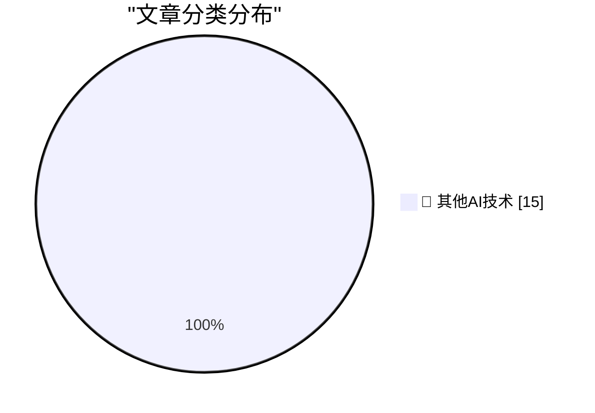

# 📰 AI 博客每日精选 — 2026-07-28

> 来自 98 个技术博客和社交媒体源，AI 精选 Top 15

## 🏆 今日必读

🥇 **Steve Jobs in 2011: ‘We Build Products That We Want for Ourselves, Too, and We Just Don’t Want Ads’**

[Steve Jobs in 2011: ‘We Build Products That We Want for Ourselves, Too, and We Just Don’t Want Ads’](https://www.businessinsider.com/apple-snubs-the-iad-2011-6) — daringfireball.net · 5 小时前 · 🔬 其他AI技术

> Steve Jobs in 2011: ‘We Build Products That We Want for Ourselves, Too, and We Just Don’t Want Ads’

🥈 **[Sponsor] Introducing Agent Fone**

[[Sponsor] Introducing Agent Fone](https://fail.xyz/phone/) — daringfireball.net · 20 小时前 · 🔬 其他AI技术

> [Sponsor] Introducing Agent Fone

🥉 **‘Always Choose the Good Soap’**

[‘Always Choose the Good Soap’](https://sixcolors.com/post/2026/07/always-choose-the-good-soap/) — daringfireball.net · 20 小时前 · 🔬 其他AI技术

> ‘Always Choose the Good Soap’

4️⃣ **Pluralistic: Discernment (28 Jul 2026)**

[Pluralistic: Discernment (28 Jul 2026)](https://pluralistic.net/2026/07/28/hitl-ers/) — pluralistic.net · 11 小时前 · 🔬 其他AI技术

> Pluralistic: Discernment (28 Jul 2026)

5️⃣ **Google Calendar "Unable to launch event" - caused by missing DTSTAMP**

[Google Calendar "Unable to launch event" - caused by missing DTSTAMP](https://shkspr.mobi/blog/2026/07/google-calendar-unable-to-launch-event-caused-by-missing-dtstamp/) — shkspr.mobi · 10 小时前 · 🔬 其他AI技术

> Google Calendar "Unable to launch event" - caused by missing DTSTAMP

---

## 📊 数据概览

| 扫描源 | 抓取文章 | 时间范围 | 精选 |
|:---:|:---:|:---:|:---:|
| 77/98 | 2708 篇 → 21 篇 | 24h | **15 篇** |

### 分类分布

---

====================

## 🔬 其他AI技术

### 1. Steve Jobs in 2011: ‘We Build Products That We Want for Ourselves, Too, and We Just Don’t Want Ads’

[Steve Jobs in 2011: ‘We Build Products That We Want for Ourselves, Too, and We Just Don’t Want Ads’](https://www.businessinsider.com/apple-snubs-the-iad-2011-6) — **daringfireball.net** · 5 小时前 · ⭐ 15/25

> Steve Jobs in 2011: ‘We Build Products That We Want for Ourselves, Too, and We Just Don’t Want Ads’

📌 其他AI技术

---

### 2. [Sponsor] Introducing Agent Fone

[[Sponsor] Introducing Agent Fone](https://fail.xyz/phone/) — **daringfireball.net** · 20 小时前 · ⭐ 15/25

> [Sponsor] Introducing Agent Fone

📌 其他AI技术

---

### 3. ‘Always Choose the Good Soap’

[‘Always Choose the Good Soap’](https://sixcolors.com/post/2026/07/always-choose-the-good-soap/) — **daringfireball.net** · 20 小时前 · ⭐ 15/25

> ‘Always Choose the Good Soap’

📌 其他AI技术

---

### 4. Pluralistic: Discernment (28 Jul 2026)

[Pluralistic: Discernment (28 Jul 2026)](https://pluralistic.net/2026/07/28/hitl-ers/) — **pluralistic.net** · 11 小时前 · ⭐ 15/25

> Pluralistic: Discernment (28 Jul 2026)

📌 其他AI技术

---

### 5. Google Calendar "Unable to launch event" - caused by missing DTSTAMP

[Google Calendar "Unable to launch event" - caused by missing DTSTAMP](https://shkspr.mobi/blog/2026/07/google-calendar-unable-to-launch-event-caused-by-missing-dtstamp/) — **shkspr.mobi** · 10 小时前 · ⭐ 15/25

> Google Calendar "Unable to launch event" - caused by missing DTSTAMP

📌 其他AI技术

---

### 6. Does every question mark deserve a Betteridge?

[Does every question mark deserve a Betteridge?](https://dynomight.net/betteridge/) — **dynomight.net** · 22 小时前 · ⭐ 15/25

> Does every question mark deserve a Betteridge?

📌 其他AI技术

---

### 7. Why npm Dependency Trees Are So Big

[Why npm Dependency Trees Are So Big](https://nesbitt.io/2026/07/28/why-npm-dependency-trees-are-so-big.html) — **nesbitt.io** · 12 小时前 · ⭐ 15/25

> Why npm Dependency Trees Are So Big

📌 其他AI技术

---

### 8. When The Future Doesn’t Need Us

[When The Future Doesn’t Need Us](https://borretti.me/article/when-the-future-doesnt-need-us) — **borretti.me** · 22 小时前 · ⭐ 15/25

> When The Future Doesn’t Need Us

📌 其他AI技术

---

### 9. The More You Buy, The More You Lose

[The More You Buy, The More You Lose](https://www.wheresyoured.at/the-more-you-buy-the-more-you-lose/) — **wheresyoured.at** · 5 小时前 · ⭐ 15/25

> The More You Buy, The More You Lose

📌 其他AI技术

---

### 10. IBM PS/2 E: The first Energy Star computer

[IBM PS/2 E: The first Energy Star computer](https://dfarq.homeip.net/ibm-ps-2-e-the-first-energy-star-computer/?utm_source=rss&#038;utm_medium=rss&#038;utm_campaign=ibm-ps-2-e-the-first-energy-star-computer) — **dfarq.homeip.net** · 11 小时前 · ⭐ 15/25

> IBM PS/2 E: The first Energy Star computer

📌 其他AI技术

---

### 11. The inliner is yielding benefits for ZJIT

[The inliner is yielding benefits for ZJIT](https://bernsteinbear.com/blog/zjit-inliner-invokeblock/?utm_source=rss) — **bernsteinbear.com** · 22 小时前 · ⭐ 15/25

> The inliner is yielding benefits for ZJIT

📌 其他AI技术

---

### 12. At the core of our mission is working through how to ensure increasingly powerful AI benefits everyone. We believe that, at some point in the future, ...

[At the core of our mission is working through how to ensure increasingly powerful AI benefits everyone. We believe that, at some point in the future, ...](https://x.com/OpenAI/status/2082208694142730340) — **𝕏 @OpenAI** · 1 小时前 · ⭐ 15/25

> At the core of our mission is working through how to ensure increasingly powerful AI benefits everyone. We believe that, at some point in the future, ...

📌 其他AI技术

---

### 13. RT Greg Brockman: Last week, we made ChatGPT Work available to enterprises. It's an awesome product. So for ChatGPT Enterprise customers, enroll by Au...

[RT Greg Brockman: Last week, we made ChatGPT Work available to enterprises. It's an awesome product. So for ChatGPT Enterprise customers, enroll by Au...](https://x.com/OpenAI/status/2081882249839157545) — **𝕏 @OpenAI** · 23 小时前 · ⭐ 15/25

> RT Greg Brockman: Last week, we made ChatGPT Work available to enterprises. It's an awesome product. So for ChatGPT Enterprise customers, enroll by Au...

📌 其他AI技术

---

### 14. You're not behind. There's no secret everyone else has. There's just the harness, and it's mostly all you need. @burkeholland gives you a simple, repe...

[You're not behind. There's no secret everyone else has. There's just the harness, and it's mostly all you need. @burkeholland gives you a simple, repe...](https://x.com/github/status/2082201573976056245) — **𝕏 @GitHub** · 1 小时前 · ⭐ 15/25

> You're not behind. There's no secret everyone else has. There's just the harness, and it's mostly all you need. @burkeholland gives you a simple, repe...

📌 其他AI技术

---

### 15. RT Cole Bemis: If your Notion sidebar were tailored exactly to how you work, what would be in it?

[RT Cole Bemis: If your Notion sidebar were tailored exactly to how you work, what would be in it?](https://x.com/NotionHQ/status/2082160716019380313) — **𝕏 @NotionHQ** · 5 小时前 · ⭐ 15/25

> RT Cole Bemis: If your Notion sidebar were tailored exactly to how you work, what would be in it?

📌 其他AI技术

---

====================

*生成于 2026-07-28 22:03 | 扫描 77 源 → 获取 2708 篇 → 精选 15 篇*
*基于 [Hacker News Popularity Contest 2025](https://refactoringenglish.com/tools/hn-popularity/) RSS 源列表，由 [Andrej Karpathy](https://x.com/karpathy) 推荐*
*由「懂点儿AI」制作，欢迎关注同名微信公众号获取更多 AI 实用技巧 💡*
