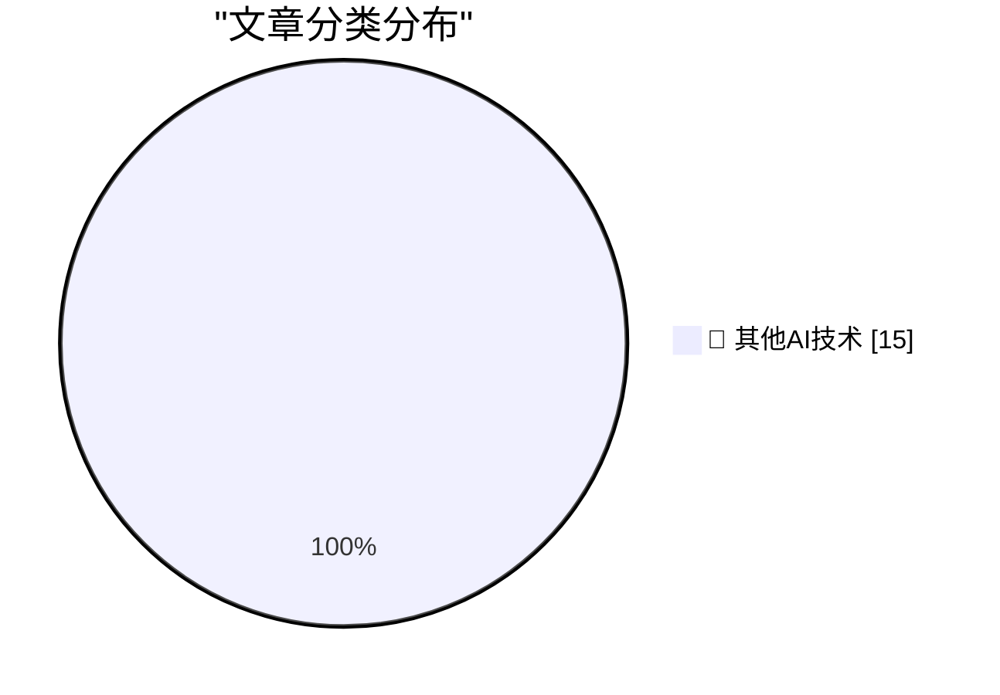

# 📰 AI 博客每日精选 — 2026-07-29

> 来自 98 个技术博客和社交媒体源，AI 精选 Top 15

## 🏆 今日必读

🥇 **Apple Says iOS 27 ‘Restricted Mode’ Isn’t for Users Who Miss Payments in New Apple Upgrade Program**

[Apple Says iOS 27 ‘Restricted Mode’ Isn’t for Users Who Miss Payments in New Apple Upgrade Program](https://9to5mac.com/2026/07/28/apple-says-ios-27-restricted-mode-isnt-for-new-upgrade-program-leases/) — daringfireball.net · 1 小时前 · 🔬 其他AI技术

> Apple Says iOS 27 ‘Restricted Mode’ Isn’t for Users Who Miss Payments in New Apple Upgrade Program

🥈 **Apple Upgrade — New Program With Klarna for Leasing iPhones, Macs, iPads, and More for Near-Zero Interest**

[Apple Upgrade — New Program With Klarna for Leasing iPhones, Macs, iPads, and More for Near-Zero Interest](https://www.apple.com/newsroom/2026/07/apple-upgrade-launches-in-the-united-states/) — daringfireball.net · 5 小时前 · 🔬 其他AI技术

> Apple Upgrade — New Program With Klarna for Leasing iPhones, Macs, iPads, and More for Near-Zero Interest

🥉 **Pastebot 3**

[Pastebot 3](https://tapbots.com/pastebot/) — daringfireball.net · 5 小时前 · 🔬 其他AI技术

> Pastebot 3

4️⃣ **Count Those Underscores**

[Count Those Underscores](https://arstechnica.com/tech-policy/2026/07/police-missed-one-underscore-and-sent-the-wrong-man-to-prison/) — daringfireball.net · 6 小时前 · 🔬 其他AI技术

> Count Those Underscores

5️⃣ **‘eBay’s Bizarre Cyberstalking Saga Ends With a $56 Million Settlement’**

[‘eBay’s Bizarre Cyberstalking Saga Ends With a $56 Million Settlement’](https://www.theverge.com/tech/972209/ebay-cyberstalking-harassment-settlement) — daringfireball.net · 7 小时前 · 🔬 其他AI技术

> ‘eBay’s Bizarre Cyberstalking Saga Ends With a $56 Million Settlement’

---

## 📊 数据概览

| 扫描源 | 抓取文章 | 时间范围 | 精选 |
|:---:|:---:|:---:|:---:|
| 76/98 | 2686 篇 → 17 篇 | 24h | **15 篇** |

### 分类分布

---

====================

## 🔬 其他AI技术

### 1. Apple Says iOS 27 ‘Restricted Mode’ Isn’t for Users Who Miss Payments in New Apple Upgrade Program

[Apple Says iOS 27 ‘Restricted Mode’ Isn’t for Users Who Miss Payments in New Apple Upgrade Program](https://9to5mac.com/2026/07/28/apple-says-ios-27-restricted-mode-isnt-for-new-upgrade-program-leases/) — **daringfireball.net** · 1 小时前 · ⭐ 15/25

> Apple Says iOS 27 ‘Restricted Mode’ Isn’t for Users Who Miss Payments in New Apple Upgrade Program

📌 其他AI技术

---

### 2. Apple Upgrade — New Program With Klarna for Leasing iPhones, Macs, iPads, and More for Near-Zero Interest

[Apple Upgrade — New Program With Klarna for Leasing iPhones, Macs, iPads, and More for Near-Zero Interest](https://www.apple.com/newsroom/2026/07/apple-upgrade-launches-in-the-united-states/) — **daringfireball.net** · 5 小时前 · ⭐ 15/25

> Apple Upgrade — New Program With Klarna for Leasing iPhones, Macs, iPads, and More for Near-Zero Interest

📌 其他AI技术

---

### 3. Pastebot 3

[Pastebot 3](https://tapbots.com/pastebot/) — **daringfireball.net** · 5 小时前 · ⭐ 15/25

> Pastebot 3

📌 其他AI技术

---

### 4. Count Those Underscores

[Count Those Underscores](https://arstechnica.com/tech-policy/2026/07/police-missed-one-underscore-and-sent-the-wrong-man-to-prison/) — **daringfireball.net** · 6 小时前 · ⭐ 15/25

> Count Those Underscores

📌 其他AI技术

---

### 5. ‘eBay’s Bizarre Cyberstalking Saga Ends With a $56 Million Settlement’

[‘eBay’s Bizarre Cyberstalking Saga Ends With a $56 Million Settlement’](https://www.theverge.com/tech/972209/ebay-cyberstalking-harassment-settlement) — **daringfireball.net** · 7 小时前 · ⭐ 15/25

> ‘eBay’s Bizarre Cyberstalking Saga Ends With a $56 Million Settlement’

📌 其他AI技术

---

### 6. Pluralistic: Enshittification and Reverse Centaurs go global (29 Jul 2026)

[Pluralistic: Enshittification and Reverse Centaurs go global (29 Jul 2026)](https://pluralistic.net/2026/07/29/la-la-la-la-la/) — **pluralistic.net** · 13 小时前 · ⭐ 15/25

> Pluralistic: Enshittification and Reverse Centaurs go global (29 Jul 2026)

📌 其他AI技术

---

### 7. Superlogical

[Superlogical](https://mitchellh.com/writing/superlogical) — **mitchellh.com** · 21 小时前 · ⭐ 15/25

> Superlogical

📌 其他AI技术

---

### 8. Making an agile version of a Windows Runtime delegate in C++/WinRT, part 8

[Making an agile version of a Windows Runtime delegate in C++/WinRT, part 8](https://devblogs.microsoft.com/oldnewthing/20260729-00/?p=112570) — **devblogs.microsoft.com/oldnewthing** · 7 小时前 · ⭐ 15/25

> Making an agile version of a Windows Runtime delegate in C++/WinRT, part 8

📌 其他AI技术

---

### 9. Why do OpenAI's GPT-2 weights beat mine?

[Why do OpenAI's GPT-2 weights beat mine?](https://www.gilesthomas.com/2026/07/why-do-openai-gpt2-weights-beat-mine-1-intro) — **gilesthomas.com** · 6 小时前 · ⭐ 15/25

> Why do OpenAI's GPT-2 weights beat mine?

📌 其他AI技术

---

### 10. Logic for Programmers is Done

[Logic for Programmers is Done](https://buttondown.com/hillelwayne/archive/logic-for-programmers-is-done/) — **buttondown.com/hillelwayne** · 6 小时前 · ⭐ 15/25

> Logic for Programmers is Done

📌 其他AI技术

---

### 11. Why compute might get 10x+ more expensive in coming years

[Why compute might get 10x+ more expensive in coming years](https://www.dwarkesh.com/p/why-compute-might-get-10x-more-expensive) — **dwarkesh.com** · 6 小时前 · ⭐ 15/25

> Why compute might get 10x+ more expensive in coming years

📌 其他AI技术

---

### 12. Clive Sinclair: a US perspective

[Clive Sinclair: a US perspective](https://dfarq.homeip.net/clive-sinclair-a-us-perspective/?utm_source=rss&#038;utm_medium=rss&#038;utm_campaign=clive-sinclair-a-us-perspective) — **dfarq.homeip.net** · 10 小时前 · ⭐ 15/25

> Clive Sinclair: a US perspective

📌 其他AI技术

---

### 13. AI: Overwegingen voor wie erover gaat

[AI: Overwegingen voor wie erover gaat](https://berthub.eu/articles/posts/ai-voor-wie-erover-gaat/) — **berthub.eu** · 8 小时前 · ⭐ 15/25

> AI: Overwegingen voor wie erover gaat

📌 其他AI技术

---

### 14. RT Lenny Rachitsky: Fable is really good at launch videos It essentially one-shotted this video. I told it to read my launch post and create a launch ...

[RT Lenny Rachitsky: Fable is really good at launch videos It essentially one-shotted this video. I told it to read my launch post and create a launch ...](https://x.com/ElevenLabs/status/2082573928942199139) — **𝕏 @ElevenLabs** · 5 小时前 · ⭐ 15/25

> RT Lenny Rachitsky: Fable is really good at launch videos It essentially one-shotted this video. I told it to read my launch post and create a launch ...

📌 其他AI技术

---

### 15. Engineering teams, your new on-call AI is here. 🚨 Meet @Sazabi, the AI-native observability platform that works directly in Slack, so your team can...

[Engineering teams, your new on-call AI is here. 🚨 Meet @Sazabi, the AI-native observability platform that works directly in Slack, so your team can...](https://x.com/SlackHQ/status/2082541771326714295) — **𝕏 @SlackHQ** · 2 小时前 · ⭐ 15/25

> Engineering teams, your new on-call AI is here. 🚨 Meet @Sazabi, the AI-native observability platform that works directly in Slack, so your team can...

📌 其他AI技术

---

====================

*生成于 2026-07-29 21:57 | 扫描 76 源 → 获取 2686 篇 → 精选 15 篇*
*基于 [Hacker News Popularity Contest 2025](https://refactoringenglish.com/tools/hn-popularity/) RSS 源列表，由 [Andrej Karpathy](https://x.com/karpathy) 推荐*
*由「懂点儿AI」制作，欢迎关注同名微信公众号获取更多 AI 实用技巧 💡*
