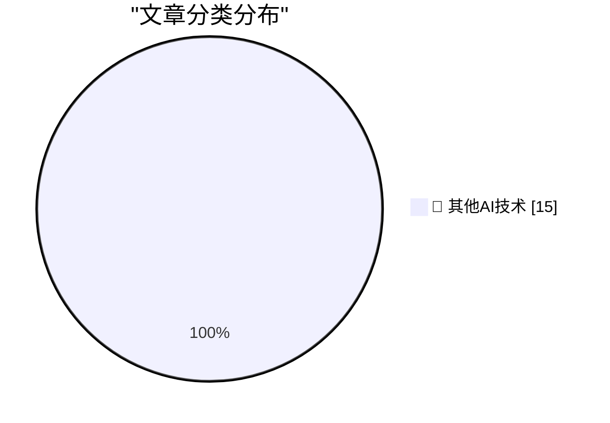

# 📰 AI 博客每日精选 — 2026-07-30

> 来自 98 个技术博客和社交媒体源，AI 精选 Top 15

## 🏆 今日必读

🥇 **Mark Zuckerberg: ‘The AI Future Is for Everyone’**

[Mark Zuckerberg: ‘The AI Future Is for Everyone’](https://www.wsj.com/opinion/the-ai-future-is-for-everyone-a0c24e20?st=T6AAwM) — daringfireball.net · 53 分钟前 · 🔬 其他AI技术

> Mark Zuckerberg: ‘The AI Future Is for Everyone’

🥈 **Apple Releases iOS and MacOS 26.6, MacOS 15.7.8, and More**

[Apple Releases iOS and MacOS 26.6, MacOS 15.7.8, and More](https://arstechnica.com/gadgets/2026/07/ios-and-macos-26-6-arrive-today-paving-the-way-for-ios-and-macos-27/) — daringfireball.net · 1 小时前 · 🔬 其他AI技术

> Apple Releases iOS and MacOS 26.6, MacOS 15.7.8, and More

🥉 **Rogue Amoeba: Unobtrusive Update Notifications**

[Rogue Amoeba: Unobtrusive Update Notifications](https://weblog.rogueamoeba.com/2026/04/28/unobtrusive-update-notifications/) — daringfireball.net · 1 小时前 · 🔬 其他AI技术

> Rogue Amoeba: Unobtrusive Update Notifications

4️⃣ **Looking for the Catch in Apple Upgrade**

[Looking for the Catch in Apple Upgrade](https://www.theatlantic.com/technology/2026/07/apple-lease-upgrade-program/688106/) — daringfireball.net · 5 小时前 · 🔬 其他AI技术

> Looking for the Catch in Apple Upgrade

5️⃣ **The Differences Between the New ‘Apple Upgrade’ and the Old ‘iPhone Upgrade Program’**

[The Differences Between the New ‘Apple Upgrade’ and the Old ‘iPhone Upgrade Program’](https://9to5mac.com/2026/07/30/apple-upgrade-vs-iphone-upgrade-program-here-are-the-key-differences/) — daringfireball.net · 6 小时前 · 🔬 其他AI技术

> The Differences Between the New ‘Apple Upgrade’ and the Old ‘iPhone Upgrade Program’

---

## 📊 数据概览

| 扫描源 | 抓取文章 | 时间范围 | 精选 |
|:---:|:---:|:---:|:---:|
| 77/98 | 2712 篇 → 28 篇 | 24h | **15 篇** |

### 分类分布

---

====================

## 🔬 其他AI技术

### 1. Mark Zuckerberg: ‘The AI Future Is for Everyone’

[Mark Zuckerberg: ‘The AI Future Is for Everyone’](https://www.wsj.com/opinion/the-ai-future-is-for-everyone-a0c24e20?st=T6AAwM) — **daringfireball.net** · 53 分钟前 · ⭐ 15/25

> Mark Zuckerberg: ‘The AI Future Is for Everyone’

📌 其他AI技术

---

### 2. Apple Releases iOS and MacOS 26.6, MacOS 15.7.8, and More

[Apple Releases iOS and MacOS 26.6, MacOS 15.7.8, and More](https://arstechnica.com/gadgets/2026/07/ios-and-macos-26-6-arrive-today-paving-the-way-for-ios-and-macos-27/) — **daringfireball.net** · 1 小时前 · ⭐ 15/25

> Apple Releases iOS and MacOS 26.6, MacOS 15.7.8, and More

📌 其他AI技术

---

### 3. Rogue Amoeba: Unobtrusive Update Notifications

[Rogue Amoeba: Unobtrusive Update Notifications](https://weblog.rogueamoeba.com/2026/04/28/unobtrusive-update-notifications/) — **daringfireball.net** · 1 小时前 · ⭐ 15/25

> Rogue Amoeba: Unobtrusive Update Notifications

📌 其他AI技术

---

### 4. Looking for the Catch in Apple Upgrade

[Looking for the Catch in Apple Upgrade](https://www.theatlantic.com/technology/2026/07/apple-lease-upgrade-program/688106/) — **daringfireball.net** · 5 小时前 · ⭐ 15/25

> Looking for the Catch in Apple Upgrade

📌 其他AI技术

---

### 5. The Differences Between the New ‘Apple Upgrade’ and the Old ‘iPhone Upgrade Program’

[The Differences Between the New ‘Apple Upgrade’ and the Old ‘iPhone Upgrade Program’](https://9to5mac.com/2026/07/30/apple-upgrade-vs-iphone-upgrade-program-here-are-the-key-differences/) — **daringfireball.net** · 6 小时前 · ⭐ 15/25

> The Differences Between the New ‘Apple Upgrade’ and the Old ‘iPhone Upgrade Program’

📌 其他AI技术

---

### 6. You have been mislead about lightbulbs

[You have been mislead about lightbulbs](https://maurycyz.com/misc/tungsten/) — **maurycyz.com** · 22 小时前 · ⭐ 15/25

> You have been mislead about lightbulbs

📌 其他AI技术

---

### 7. Pluralistic: The stupidest imaginable excuses for surveillance pricing (30 Jul 2026)

[Pluralistic: The stupidest imaginable excuses for surveillance pricing (30 Jul 2026)](https://pluralistic.net/2026/07/30/pay-for-privacy/) — **pluralistic.net** · 9 小时前 · ⭐ 15/25

> Pluralistic: The stupidest imaginable excuses for surveillance pricing (30 Jul 2026)

📌 其他AI技术

---

### 8. Are political journalists always wrong?

[Are political journalists always wrong?](https://shkspr.mobi/blog/2026/07/are-political-journalists-always-wrong/) — **shkspr.mobi** · 10 小时前 · ⭐ 15/25

> Are political journalists always wrong?

📌 其他AI技术

---

### 9. So you want to use plants to reduce indoor CO₂

[So you want to use plants to reduce indoor CO₂](https://dynomight.net/plants/) — **dynomight.net** · 22 小时前 · ⭐ 15/25

> So you want to use plants to reduce indoor CO₂

📌 其他AI技术

---

### 10. Why do OpenAI's GPT-2 weights beat mine?  Part two: the bugfix

[Why do OpenAI's GPT-2 weights beat mine?  Part two: the bugfix](https://www.gilesthomas.com/2026/07/why-do-openai-gpt2-weights-beat-mine-2-the-bugfix) — **gilesthomas.com** · 3 小时前 · ⭐ 15/25

> Why do OpenAI's GPT-2 weights beat mine?  Part two: the bugfix

📌 其他AI技术

---

### 11. Wheels, Bottles and Images

[Wheels, Bottles and Images](https://nesbitt.io/2026/07/30/wheels-bottles-images.html) — **nesbitt.io** · 12 小时前 · ⭐ 15/25

> Wheels, Bottles and Images

📌 其他AI技术

---

### 12. When Nintendo sued Blockbuster

[When Nintendo sued Blockbuster](https://dfarq.homeip.net/when-nintendo-sued-blockbuster/?utm_source=rss&#038;utm_medium=rss&#038;utm_campaign=when-nintendo-sued-blockbuster) — **dfarq.homeip.net** · 11 小时前 · ⭐ 15/25

> When Nintendo sued Blockbuster

📌 其他AI技术

---

### 13. RT jason: one of the most beautiful things about OpenAI is that every employee really has a voice. i wanted to capture what it feels like to work here...

[RT jason: one of the most beautiful things about OpenAI is that every employee really has a voice. i wanted to capture what it feels like to work here...](https://x.com/OpenAI/status/2082866778774921261) — **𝕏 @OpenAI** · 6 小时前 · ⭐ 15/25

> RT jason: one of the most beautiful things about OpenAI is that every employee really has a voice. i wanted to capture what it feels like to work here...

📌 其他AI技术

---

### 14. RT Damian Brady 🥑 🏠: Stacked PRs are now available in public preview! http://gh.io/stacks

[RT Damian Brady 🥑 🏠: Stacked PRs are now available in public preview! http://gh.io/stacks](https://x.com/github/status/2082946176580538489) — **𝕏 @GitHub** · 19 分钟前 · ⭐ 15/25

> RT Damian Brady 🥑 🏠: Stacked PRs are now available in public preview! http://gh.io/stacks

📌 其他AI技术

---

### 15. RT Ashley Wolf: http://gh.io/stacks

[RT Ashley Wolf: http://gh.io/stacks](https://x.com/github/status/2082924119213908124) — **𝕏 @GitHub** · 1 小时前 · ⭐ 15/25

> RT Ashley Wolf: http://gh.io/stacks

📌 其他AI技术

---

====================

*生成于 2026-07-30 22:03 | 扫描 77 源 → 获取 2712 篇 → 精选 15 篇*
*基于 [Hacker News Popularity Contest 2025](https://refactoringenglish.com/tools/hn-popularity/) RSS 源列表，由 [Andrej Karpathy](https://x.com/karpathy) 推荐*
*由「懂点儿AI」制作，欢迎关注同名微信公众号获取更多 AI 实用技巧 💡*
